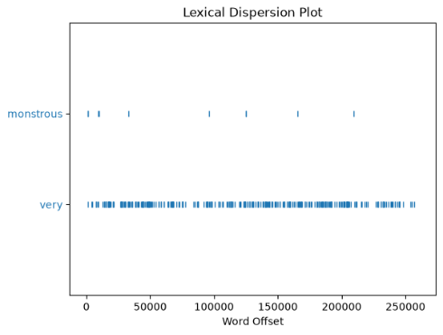

```py title='nltk'
import nltk
nltk.__version__ # 3.9.4

nltk.download() # opens UI to install various text corpora and models
nltk.data.path.append("/Users/riteshraj/.../nltk-data") # tells nltk where to find text corpora and models

from nltk.book import * # loads text1, ...text9, sent1, ...sent9, gutenberg, ...wordnet, FreqDist, Text and bigrams
type(text1) # nltk.text.Text
```

- NLP: Natural Language Processing
- NLTK: Natural Language ToolKit
- NLP faces following challenges:
  - Word sense disambiguation:
    - We want to work out which sense of a word was intended in a given context
    - E.g: ambiguous word 'serve': help with food or drink; hold an office; put ball into play
    - We automatically disambiguate words using context, exploiting the simple fact that nearby words have **closely related meanings**
  - Pronoun Resolution:
    - To work out "who did what to whom" — i.e., to detect the subjects and objects of verbs
    - E.g. "The thieves stole the paintings. They were subsequently caught."
  - Generating Language Output: Such as question answering and machine translation (e.g. English -> French)

## Accessing Text Corpora

- Gutenberg Corpus: contains books
- Nps Chat: contains instant messaging chats
- Brown Corpus: contains text from 500 sources, and the sources have been categorized by genre, such as news, editorial, and so on
- Reuters Corpus: contains news documents. The documents have been classified into 90 topics, and grouped into two sets, called "training" and "test"

```py title='Gutenberg Corpus'
nltk.corpus.gutenberg.fileids() # returns list of file identifiers (file names) for texts in Gutenberg corpus. ['austen-emma.txt',...'whitman-leaves.txt']

emma = nltk.corpus.gutenberg.words("austen-emma.txt")
print(type(emma)) # nltk.corpus.reader.util.StreamBackedCorpusView
print(len(emma)) # 192427. Total words
print(emma[:10]) # ['[', 'Emma', 'by', 'Jane', 'Austen', '1816', ']', 'VOLUME', 'I', 'CHAPTER']

emma_text = nltk.Text(emma)
type(emma_text) # nltk.text.Text
emma.concordance("surprise")

len(nltk.corpus.gutenberg.raw(fileid)) # Total characters. raw() format: <string>. '[Emma by Jane Austen...'
len(nltk.corpus.gutenberg.words(fileid)) # Total words
len(nltk.corpus.gutenberg.sents(fileid)) # Total sentences. sents() format: list of list of words. [['[', 'The',...'1603', ']'], ['Actus', 'Primus', '.'], ...]
len(set(w.lower() for w in nltk.corpus.gutenberg.words(fileid))) # Total Vocabulary (unique words)
```

```py title='NPS Chats'
nltk.corpus.nps_chat.fileids() # returns list of file identifiers. ['10-19-20s_706posts.xml', ...'11-09-teens_706posts.xml']

p = nltk.corpus.nps_chat.posts("10-19-20s_706posts.xml")
type(p) # nltk.corpus.reader.xmldocs.XMLCorpusView
p[0] # 'p' is list of chats (list of words).  ['now', 'im', 'left', 'with', 'this', 'gay', 'name']

w = nltk.corpus.nps_chat.words("10-19-20s_706posts.xml")
type(w) # nltk.collections.LazyConcatenation
w[:10] # ['now', 'im', 'left', 'with', 'this', 'gay', 'name', ':P', 'PART', 'hey']
```

```py title='Brown Corpus'
nltk.corpus.brown.categories() # ['adventure', ...'science_fiction']
nltk.corpus.brown.words(categories="news") # ['The', 'Fulton', 'County', 'Grand', 'Jury', 'said', ...]
nltk.corpus.brown.sents(categories=["news", "editorial", "reviews"]) # [['The', 'Fulton', 'County'...], ['The', 'jury', 'further'...], ...]
nltk.corpus.brown.words(fileids=["cg22"]) # ['Does', 'our', 'society', 'have', 'a', 'runaway', ',', ...]
```

## Searching Text using Context

- Concordance:
  - It shows us every occurrence of a given word, together with some context (immediate surrounding text - like 10 words before and 10 words after the given word)
  - Usage: it allows researchers to study how a writer used language. e.g. Someone use 'monstrous' in a negative way and someone in a positive way
  - `text1.concordance("monstrous")`
- Similar:
  - It shows other words (with context) that appear in a similar range of contexts
  - It takes a word $w$, finds all contexts $w_1 w w_2$, then finds all words $w^\prime$ that appear in the same context, i.e. $w_1 w^\prime w_2$
  - `text1.similar("monstrous")`
- Common Context:
  - It allows us to examine just the contexts that are shared by two or more words
  - `text2.common_contexts(["monstrous", "very"])`
- Dispersion Plot
  - It is a data visualization tool that shows where specific words appear throughout a text corpus (spatial distribution of the words)
  - X-axis represents progression of text corpus from start to finish; Y-axis contains given words; Each blue stripe/tick represents a single occurrence of that specific word
  - `text1.dispersion_plot(["monstrous", "very"])`: SEE INFOGRAPHIC

## Count

- Token: a sequence of characters (e.g. hair, :) that we want to treat as a group. For nltk, a token is a word or a punctuation symbol
- `len(text3)`: returns number of tokens; unlike Python which returns number of characters
- Vocabulary of (raw) text: It means set (**no duplication**) of tokens that the raw text contains. Unique words. `sorted(set(text3))`
- Lexical: It means relating to the words or vocabulary of a language, as opposed to its grammar, syntax, or structure. In simple term, it means **a word**
- Lexical Richness/Diversity: 2 ways to look at this:
  - `len(set(text3)) / len(text3) = 0.06230`: number of distinct words is just 6% of the total number of words
  - `len(text3) / len(set(text3)) = 16.0501`: each word is used 16 times on average

## Computing: Simple Statistics

- Frequency Distribution: it tells us the frequency of each vocabulary item in the text
  - `FreqDist(text1)`: returns tuple (token, count)
- Conditional Frequency Distribution: its a collection of frequency distributions, each one for a different "condition"/category
  - Input: list of tuple (condition/category, word/event)
  - `ConditionalFreqDist()` returns `{<condition>: FreqDist}`
- Collocations & Bigrams:
  - Collocation: its a sequence of words/tokens that occur together unusually often. Thus 'red wine' is a collocation, whereas 'the wine' is not
    - Collocations are resistant to the substitution. E.g. 'maroon wine' sounds definitely odd
    - Collocations are essentially frequent N-grams
  - Bigram: its a collocation (sequence of word/token) of 2 words. I.e. Bigrams are word pairs
    - `list(nltk.bigrams(["more", "is", "said", "than"])) => [('more', 'is'), ('is', 'said'), ('said', 'than')]`
    - `text4.collocations(window_size=2, num=5) => United States; fellow citizens; years ago; four years; Federal Government`

```py title='freqDist'
fdist1 = nltk.FreqDist(text1) # returns tuple of token and its count
type(fdist1) # nltk.probability.FreqDist

print(fdist1) # <FreqDist with 19317 samples and 260819 outcomes>. Sample => total unique words; Outcome => total words
len(text1) # 260819. Total tokens
len(fdist1)  # 19317. Total unique words. Same as `len(set(text1))`
fdist1.most_common(5)  # 5 most common words. [(',', 18713), ('the', 13721), ('.', 6862), ('of', 6536), ('and', 6024)]
fdist1["and"]  # 6024. Frequency of the word 'and'
```

```py title='ConditionalFreqDist'
from nltk.corpus import brown

cfd = nltk.ConditionalFreqDist(
    (genre, word)
    for genre in brown.categories()
    for word in brown.words(categories=genre)
)

cfd # <ConditionalFreqDist with 15 conditions>
type(cfd) # nltk.probability.ConditionalFreqDist
cfd.conditions() # ['adventure', ...'science_fiction']. Total: 15 conditions
type(cfd["news"]) # nltk.probability.FreqDist
cfd["news"].most_common(10) # [('the', 5580), ...('for', 943), ('The', 806)]
```

## Lexical Resource

- | Feature  | Lexical                                                           | Semantic                                                                  |
  | -------- | ----------------------------------------------------------------- | ------------------------------------------------------------------------- |
  | Focus    | Words, tokens, and forms                                          | Meaning, intent, and context                                              |
  | Scope    | Surface level (isolated words)                                    | Deep level (phrases, sentences, relations)                                |
  | Example  | text1.count("bat") counts how many times the letters B-A-T appear | Identifying if "bat" means a flying mammal or a piece of sports equipment |
  | NLP Task | Tokenization, Lemmatisation, Stemming                             | Sentiment Analysis, Word Sense Disambiguation                             |
- Lexicon (Lexical Resource): its a collection of words and/or phrases along with associated information such as part of speech and sense definitions
  - Both vocabulary (`vocab = sorted(set(my_text))`) and Frequency Distribution (`word_freq = FreqDist(my_text)`) are simple lexical resources
  - Another example: Concordance
  - Lexicon Terminology: SEE INFOGRAPHIC
- Lemma/Headword:
  - The base vocabulary unit. E.g., go
  - Word Forms / Inflections: the actual physical variations found in a text. E.g., goes, going, went, gone
- Polysemy vs. Homonymy: these describe words that look identical but have different relationships:
  - Homonyms: (Same Name) two distinct words having the same spelling. E.g., "Bank" -> River bank vs. Financial bank
  - Polysemy: (Many Signs) a single word with multiple related meanings. E.g., "Good" -> "A good book" vs. "A good person"
- Hypernyms vs. Hyponyms: these define hierarchical "is-a" relationships between words:
  - Hypernym: The broader, umbrella term. E.g., Color, Animal
  - Hyponym: The specific instance under that umbrella. E.g., Crimson is a hyponym of color; Whale is a hyponym of animal
- Meronyms vs. Holonyms: these define structural "part-of" relationships
  - Meronym: ((meros)Part Name) A part of a whole. E.g., Wheel or Engine
  - Holonym: ((holos)Whole Name) The whole entity containing the parts. E.g., Car
- Stopword:
  - Its a commonly used word (such as "the", "a", "an", "in", "is") that a natural language processing pipeline is programmed to filter out and ignore before processing text
  - These words occur with incredibly high frequency in any language, but they carry very little semantic meaning or unique information
  - E.x., in the sentence "The flight to Sydney was delayed", removing stopwords leaves ['flight', 'Sydney', 'delayed'], which perfectly captures the core message
  - When NOT to Remove stopwords: Machine Translation, Language Modelling / Text Generation, Sentiment Nuance: meaning changes when "not" from "I do not like this movie" is removed
  - `from nltk.corpus import stopwords; print(stopwords.words("english"))`
- Pronouncing Dictionary:
  - Tuple of (word, list of syllable). E.g. `('fire', ['F', 'AY1', 'R'])`
  - `entries = nltk.corpus.cmudict.entries(); entries[42373] # ('fire', ['F', 'AY1', 'R'])`

```py title='Wordnet Corpus'
# WordNet is a dictionary of English but with a richer structure
from nltk.corpus import wordnet as wn

# SYNONYMS & LEMMAS
wn.synsets("motorcar")  # Returns all "synonym set". [Synset('car.n.01')]. First noun sense of car
# 'motorcar' has just one possible meaning and it is identified as 'car.n.01', the first noun sense of 'car'
# the entity 'car.n.01' is called a synset, or "synonym set", a collection of synonymous words (or "lemmas")

wn.synset('car.n.01').lemma_names() # ['car', 'auto', 'automobile', 'machine', 'motorcar']
# NOTE: 'synset()' is singular; while 'synsets("motorcar")' was plural
wn.synset('car.n.01').lemmas() # [Lemma('car.n.01.car'), Lemma('car.n.01.auto'), ...Lemma('car.n.01.motorcar')]

wn.synset('car.n.01').definition() # 'a motor vehicle with four wheels; usually propelled by an internal combustion engine'
wn.synset('car.n.01').examples() # ['he needs a car to get to work']

# Lemma
wn.lemma('car.n.01.automobile') # Lemma('car.n.01.automobile')
wn.lemma('car.n.01.automobile').synset() # Synset('car.n.01')
wn.lemma('car.n.01.automobile').name() # 'automobile'
wn.lemmas('car') # returns all the lemmas involving the word 'car'. [Lemma('car.n.01.car'), Lemma('car.n.02.car'), ...Lemma('cable_car.n.01.car')]

# HIERARCHY
motorcar = wn.synset('car.n.01')
types_of_motorcar = motorcar.hyponyms() # Returns immediate child/hyponyms. [Synset('ambulance.n.01'), ...]
motorcar.hypernyms() # Return immediate parent/hypernyms. [Synset('motor_vehicle.n.01')]
# hypernyms path: some words have multiple paths, because they can be classified in more than one way
# motor vehicle has a parent as 'wheeled_vehicle.n.01' which can be classified as both a vehicle and a container
paths = motorcar.hypernym_paths() # len(paths) = 2
[synset.name() for synset in paths[0]]
# ['entity.n.01', ...'instrumentality.n.03', 'container.n.01', 'wheeled_vehicle.n.01', 'self-propelled_vehicle.n.01', 'motor_vehicle.n.01', 'car.n.01']
>>> [synset.name() for synset in paths[1]]
# ['entity.n.01', ...'instrumentality.n.03', 'conveyance.n.03', 'vehicle.n.01', 'wheeled_vehicle.n.01', 'self-propelled_vehicle.n.01', 'motor_vehicle.n.01', 'car.n.01']

# MERONYMS & HOLONYMS
wn.synset("car.n.01").part_meronyms() # [Synset('first_gear.n.01'), Synset('car_mirror.n.01'), Synset('car_door.n.01') ...]
wn.synset("car.n.01").part_holonyms() # []

# SEMANTIC SIMILARITY
# Idea:
# Two synsets linked to the same root may have several hypernyms in common
# If two synsets share a very specific hypernym — one that is low down in the hypernym hierarchy — they must be closely related

right = wn.synset('right_whale.n.01')
orca = wn.synset('orca.n.01')
minke = wn.synset('minke_whale.n.01')
tortoise = wn.synset('tortoise.n.01')
novel = wn.synset('novel.n.01')
right.lowest_common_hypernyms(minke) # [Synset('baleen_whale.n.01')]
right.lowest_common_hypernyms(orca) # [Synset('whale.n.02')]
right.lowest_common_hypernyms(tortoise) # [Synset('vertebrate.n.01')]
right.lowest_common_hypernyms(novel) # [Synset('entity.n.01')]
# we know that 'whale' is very specific (and 'baleen whale' even more so), while 'vertebrate' is more general and 'entity' is completely general
# quantify #1 by looking up the depth of each synset:
wn.synset('baleen_whale.n.01').min_depth() # 14
wn.synset('whale.n.02').min_depth() # 13
wn.synset('vertebrate.n.01').min_depth() # 8
wn.synset('entity.n.01').min_depth() # 0
# quantify #2
# `path_similarity` assigns a score in range 0–1 based on the shortest path that connects the concepts in the hypernym hierarchy (-1 when a path cannot be found)
# although the numbers won't matter much, they decrease as we move away from the semantic space
right.path_similarity(minke) # 0.25
right.path_similarity(orca) # 0.16
right.path_similarity(tortoise) # 0.07
right.path_similarity(novel) # 0.04
```

## Grammar

| #   | Part of Speech | What It Does                                                       | Example Words                  | Example in a Sentence                         |
| --- | -------------- | ------------------------------------------------------------------ | ------------------------------ | --------------------------------------------- |
| 1   | Noun           | Names a person, place, thing, or idea.                             | London, cat, teacher, love     | The teacher went to London.                   |
| 2   | Pronoun        | Replaces a noun to avoid repetition.                               | He, she, it, they, us          | She told them that it was broken.             |
| 3   | Verb           | Shows an action, occurrence, or state of being.                    | Run, is, became, think         | The athlete ran fast because he is fit.       |
| 4   | Adjective      | Describes or modifies a noun or pronoun.                           | Beautiful, blue, tall, quick   | A beautiful bird sat on the tall tree.        |
| 5   | Adverb         | Modifies a verb, adjective, or another adverb.                     | Quickly, very, yesterday, here | She walked very quickly yesterday.            |
| 6   | Preposition    | Shows the relationship (time, place, direction) between words.     | In, on, under, through, at     | The keys are on the table in the kitchen.     |
| 7   | Conjunction    | Connects words, phrases, or entire clauses.                        | And, but, because, although    | I wanted to go but stayed because it rained.  |
| 8   | Interjection   | Expresses strong emotion and stands grammatically alone.           | Wow, ouch, hey, oops, hurrah   | Wow! That hurt, ouch!                         |
| 9   | Article        | Introduces a noun and defines it as specific or general.           | A, an, the                     | The dog chased a cat up an apple tree.        |
| 10  | Determiner     | Introduces a noun and specifies quantity, possession, or position. | This, those, my, many, some    | My friend bought those books with some money. |

Sub-categories of nouns

| Noun Category        | What It Does                                                  | Examples                    | Example in a Sentence                                      |
| -------------------- | ------------------------------------------------------------- | --------------------------- | ---------------------------------------------------------- |
| **Proper Noun**      | Names a specific person, place, or thing.                     | Paris, Sarah, Microsoft     | **Sarah** visited **Paris** last summer.                   |
| **Common Noun**      | Names general items, people, places, or concepts.             | city, woman, company        | The **woman** drove to the nearest **city**.               |
| **Concrete Noun**    | Names physical objects perceived by the 5 senses.             | coffee, guitar, rain        | I listened to the **rain** while holding hot **coffee**.   |
| **Abstract Noun**    | Names ideas, feelings, qualities, or concepts (cannot touch). | freedom, love, patience     | Her **curiosity** led to a breakthrough in science.        |
| **Countable Noun**   | Names individual items that can be counted and made plural.   | apple/apples, book/books    | She placed three **apples** and two **books** on the desk. |
| **Uncountable Noun** | Names substances, masses, or concepts that cannot be counted. | water, luggage, information | We need more **information** and fresh **water**.          |
| **Collective Noun**  | Names a group or collection of people, animals, or things.    | team, herd, committee       | The **herd** of deer ran away from the **pack** of wolves. |
| **Compound Noun**    | Combines two or more words to form a single noun.             | ice-cream, toothpaste       | I need to buy **toothpaste** before my **haircut**.        |
