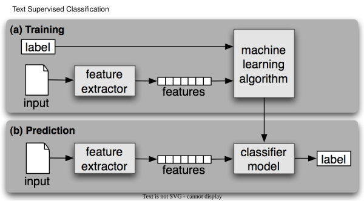

- Detecting patterns is a central part of Natural Language Processing
- Text Supervised Learning (SEE INFOGRAPHIC):
  - During training:
    - A feature extractor is used to convert each input value to a feature set. These feature sets capture the basic information about each input
    - Pairs of feature sets and labels are fed into the machine learning algorithm to generate a model
  - During prediction:
    - The same feature extractor is used to convert unseen inputs to feature sets
    - These feature sets are then fed into the model, which generates predicted labels
- Do not use NLTK in-build classification models (e.g. `nltk.NaiveBayesClassifier`). Use **NLTK + Scikit-learn**
- Choosing the right features:
  - Select relevant features and decide how to encode them
  - If you provide too many features, then the algorithm will have a higher chance of relying on idiosyncrasies of your training data that don't generalize well to new examples
    - This problem is known as **overfitting**
  - Eg. Document Classification (movie review is positive or negative):
    - To limit the number of features that the classifier needs to process, we begin by constructing a list of the 2000 most frequent words in the overall corpus
    - We can then define a feature extractor [2] that simply checks whether each of these words is present in a given document
    - SEE CODE (Document Classification)

```py title='Gender Classification'
import random
from nltk.corpus import names
from sklearn.model_selection import train_test_split
from sklearn.feature_extraction import DictVectorizer
from sklearn.naive_bayes import BernoulliNB
from sklearn.metrics import accuracy_score


# 1. Feature extraction function
def gender_features(name):
    return {
        "suffix1": name[-1].lower(),
        "suffix2": name[-2].lower(),
    }
print(gender_features("Shrek")) # {'suffix1': 'k', 'suffix2': 'e'}

# 2. Load dataset
labeled_names = [(name, "male") for name in names.words("male.txt")] + [
    (name, "female") for name in names.words("female.txt")
]

# Separate features and labels
X = [gender_features(name) for name, gender in labeled_names]
y = [gender for name, gender in labeled_names]

# Convert feature dictionaries to numeric vectors
vectorizer = DictVectorizer(sparse=False)
X_vectorized = vectorizer.fit_transform(X)

# 4. Split into training and testing sets
X_train, X_test, y_train, y_test = train_test_split(
    X_vectorized,
    y,
    test_size=0.2,  # 20% test data
    random_state=42,
    shuffle=True,  # shuffle the data before splitting
    stratify=y,  # maintain the same class distribution in train and test sets
)

# 5. Train classifier
classifier = BernoulliNB()
classifier.fit(X_train, y_train)

# 6. Predict a new name
neo_features = vectorizer.transform([gender_features("Neo")])
prediction = classifier.predict(neo_features)[0]
print("Prediction for 'Neo':", prediction) # Prediction for 'Neo': male

# 7. Evaluate accuracy
y_pred = classifier.predict(X_test)
accuracy = accuracy_score(y_test, y_pred)
print("Accuracy:", accuracy) # Accuracy: 0.789
```

```py title='Document Classification'
from nltk.corpus import movie_reviews

documents = [
    (list(movie_reviews.words(fileid)), category)
    for category in movie_reviews.categories()
    for fileid in movie_reviews.fileids(category)
]
# movie_reviews.categories() # ['neg', 'pos']
# movie_reviews.fileids("pos")[:2] # ['pos/cv000_29590.txt', 'pos/cv001_18431.txt']

all_words = nltk.FreqDist(w.lower() for w in movie_reviews.words())
word_features = list(all_words)[:2000] # returns top high frequency 2000 words

def document_features(document):
    document_words = set(document)
    features = {}
    for word in word_features:
        features["contains({})".format(word)] = word in document_words
    return features

document_features(movie_reviews.words("pos/cv000_29590.txt")) # {'contains(,)': True, 'contains(the)': True, ...}
```

## Part-of-Speech Tagging

- Basic Classification (at word level):
  - Find out what are the most common suffixes (last 1 alphabet, 2 alphabets and 3 alphabets)
  - Define a feature extractor function which checks a given word for these suffixes
  - SEE CODE (Basic - Word level)
- Exploiting Context:
  - Contextual features often provide powerful clues about the correct tag. E.g. The word "run" can be a noun ("go for a run") or a verb ("they run fast")
  - Unlike N-Gram, we use previous **word**
  - SEE CODE (Context - Prev Word)
- Sequence Classification (when samples are related):
  - Joint classifier Model: they are used when there's a relationship/dependencies among the samples
  - Sequence Classifier Model: They are subset of Joint classifier. The current sample is related to the previous samples.
    - In the case of POS tagging, a variety of different **sequence classifier models** can be used to **jointly** choose POS tags for all the words in a given sentence
  - Consecutive classification or greedy sequence classification:
    - Type of sequence classification
    - We find the most likely class label for the first input, then to use that answer to help find the best label for the next input, and so on
    - Like N-Gram, we use previous **POS tag**. We use previous **word** as well
  - Problem: we commit to every decision that we make. E.x, if we label a word as noun, but later find that it should have been verb, there's no way to go back and fix our mistake
  - Solution #1:
    - Use Transformational Strategy - for example Brill Tagger
    - This is one of Joint Classifier Model
    - Create an initial assignment of labels for the inputs, and then iteratively refine that assignment in an attempt to repair inconsistencies between related inputs
  - Solution #2:
    - Use **Hidden Markov Model**
    - Assign scores to all of the possible sequences of POS tags, and to choose the sequence whose overall score is highest
    - Like Consecutive classifiers, these models look at both the inputs and the history of predicted tags
    - However, rather than simply finding the single best tag for a given word, they generate a probability distribution over tags
    - These probabilities are then combined to calculate probability scores for tag sequences, and the tag sequence with the highest probability is chosen
    - Problem: number of possible tag sequences is quite large. Given a tag set with 30 tags, there are $30^10$ ways to label a 10-word sentence
    - Solution: Instead of look at long sequence, just look back to 2-3 words & its tags

```py title='Basic - Word level'
from nltk.corpus import brown

suffix_fdist = nltk.FreqDist()
for word in brown.words():
    word = word.lower()
    suffix_fdist[word[-1:]] += 1
    suffix_fdist[word[-2:]] += 1
    suffix_fdist[word[-3:]] += 1

common_suffixes = [suffix for (suffix, _) in suffix_fdist.most_common(100)]
print(common_suffixes)  # ['e', ',', '.', 's', 'd', 't', 'he', 'n' ...]

def pos_features(word):
    features = {}
    for suffix in common_suffixes:
        features["endswith({})".format(suffix)] = word.lower().endswith(suffix)
    return features
```

```py title='Context - Prev Word'
def pos_features(sentence, i):
    features = {
        "suffix(1)": sentence[i][-1:],
        "suffix(2)": sentence[i][-2:],
        "suffix(3)": sentence[i][-3:],
    }
    if i == 0:
        features["prev-word"] = "<START>"
    else:
        features["prev-word"] = sentence[i - 1]
    return features

pos_features(brown.sents()[0], 8) # {'suffix(1)': 'n', 'suffix(2)': 'on', 'suffix(3)': 'ion', 'prev-word': 'an'}
```

```py title='Sequence Classification'
# `history` - provides a list of the tags that we've predicted for the sentence so far
def pos_features(sentence, i, history):
    features = {
        "suffix(1)": sentence[i][-1:],
        "suffix(2)": sentence[i][-2:],
        "suffix(3)": sentence[i][-3:],
    }
    if i == 0:
        features["prev-word"] = "<START>"
        features["prev-tag"] = "<START>"
    else:
        features["prev-word"] = sentence[i - 1]
        features["prev-tag"] = history[i - 1]
    return features
```

## Recognizing Textual Entailment (RTE)

- RTE involves determining the logical relationship between 2 pieces of text:
  - Premise: **Source** of information
  - Hypothesis: **Claim** being tested
- In other word, it is a task of determining whether a given piece of text (premise) **entails** another text (hypothesis)
- Entailment: Hypothesis is true based on the context of premise
  - E.x. #1: 'She is the mother' entails 'she has at least one child'
  - E.x. #2: 'Sky is dark and cloudy' does not entails 'it is raining'
- We treat RTE as a classification task, in which we try to predict the True/False label for each pair
- The degree of success (high accuracy) involve a combination of **parsing, semantics and real world knowledge**
- Basic feature extractor:
  - First filter out all stopwords; and secondly get all named entities (NER)
  - features:
    - `features['word_overlap']`: number of words overlap between premise and hypothesis
    - `features['word_hyp_extra']`: number of words in the hypothesis but not in the text
    - `features['ne_overlap']`: number of Named Entity overlap
    - `features['ne_hyp_extra']`: umber of Named Entity in the hypothesis but not in the text

## Evaluation Metrics

- Accuracy: simplest metrics. it measures the percentage of inputs in the test set that the classifier correctly labeled
  - E.g: a name gender classifier that predicts the correct name 60 times in a test set containing 80 names would have an accuracy of $60/80 = 75%$
- Precision and Recall:
  - Problem of Accuracy: This metric is misleading when we have to measure **negative labels**
    - E.g Search task, such as information retrieval, where we are attempting to find documents that are relevant to a particular task
    - Since number of irrelevant documents far outweighs number of relevant ones, the accuracy score for a model that labels every document as irrelevant would be close to 100%
  - Model's result can be categorized in 4 set:
    1. **True positives**: items that we **correctly** labelled as **relevant**
    2. **True negatives**: items that we **correctly** labelled as **irrelevant**
    3. **False positives (Type I errors)**: items that we **incorrectly** labelled as **relevant**
    4. **False negatives (Type II errors)**: items that we **incorrectly** labelled as **irrelevant**
  - Precision: Focus on the inference relevant data. Indicates how many of the items that we identified were relevant. Equation: $TP/(TP+FP)$
  - Recall: Focus on the test relevant data. Indicates how many of the relevant items that we identified. Equation: $TP/(TP+FN)$
  - F-Measure (F-Score): Defined to be the harmonic mean of the precision and recall. Equation: $(2 × Precision × Recall) / (Precision + Recall)$
- Confusion Matrices:
  - Useful when performing classification tasks with three or more labels
  - It is a table where each cell $[i,j]$ indicates how often label $j$ was predicted when the correct label was $i$
    - This means, the diagonal entries (e.g. `[0,0], [1,1], [2,2] ...`) indicate labels that were correctly predicted

# Common Models

- Decision Tree
