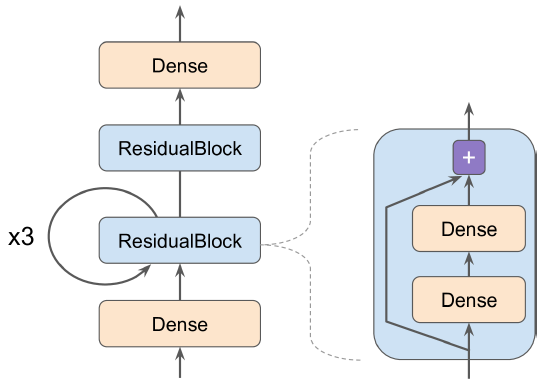

## TODO examples (REMOVE LATER)

- https://www.tensorflow.org/hub/tutorials
- https://github.com/tensorflow/models/
- https://github.com/jtoy/awesome-tensorflow

## TensorFlow

- TensorFlow is a library for heavy numerical computation. Its well suited and fine-tuned for Machine Learning
- Core modules:
  - `tf.keras`: implementing keras api
  - `tf.data`, `tf.io`: data loading and preprocessing
  - `tf.image`: image processing
  - `tf.nn`, `tf.rnn`, `tf.train`: low-level deep learning api
  - `tf.sparse`: contains operations for sparse tensors (`tf.SparseTensor` data structure)
- Many TensorFlow operations have multiple implementations, called **kernels**:
  - Each kernel is dedicated to a specific device type, such as CPUs, GPUs, or TPUs (Tensor Processing Units)
  - GPUs speed up computations by splitting computations into many smaller chunks and running them in parallel across many GPU threads
  - TPUs are even faster
- A tensor is a multidimensional array (exactly like a **NumPy ndarray**), but it can also hold a scalar (a simple value, such as 42)
- Tensor Operation:
  - `t + 10` is equivalent to calling `tf.add(t, 10)`
  - `tf.square(t)`
  - `t @ tf.transpose(t)`: `@` -> matrix multiplication. Equivalent to calling `tf.matmul()`. `<tf.Tensor: shape=(2, 2), dtype=float32, numpy=array(...)>`
  - Many functions & classes have aliases to organize modules properly. E.g. `tf.add()` & `tf.math.add()` are same function
    - Notable Exception: We have `tf.math.log()` but no `tf.log()` alias (as it might be confused with logging)
  - Sometime function names are different for TensorFlow & NumPy. When the name differs, there is often a good reason for it. For e.x.:
    - `tf.transpose(t)` creates a new tensor with its own copy of the transposed data, while `np.T()` is just a transposed view on the same data
    - `tf.reduce_sum()` is named this way because its GPU kernel (GPU implementation) uses a reduce algorithm that does not guarantee the order in which the elements are added
  - Keras’ Low-Level API:
    - Keras API actually has its own low-level API, located in `keras.backend`
    - It includes functions like `square()`, `exp()`. In `tf.keras`, these functions just call the corresponding TensorFlow operations
    - If you want to write code that will be portable to other Keras implementations, you should use these Keras functions
    - `from tensorflow import keras; K = keras.backend; K.square(K.transpose(t)) + 10`
  - NOTE:
    - For better performance, always use a vectorized implementation
    - If you want to benefit from TensorFlow’s graph features, you should use only TensorFlow operations
- Tensor Type Conversions:
  - Type conversions can significantly hurt performance, and they can easily go unnoticed when they are done automatically
  - To avoid this, TensorFlow does not perform any type conversions automatically: it raises exception if you try to execute an operation on tensors with incompatible types
  - `tf.constant(2.) + tf.constant(40)`: raises error
  - `tf.constant(2.) + tf.constant(40., dtype=tf.float64)`: raises error since TensorFlow uses 32-bit by default
  - `tf.cast(t2, tf.float32)`: convert type manually
- Tensor Variables:
  - `tf.constant()` (SmallCase 'c'): as the name suggests, you cannot modify them
  - `tf.Variable` (CapitalCase 'V'): its a data structure (another e.x: `tf.SparseTensor`) which can be modified:
    - In-place modification: use `assign()` (or `assign_add()` or `assign_sub()` which increment or decrement the variable by the given value)
    - Modify individual cells (or slices): use `assign()`, `scatter_update()`, `scatter_nd_update()`. NOTE: direct item assignment will not work

```py title='tensor creation & indexing'
import tensorflow as tf

## CREATE
t = tf.constant(42)  # scalar. <tf.Tensor: shape=(), dtype=int32, numpy=42>. No shape
t = tf.constant([[1.0, 2.0, 3.0], [4.0, 5.0, 6.0]])  # matrix. <tf.Tensor: shape=(2, 3), dtype=float32, numpy=array(...)>

## TENSORS AND NUMPY
# Tensors play nice with NumPy: create tensor from NumPy array, and vice versa, and apply TensorFlow operations to NumPy arrays and vice versa
a = np.array([2.0, 4.0, 5.0])
t = tf.constant(a)  # <tf.Tensor: shape=(3,), dtype=float64, numpy=array([2., 4., 5.])>
t.numpy()  # or np.array(t). # array([2., 4., 5.])
tf.square(a)  # <tf.Tensor: shape=(3,), dtype=float64, numpy=array([ 4., 16., 25.])>
np.square(t)  # array([ 4., 16., 25.])
# NOTE:
# NumPy uses 64-bit precision by default, while TensorFlow uses 32-bit (reason: more than enough for NN, plus it runs faster and uses less RAM)
# When creating a tensor from a NumPy array, make sure to set dtype=tf.float32

## LIKE ndarray, tensor HAS A SHAPE AND A DATA TYPE
t.shape # TensorShape([2, 3])
t.dtype # tf.float32

## INDEXING: works much like in NumPy
t[:, 1:] # <tf.Tensor: shape=(2, 2), dtype=float32, numpy=array(...)>
t[:, 1] or t[..., 1] # column 1. <tf.Tensor: shape=(2,), dtype=float32, numpy=array([2., 5.], dtype=float32)>
t[..., 1, tf.newaxis] # newaxis adds a new dimension at the end of the shape of the tensor. <tf.Tensor: shape=(2, 1), dtype=float32, numpy=array([[2.],[5.]], dtype=float32)>
```

```py title='tensor variable'
v = tf.Variable([[1.0, 2.0, 3.0], [4.0, 5.0, 6.0]]) # <tf.Variable 'Variable:0' shape=(2, 3) dtype=float32, numpy=array(...)>
v.assign(2 * v) # => [[2., 4., 6.], [8., 10., 12.]]
v[0, 1].assign(42) # => [[2., 42., 6.], [8., 10., 12.]]
v[:, 2].assign([0., 1.]) # => [[2., 42., 0.], [8., 10., 1.]]
v.scatter_nd_update(indices=[[0, 0], [1, 2]], updates=[100., 200.]) # => [[100., 42., 0.], [8., 10., 200.]]
```

## Saving and Loading Models That Contain Custom Components

- When saving, Keras just saves the name of the custom function. It does not even save the arguments/hyperparameter of the custom function
- When loading, you need to provide a dictionary that maps the function name to the actual function
- NOTE: the function name is the function referenced/returned and not the name of the function that created it (REFER CODE 'custom huber func')
- Use subclass & implement `get_config()` for model to save the arguments/hyperparameter (REFER CODE 'custom huber subclass')

## Custom Loss Functions

- MSE (mean squared error) disadvantage: MSE might penalize large errors too much, so your model will end up being imprecise
- MAE (mean absolute error) disadvantage: MAE would not penalize outliers as much, & training might take a while to converge & the trained model might not be very precise

```py title='custom huber func'
# For each batch during training, Keras will call the huber_fn() to compute the loss, and use it to perform a Gradient Descent step
# Also, Keras will keep track of the total loss since the beginning of the epoch, and it will display the mean loss
def create_huber(threshold=1.0):
  def huber_fn(y_true, y_pred): # NOTE: In tf.keras, we already have keras.losses.Huber
    error = y_true - y_pred
    is_small_error = tf.abs(error) < threshold
    squared_loss = tf.square(error) / 2
    linear_loss = threshold * tf.abs(error) - threshold**2 / 2
    return tf.where(is_small_error, squared_loss, linear_loss) # return a tensor containing one loss per instance
  return huber_fn

model.compile(loss=create_huber(2.0), optimizer="nadam") # create_huber() returns huber_fn reference
model.fit(X_train, y_train, [...])

# LOADING MODEL
model = keras.models.load_model("my_model_with_a_custom_loss_threshold_2.h5", custom_objects={"huber_fn": create_huber(2.0)})
```

```py title='custom huber subclass'
from tensorflow import keras
class HuberLoss(keras.losses.Loss):
    def __init__(self, threshold=1.0, **kwargs):
        # kwargs handles the name and reduction parameters of the base Loss class
        # reduction algorithm specifies how to aggregate the individual instance losses across the batch
        # default is 'auto' which means 'sum_over_batch_size' (total loss divided by batch size)
        # other options include 'sum' (total loss) and 'none' (no reduction, return individual losses)
        self.threshold = threshold
        super().__init__(**kwargs)

    def call(self, y_true, y_pred):
        # takes labels and predictions, computes all the instance losses (per batch), and returns them
        error = y_true - y_pred
        is_small_error = tf.abs(error) < self.threshold
        squared_loss = tf.square(error) / 2
        linear_loss = self.threshold * tf.abs(error) - self.threshold**2 / 2
        return tf.where(is_small_error, squared_loss, linear_loss)

    def get_config(self):
        # returns a dictionary mapping each hyperparameter name to its value
        base_config = super().get_config()
        return {**base_config, "threshold": self.threshold}

model.compile(loss=HuberLoss(2.), optimizer="nadam")

# LOADING MODEL
model = keras.models.load_model("my_model_with_a_custom_loss_class.h5", custom_objects={"HuberLoss": HuberLoss})
# When saving, Keras calls the loss instance’s get_config() and saves the config as JSON in the HDF5 file
# When loading, Keras calls from_config() (implemented by base class (Loss)) and just creates an instance of the class, passing **config to the constructor
```

## Custom Activation Functions, Initializers, Regularizers, & Constraints

- Activation functions: e.x. `keras.activations.softplus` equivalent to `tf.nn.softplus`
- Initializer: e.x. `keras.initializers.glorot_normal`
- Regularizer: e.x.: `keras.regularizers.l1(0.01)`
- Constraint: e.x: ensure weights are all positive - `keras.constraints.nonneg()` or `tf.nn.relu`

```py title='custom activation & kernel'
def my_softplus(z): # return value is just tf.nn.softplus(z)
  return tf.math.log(tf.exp(z) + 1.0)

def my_glorot_initializer(shape, dtype=tf.float32):
  stddev = tf.sqrt(2. / (shape[0] + shape[1]))
  return tf.random.normal(shape, stddev=stddev, dtype=dtype)

def my_l1_regularizer(weights):
  return tf.reduce_sum(tf.abs(0.01 * weights))

def my_positive_weights(weights): # return value is just tf.nn.relu(weights)
  return tf.where(weights < 0., tf.zeros_like(weights), weights)

layer = keras.layers.Dense(
    30,
    activation=my_softplus,
    kernel_initializer=my_glorot_initializer,
    kernel_regularizer=my_l1_regularizer,
    kernel_constraint=my_positive_weights,
)
# Activation function will be applied to the output of this Dense layer, and its result will be passed on to the next layer
# The layer’s weights will be initialized using the value returned by the initializer
# At each training step regularization function will compute the regularization loss, which will be added to the main loss to get the final loss used for training
# Finally, constraint function will be called after each training step, and the layer’s weights will be replaced by the constrained weights
```

```py title='custom regularizer subclass'
# If a function has some hyperparameters that need to be saved along with the model, then subclass the appropriate class, such as:
# keras.regularizers.Regularizer, keras.constraints.Constraint, keras.initializers.Initializer or keras.layers.Layer (for any layer, including activation functions)
# NOTE: implement call() for losses, layers (including activation functions) and models, or __call__() for regularizers, initializers & constraints

# we do not need to call the parent constructor or get_config(), as they are not defined by the parent class
class MyL1Regularizer(keras.regularizers.Regularizer):
    def __init__(self, factor):
        self.factor = factor

    def __call__(self, weights):
        return tf.reduce_sum(tf.abs(self.factor * weights))

    def get_config(self):
        return {"factor": self.factor}
```

## Custom Metrics

- **losses** are used by Gradient Descent to train a model; In contrast, **metrics** are used to evaluate a model
  - For each batch during training, Keras will compute both loss & metric and keep track of its mean (by default) since the beginning of the epoch
  - Using huber as metric: `model.compile(loss="mse", optimizer="nadam", metrics=[create_huber(2.0)])`
  - Using huber as loss: `model.compile(loss=create_huber(2.0), optimizer="nadam")`
- Keeping track of mean (since the beginning of the epoch) is not always favorable:
  - Consider binary classifier’s precision - precision is number of true positives divided by number of total positive predictions (true positives + false positives)
  - First batch: model made 5 positive predictions, 4 of which were correct; that’s 80% precision
  - Second batch (w.r.t first batch, number of instances are different): model made 3 positive predictions, none are correct; that's 0% precision
  - Mean is 40%; but it is not the model’s precision over these two batches. Overall precision is 50% ($\frac{4+0}{5+3}$), not 40%
  - Conclusion: we need is an object that can keep track of number of true positives and number of false positives, and compute their ratio when requested
    - This is precisely what `keras.metrics.Precision` class does (REFER CODE 'precision')
    - This is called **streaming metric** (or **stateful metric**), as it is gradually updated, batch after batch
- To create a streaming metric, write a subclass of the `keras.metrics.Metric` class
- Conclusion from the code 'precision' & 'custom metric subclass':
  - When you define a metric using a simple function, Keras automatically calls it for each batch, and it keeps track of the mean during each epoch, just like we did manually
  - Only benefit of our HuberMetric class is that the threshold will be saved
  - But of course, some metrics, like precision, cannot simply be averaged over batches: in those cases, there’s no other option than to implement a streaming metric

```py title='precision'
precision = keras.metrics.Precision()

# FIRST BATCH: passing labels and predictions (note that we could also have passed sample weights - weight assigned directly to the sample depending on their importance/origin)
precision([0, 1, 1, 1, 0, 1, 0, 1], [1, 1, 0, 1, 0, 1, 0, 1]) # <tf.Tensor: shape=(), dtype=float32, numpy=0.8>
# SECOND BATCH: it returns 50% which is the overall precision so far, not the second batch’s precision
# This is called a streaming metric (or stateful metric), as it is gradually updated, batch after batch
precision([0, 1, 0, 0, 1, 0, 1, 1], [1, 0, 1, 1, 0, 0, 0, 0]) # <tf.Tensor: shape=(), dtype=float32, numpy=0.5>

# GET THE CURRENT VALUE OF THE METRIC
precision.result() # <tf.Tensor: shape=(), dtype=float32, numpy=0.5>

# TRACK NUMBER OF TRUE AND FALSE POSITIVES
precision.variables
# [<tf.Variable 'true_positives:0' shape=(1,) dtype=float32, numpy=array([4.], dtype=float32)>,
#  <tf.Variable 'false_positives:0' shape=(1,) dtype=float32, numpy=array([4.], dtype=float32)>]

# RESET THESE VARIABLES: both variables get reset to 0.0
precision.reset_state()
precision.variables
# [<tf.Variable 'true_positives:0' shape=(1,) dtype=float32, numpy=array([0.], dtype=float32)>,
#  <tf.Variable 'false_positives:0' shape=(1,) dtype=float32, numpy=array([0.], dtype=float32)>]
```

```py title='custom metric subclass'
# This example keeps track of total Huber loss and number of instances seen so far
# When asked for the result, it returns the ratio, which is simply the mean Huber loss
class HuberMetric(keras.metrics.Metric):
    def __init__(self, threshold=1.0, **kwargs):
        super().__init__(**kwargs)  # handles base args (e.g., dtype)
        self.threshold = threshold
        self.huber_fn = create_huber(threshold)
        self.total = self.add_weight("total", initializer="zeros")
        # add_weight() is not same as Layer.add_weight() - it does not create a trainable variable, but rather a 'stateful' variable that is updated during metric calculation
        # add_weight() basically calls self.add_variable(). Instead, you could have used tf.Variable() directly, but add_weight() is the recommended way
        # Keras will take care of variable persistence seamlessly, no action is required
        # add_weight() keeps track of the variable across batches and epochs
        self.count = self.add_weight("count", initializer="zeros")

    def update_state(self, y_true, y_pred, sample_weight=None):
        # This is called when you use an instance of this class as a function (as we did with the Precision object)
        # It updates the variables given the labels and predictions for one batch (and sample weights, but in this case we just ignore them)
        # sample_weight: weight assigned directly to the sample depending on their importance/origin. In this case we just ignore them
        metric = self.huber_fn(y_true, y_pred)
        self.total.assign_add(tf.reduce_sum(metric))
        self.count.assign_add(tf.cast(tf.size(y_true), tf.float32))

    def result(self):
        # This computes and returns the final result, in this case just the mean Huber metric over all instances
        # When you use the metric as a function, update_state() gets called first, then the result() is called, and its output is returned
        return self.total / self.count

    def get_config(self):
        # This ensures the threshold gets saved along with the model
        base_config = super().get_config()
        return {**base_config, "threshold": self.threshold}

    def reset_states(self):
        # The default implementation of the reset_states() method just resets all variables to 0.0 (but you can override it if needed)
        pass
```

## Custom Layers

- Usage E.x: if the model is sequence of layers A, B, C, A, B, C, A, B, C, then define a custom layer D containing layers A, B, C, and your model would then simply be D, D, D
- Layer with no weight:
  - E.x.: `keras.layers.Flatten`, `keras.layers.ReLU`
  - Custom layer without weights: simplest option is to wrap a function in a `keras.layers.Lambda` layer - `exponential_layer = keras.layers.Lambda(lambda x: tf.exp(x))`
    - The exponential layer is sometimes used in the output layer of a regression model when the values to predict have very different scales (e.g., 0.001, 10., 1000.)
    - Exponential can also be used as an activation function: `activation=tf.exp` or `activation=keras.activations.exponential` or `activation="exponential"`
- **Stateful Layer**: A layer with weights

```py title='custom dense layer'
# This class implements a simplified version of the Dense layer
class MyDense(keras.layers.Layer):
    def __init__(self, units, activation=None, **kwargs):
        # constructor takes all the hyperparameters as arguments (in this example: units and activation)
        # kwargs: this takes care of standard arguments such as input_shape, trainable, name, and so on
        super().__init__(**kwargs)
        self.units = units
        self.activation = keras.activations.get(activation)
        # get() converts the activation argument to the appropriate activation function
        # get() accepts functions, standard strings like "relu" or "selu", or simply None

    def build(self, batch_input_shape):
        # This function role is to create the layer’s variables, by calling the add_weight()
        # batch_input_shape: this is the shape of the input data, including the batch size. It is passed to build() by Keras when it first calls the layer on some input data
        # we need to know the number of neurons in the previous layer in order to create the connection weights matrix (i.e., the "kernel")
        self.kernel = self.add_weight(name="kernel", shape=[batch_input_shape[-1], self.units], initializer="glorot_normal")
        self.bias = self.add_weight(name="bias", shape=[self.units], initializer="zeros")
        super().build(batch_input_shape)  # NOTE: must be at the end. this tells Keras that the layer is built (it just sets self.built = True)

    def call(self, X):
        # This function actually performs the desired operations
        # In this case, we compute matrix multiplication of inputs X and layer’s kernel, add bias vector
        # apply activation function to the result, and this gives us the output of the layer
        return self.activation(X @ self.kernel + self.bias)

    def compute_output_shape(self, batch_input_shape):
        # This simply returns the shape of this layer’s outputs
        # In this case, it is the same shape as the inputs, except the last dimension is replaced with the number of neurons in the layer
        # Note: in tf.keras, shapes are instances of the tf.TensorShape class, which you can convert to Python lists using as_list()
        return tf.TensorShape(batch_input_shape.as_list()[:-1] + [self.units])

    def get_config(self):
        base_config = super().get_config()
        return {
            **base_config,
            "units": self.units,
            "activation": keras.activations.serialize(self.activation)  # we save the activation function’s full configuration
        }
```

```py title='multiple input & multiple output'
# E.x. of layer taking multiple inputs - Concatenate()
# This class layer takes two inputs and returns three output
class MyMultiLayer(keras.layers.Layer):
  def call(self, X):
    # X: a tuple containing all the inputs
    # Since this layer returns 3 output - this function should return the list of outputs
    X1, X2 = X
    return [X1 + X2, X1 * X2, X1 / X2]

  def compute_output_shape(self, batch_input_shape):
    # batch_input_shape: a tuple containing each input’s batch shape
    # Since this layer returns 3 output - should return the list of batch output shapes (one per output)
    b1, b2 = batch_input_shape
    return [b1, b1, b1] # should probably handle broadcasting rules
```

```py title='different behavior for training & testing'
# If your layer needs to have a different behavior during training and during testing (e.g., if it uses Dropout or BatchNormalization layers)
class MyLayer(keras.layers.Layer):
  ...
  def call(self, X, training=None):
    # add a train ing argument to the call() method and use this argument to decide what to do
    if training:
      pass
    else:
      pass
```

## Custom Models

- subclass the `keras.models.Model`, create layers and variables in the constructor, and implement `call()` to do whatever you want the model to do
- The `Model` class is actually a subclass of the `Layer` class, so models can be defined and used exactly like layers:
  - But a model also has some extra functionalities - compile(), fit(), evaluate() and predict() methods
  - DO NOT define every layer as a model since its cleaner to distinguish the internal components of your model (layers or reusable blocks of layers) from the model itself



```py title='custom model example'
# Here we are implementing the above image custom model
# If you want to save-load model, you must implement the get_config() method (as we did earlier) in both the ResidualBlock class and the ResidualRegressor class
# Alternatively, you can just save and load the weights using the save_weights() and load_weights() methods
class ResidualBlock(keras.layers.Layer):
    def __init__(self, n_layers, n_neurons, **kwargs):
        # Likewise Model, We create the layers in the constructor, and use them in the call() method
        super().__init__(**kwargs)
        self.hidden = [
            keras.layers.Dense(
                n_neurons, activation="elu", kernel_initializer="he_normal"
            )
            for _ in range(n_layers)
        ]

    def call(self, inputs):
        Z = inputs
        for layer in self.hidden:
            Z = layer(Z)
        return inputs + Z

class ResidualRegressor(keras.models.Model):
    def __init__(self, output_dim, **kwargs):
        # We create the layers in the constructor, and use them in the call() method
        super().__init__(**kwargs)
        self.hidden1 = keras.layers.Dense(
            30, activation="elu", kernel_initializer="he_normal"
        )
        self.block1 = ResidualBlock(2, 30)
        self.block2 = ResidualBlock(2, 30)
        self.out = keras.layers.Dense(output_dim)

    def call(self, inputs):
        Z = self.hidden1(inputs)
        for _ in range(1 + 3):
            Z = self.block1(Z)
        Z = self.block2(Z)
        return self.out(Z)
```

## Losses and Metrics Based on Model Internals

- Normally, custom losses and metrics are based on the labels and the predictions (and optionally sample weights)
- Custom Loss based on model internal:
  - You will occasionally want to define losses based on other parts of your model, such as the weights or activations of its hidden layers
  - This may be useful for regularization purposes, or to monitor some internal aspect of your model
  - To define a custom loss based on model internals, just compute it based on any part of the model you want, then pass the result to the `add_loss()`
  - Rule of thumb for custom loss based on model internals:
    - Since this custom loss is normally used for regularization purpose, use it only in training inside `call(self, X, training=None)`
    - Scale down the reconstruction loss, to ensure the main loss dominates. e.g. `self.add_loss(0.05 * recon_loss)`
- Custom metric based on model internals:
  - Create metric object (e.g. `keras.metrics.Mean()`) in constructor, then call it in `call()`, passing it the metric value, and finally add it to model by calling `add_metric()`

## Computing Gradients Using Autodiff

- Consider example: $f(w_1, w_2) = 3w_1^2 + 2w_1w_2$
  - Partial derivative of this function with regards to $w_1$ is $6w_1 + 2w_2$
  - Partial derivative of this function with regards to $w_2$ is $2w_1$
  - At the point $(w_1,w_2) = (5,3)$, these partial derivatives are equal to 36 & 10, respectively, so the gradient vector at this point is (36, 10)
  - Problem: NN has tens of thousands of parameters, and finding the partial derivatives analytically by hand would be an almost impossible task
  - Solution #1: compute approximation of each partial derivative by measuring how much the function’s output changes when you tweak the corresponding parameter
    - `w1, w2 = 5, 3`
    - `eps = 1e-6`
    - `(f(w1 + eps, w2) - f(w1, w2)) / eps`; o/p => 36.000003007075065
    - `(f(w1, w2 + eps) - f(w1, w2)) / eps`; o/p => 10.000000003174137
    - Problem with Solution #1 is that we have to call `f()` for every parameter
  - Solution #2:
    - Use **autodiff**: this automatically calls `f()` for every parameter
    - TensorFlow makes this pretty simple by using `tf.GradientTape` context which automatically record every operation that involves a variable

```py title='Gradient Tape'
def f(w1, w2):
    return 3 * w1**2 + 2 * w1 * w2

w1, w2 = tf.Variable(5.0), tf.Variable(3.0)
with tf.GradientTape() as tape:
    # this context that will automatically record every operation that involves a variable
    # NOTE: put the strict minimum inside the tf.GradientTape() block, to save memory
    z = f(w1, w2)

gradients = tape.gradient(z, [w1, w2])  # computes the gradients of the result 'z' with regards to both variables [w1, w2]
# gradients => [<tf.Tensor: shape=(), dtype=float32, numpy=36.0>,  <tf.Tensor: shape=(), dtype=float32, numpy=10.0>]

# The tape is automatically erased immediately after you call its gradient() method
# You will get an exception if you try to call gradient() twice
tape.gradient(z, w1)  # RuntimeError: A non-persistent GradientTape can only be used to compute one set of gradients
```

```py title='Persistent Gradient Tape'
# If you need to call gradient() more than once, you must make the tape persistent, and delete it when you are done with it to free resources
with tf.GradientTape(persistent=True) as tape:
    z = f(w1, w2)

dz_dw1 = tape.gradient(z, w1)  # <tf.Tensor: shape=(), dtype=float32, numpy=36.0>
dz_dw2 = tape.gradient(z, w2)  # <tf.Tensor: shape=(), dtype=float32, numpy=10.0>
del tape
```

```py title='Watch Tensor Gradient Tape'
# By default, the tape will only track operations involving variables
# If you try to compute the gradient of z with regards to anything else than a variable, the result will be None
c1, c2 = tf.constant(5.), tf.constant(3.)
with tf.GradientTape() as tape:
  z = f(c1, c2)
gradients = tape.gradient(z, [c1, c2]) # returns [None, None]

# However, you can force the tape to watch any tensors you like, to record every operation that involves them
# You can then compute gradients with regards to these tensors, as if they were variables
with tf.GradientTape() as tape:
  tape.watch(c1)
  tape.watch(c2)
  z = f(c1, c2)
gradients = tape.gradient(z, [c1, c2]) # returns [tensor 36., tensor 10.]
```

```py title='second order partial derivatives'
# Jacobians: first order partial derivatives
# Hessians: second order partial derivatives
with tf.GradientTape(persistent=True) as hessian_tape:
  with tf.GradientTape() as jacobian_tape:
    z = f(w1, w2)
  jacobians = jacobian_tape.gradient(z, [w1, w2])
hessians = [hessian_tape.gradient(jacobian, [w1, w2]) for jacobian in jacobians]
del hessian_tape
# hessians
# return dz_dw1_dw1, dz_dw1_dw2, dz_dw2_dw1, dz_dw2_dw2
# returns [tensor 6., tensor 2., tensor 2., None]
```

## Custom Training Loops

- Usage: `fit()` only accepts one optimizer. We need custom training loop when we want to use multiple optimizer for different path/layer

```py title='simple custom training loop'
# This training loop does not handle layers that behave differently during training and testing (e.g., BatchNormalization or Dropout)
# To handle these, you need to call the model with training=True and make sure it propagates this to every layer that needs it

# Step 1: Build a simple model. No need to compile it, since we will handle the training loop manually
l2_reg = keras.regularizers.l2(0.05)
model = keras.models.Sequential(
    [
        keras.layers.Dense(30, activation="elu", kernel_initializer="he_normal", kernel_regularizer=l2_reg),
        keras.layers.Dense(1, kernel_regularizer=l2_reg),
    ]
)

# Step 2: Create a tiny function that will randomly sample a batch of instances from the training set
def random_batch(X, y, batch_size=32):
    idx = np.random.randint(len(X), size=batch_size)
    return X[idx], y[idx]

# Step 3: Define a function that will display the training status - step counter, total steps, mean loss since the start of epoch, and other metrics
def print_status_bar(iteration, total, loss, metrics=None):
    metrics = " - ".join([f"{m.name}: {m.result():.4f}" for m in [loss] + (metrics or [])])
    end = "" if iteration < total else "\n"
    print(f"\r{iteration}/{total} - " + metrics, end=end)

# Step 4: Define some hyperparameters, choose the optimizer, the loss function and the metrics
n_epochs = 5
batch_size = 32
n_steps = len(X_train) // batch_size
optimizer = keras.optimizers.Nadam(lr=0.01)
loss_fn = keras.losses.mean_squared_error
mean_loss = keras.metrics.Mean()
metrics = [keras.metrics.MeanAbsoluteError()] # unlike loss, no need for mean metric - MeanAbsoluteError() already takes care of it

# Step 5: Build the custom loop!

# create two nested loops: one for the epochs, the other for the batches within an epoch
for epoch in range(1, n_epochs + 1):
    print(f"Epoch {epoch}/{n_epochs}")
    for step in range(1, n_steps + 1):
        # Sample a random batch from the training set
        X_batch, y_batch = random_batch(X_train_scaled, y_train)

        with tf.GradientTape() as tape:
            y_pred = model(X_batch, training=True)
            # Compute the main loss (the one minimized by the optimizer) and add to it any other loss (e.g. regularization losses) that may be present in the model
            # mean_squared_error() function returns one loss per instance, we compute the mean over the batch using tf.reduce_mean()
            # tf.add_n: Returns the element-wise sum of a list of tensors
            main_loss = tf.reduce_mean(loss_fn(y_batch, y_pred))
            loss = tf.add_n([main_loss] + model.losses)

        # compute the gradient of the loss with regards to each trainable variable (not all variables!)
        gradients = tape.gradient(loss, model.trainable_variables)
        # If you want to apply any other transformation to the gradients, simply do so before calling the apply_gradients()
        # e.x. gradient clipping: gradients = [tf.clip_by_norm(g, 1.0) for g in gradients]
        # If you set the optimizer’s clipnorm or clipvalue hyperparameters, it will take care of this for you - you don't need to do it manually
        optimizer.apply_gradients(zip(gradients, model.trainable_variables))
        # If you add weight constraints to your model (e.g., by setting kernel_constraint or bias_constraint when creating a layer), apply these constraints just after apply_gradients()
        # for variable in model.variables:
        #     if variable.constraint is not None:
        #         variable.assign(variable.constraint(variable))

        # Update the mean loss and the metrics (over the current epoch), and we display the status bar
        mean_loss(loss)
        for metric in metrics:
            metric(y_batch, y_pred)
        print_status_bar(step * batch_size, len(y_train), mean_loss, metrics)

    # At the end of each epoch, we display the status bar again to make it look complete and to print a line feed
    print_status_bar(len(y_train), len(y_train), mean_loss, metrics)

    # Reset the states of the mean loss and the metrics
    for metric in [mean_loss] + metrics:
        metric.reset_states()
```

## TensorFlow Functions and Graphs

- A TensorFlow Computation Graph is a data structure that represents a set of computations as a directed map. In this graph:
  - Nodes represent mathematical operations (like adding numbers or multiplying matrices)
  - Edges represent the data (Tensors) that flow between these operations
- Why Tensorflow generates computation graph:
  - Speed & Optimization: TensorFlow can optimize a graph by removing unnecessary steps or combining operations to make them run faster
  - Parallelism: The graph structure makes it easy for TensorFlow to run independent parts of your computation simultaneously across multiple CPUs or GPUs
- In modern TensorFlow, you don't usually build graphs manually
- Use `tf.function` as function or decorator to automatically convert a regular Python function into a TensorFlow function
  - This TF Function can then be used exactly like the original Python function, and it will return the same result (but as tensors)
  - Under the hood, `tf.function` analyze the computations performed by the original Python function and generated an equivalent computation graph
- Keras automatically converts your custom function (e.g. loss, metric), when used inside a Keras model, into a TF Function - so no need to use `tf.function()`
- TF Function generates a new graph for every unique set of input shapes and data types, and it caches it for subsequent calls
  - If you call `tf_cube(tf.constant(10))`, a graph will be generated for `int32` tensors of shape `[]`
  - Then if you call `tf_cube(tf.constant(20))`, the same graph will be reused
  - But if you then call `tf_cube(tf.constant([10, 20]))`, a new graph will be generated for `int32` tensors of shape `[2]`
  - However, this is only true for tensor arguments: if you pass numerical Python values (`tf_cube(10)`) to a TF Function, a new graph will be generated for every distinct value
- TF Function Rules:
  - Use TensorFlow Ops Only: Use `tf.reduce_sum()` instead of `np.sum()`
  - Beware of Static Randomness: If you use `np.random`, a random value is generated only once. To get a new random number every time the graph runs, use `tf.random`
  - Python Side-Effects are Lost: Code that performs side-effects (like logging or incrementing a Python counter) will only execute once, not every time the function is called
  - Nested Functions: You can call other functions within a TF Function, but they must follow these same rules to be correctly captured in the graph:
    - Note that these other functions do not need to be decorated with `@tf.function`
  - Loop Capturing: use for `i in tf.range(10)` rather than for `i in range(10)`, or else the loop will not be captured in the graph:
    - As always, for performance reasons, you should prefer a vectorized implementation whenever you can, rather than using loops

```py title='tf.function'
@tf.function
def cube(x):
  return x ** 3
# Either decoration or `tf_cube = tf.function(cube)`

tf_cube(2) # <tf.Tensor: shape=(), dtype=int32, numpy=8>
tf_cube(tf.constant(2.0)) # <tf.Tensor: shape=(), dtype=float32, numpy=8.0>
```
