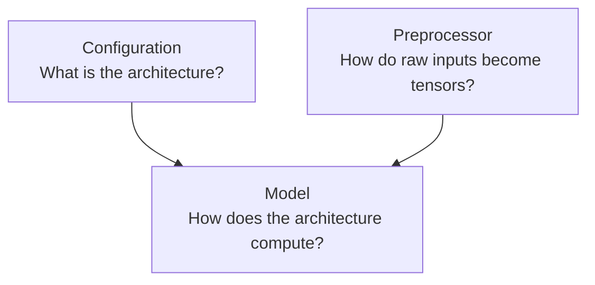
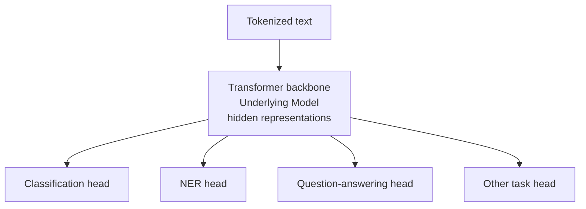
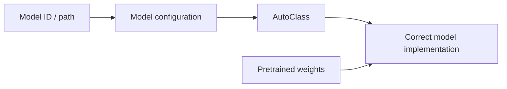
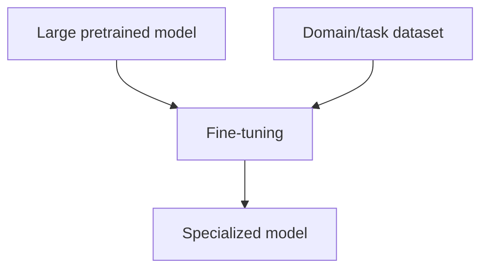
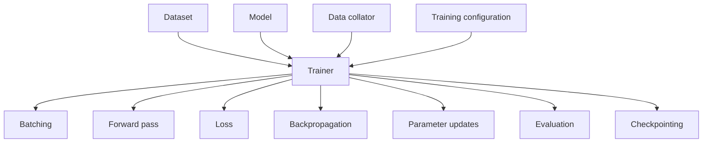
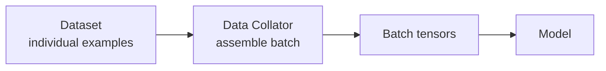

- Hugging Face Transformers:
  - It is a common language for describing, loading, running, training, and sharing **pretrained** model architectures
  - It gives access to pre-trained models (like BERT, GPT, Llama, Qwen) so you do not have to train models from scratch
  - it works seamlessly with major deep learning frameworks like PyTorch, TensorFlow
- Transformer (NN architecture) ≠ Hugging Face Transformers
- The deeper philosophy: separate concerns:
  1. Configuration: "What is this model?"
  2. Preprocessor: "How do I turn real-world input into model input?"
  3. Model: "How does the neural network compute?"
  4. Pipeline / Generate: "How do I use the model?"
  5. Dataset / Collator: "How do I feed training data?"
  6. Trainer: "How do I optimize the model?"

## The big picture

- Imagine you want to use a language model
- Without Transformers, you might need to know:
  - how the original model was implemented
  - how its weights are stored
  - how its tokenizer works
  - what input tensor format it expects
  - how to train it
  - how to generate text
  - how to save and reload it
  - how to move it to a GPU
- Transformers tries to make those details standardized

```mermaid
---
title: The architecture is roughly:
---
flowchart LR
    A["Hugging Face Hub<br/>model + weights + config + tokenizer"]
    B["Transformers"]
    C["Preprocessor"]
    D["Model"]
    E["Training API<br/>Trainer"]
    F["Inference APIs<br/>Pipeline / generate"]
    G["Hardware / frameworks<br/>PyTorch, GPU, TPU, ..."]

    A --> B
    B --> C
    B --> D
    B --> E
    B --> F
    D --> G
    E --> G
    F --> G
```

## The philosophy

- 3 pieces involved in a pretrained model:
  1. configuration
  2. model
  3. preprocessor



## Base Class #1 — Configuration

- Configuration = the model's blueprint
- A configuration answers: "What kind of neural network am I dealing with?"
- Configuration Vs Model Weights:
  - Configuration: number of layers, hidden size, attention structure, context length, activation function
  - Model Weights: millions/billions of learned numbers, attention matrices, feed-forward matrices, embeddings
  - Configuration tells Transformers how the model is constructed, while the weights contain what the model learned
  - Analogy: configuration is like an architectural blueprint; weights are the actual building

## Base Class #2 — Model

- Model = the neural network itself
- The model takes numerical tensors and performs computation
- The underlying model can produce representations, but a useful application generally needs a task-specific head:
  - Representation:
    - When you feed text into it, it translates words into complex mathematical vectors (representations)
    - These numbers capture the deep grammatical rules, context, and meaning of the text
  - Task-Specific Head:
    - It is a small, simple neural network layer attached to the very top of the underlying model
    - Its job is to take those abstract mathematical representations and converts them into a final concrete answer
  - Analogy: student:
    - Underlying model is someone who graduated with a broad, general education, while
    - Task-specific head is the specialized training they get for their exact job title



## Base Class #3 — Preprocessor

- NN does not understand 'Sydney is beautiful.". It understands tensors
- `human/world input -> preprocessing -> numbers (tensors) -> model`
- Preprocessor is the adapter between the real world and the mathematical world of the model
- For text, that is typically a tokenizer
- For images, it might resize/normalize/convert pixels
- For audio, it might convert a waveform into numerical features

## AutoClasses

- Idea:
  - Instead of saying "I know this is specifically a Llama model, so instantiate the Llama implementation."
  - We can conceptually say: "Here is the model identifier. Figure out what architecture it represents."
- Configuration and model metadata provide the information needed to select the appropriate implementation



## Pipeline API: high-level inference machine

- Idea/Philosophy: Don't make the user manually connect every preprocessing and model step for common tasks like classification
- Pipeline is about task-level abstraction

```py title='Pipeline Approach'
from transformers import pipeline

# 1. Load the automatic pipeline for sentiment analysis
classifier = pipeline("sentiment-analysis")

# 2. Pass the text directly
text = "I love learning about AI architecture!"
result = classifier(text)

print(result)
# Output: [{'label': 'POSITIVE', 'score': 0.9998}]
```

```py title='Manual Approach'
import torch # To use tensorflow: `import tensorflow as tf`
from transformers import AutoTokenizer, AutoModelForSequenceClassification
# tensorflow: from transformers import TFAutoModelForSequenceClassification ## Note the "TF" prefix

model_name = "distilbert-base-uncased-finetuned-sst-2-english"

# 1. Load the tokenizer (converts text to numbers)
tokenizer = AutoTokenizer.from_pretrained(model_name)

# 2. Load the model WITH the task-specific classification head
# "ForSequenceClassification" automatically appends the classification head
model = AutoModelForSequenceClassification.from_pretrained(model_name)

text = "I love learning about AI architecture!"

# 3. Step 1: Tokenize the text
inputs = tokenizer(text, return_tensors="pt")
# tensorflow: tokenizer(text, return_tensors="tf") ## tf: TensorFlow; pt: PyTorch

# 4. Step 2: Pass tokens through the model (Underlying Model + Head)
with torch.no_grad():
    outputs = model(**inputs)
# tensorflow: TensorFlow handles gradients automatically. so no context manager

# 5. Step 3: Extract the raw numbers (logits) from the head
# The head outputs raw numbers for [NEGATIVE, POSITIVE]
logits = outputs.logits

# 6. Step 4: Convert raw numbers into probabilities using Softmax
probabilities = torch.nn.functional.softmax(logits, dim=-1)
# tensorflow: tf.nn.softmax(logits, axis=-1)

# 7. Step 5: Get the final label
labels = ["NEGATIVE", "POSITIVE"]
prediction_idx = torch.argmax(probabilities).item()
# tensorflow: tf.math.argmax(probabilities, axis=-1).numpy()[0]
# tensorflow: Added .numpy() to pull the raw values out of the TensorFlow tensor framework

print(f"Label: {labels[prediction_idx]}")
print(f"Confidence: {probabilities[0][prediction_idx].item():.4f}")
# tensorflow: probabilities[0][prediction_idx].numpy()
# Output:
# Label: POSITIVE
# Confidence: 0.9998
```

## Generate API: different inference problem

- Generation is an iterative inference loop. The model predict one token after another and keep going on
- It is fundamentally different from simply asking a classifier for one result
- Generate API:
  - It produces a probability distribution over possible next tokens
  - E.g. "The cat sat on the". `mat → 0.35, floor → 0.25, chair → 0.15, table → 0.08, ...`
  - A generation strategy determines how we turn those probabilities into actual tokens
  - This is where concepts such as followings come into play:
    - greedy decoding
    - sampling
    - temperature
    - top-k
    - top-p
- Mental Model: Model provides probabilities; generation provides policy for turning those probabilities into a sequence

## Training: fundamental loop

- Training is where the model's weights change
- Loop:
  1. Give model data
  2. Model makes prediction
  3. Compare prediction with target
  4. Calculate loss
  5. Calculate gradients
  6. Update weights
  7. Repeat
- Transformers primarily gives you the machinery around the training loop

## Why pretrained models matter so much

- From scratch: `random weights -> train on enormous corpus -> billions of examples -> huge compute bill -> useful model`
- Transformers philosophy: `already-trained model -> your task/domain data -> fine-tuning -> specialized model`
- Starting from pretrained weights reduces computation, time, and cost compared with training from scratch

## Fine-tuning

- Continue training an already-trained model on a smaller, specialized dataset like legal docs, customer support



## Trainer: training abstraction

- Pipeline is the high-level abstraction for inference; Trainer is the corresponding abstraction for training
- Without Trainer, you might manually implement something resembling:
  ```txt title='Manual Approach'
  for epoch:
      for batch:
          move batch to GPU
          outputs = model(batch)
          loss = calculate_loss(outputs)
          loss.backward()
          optimizer.step()
          scheduler.step()
          optimizer.zero_grad()
      evaluate()
      save_checkpoint()
  ```
- Trainer provides a framework around this process:
  - That means you can concentrate more on:
    - What model?
    - What data?
    - What objective?
    - What hyperparameters?
    - What evaluation?
  - and less on:
    - How do I implement the mechanics of distributed training?
    - How do I accumulate gradients?
    - How do I checkpoint?
    - How do I perform evaluation?
    - How do I use mixed precision?



## TrainingArguments: the control panel

- Metal model:
  - Trainer: how training is executed
  - TrainingArguments: how I want training configured
- TrainingArguments:
  - batch size
  - learning rate
  - number of epochs
  - evaluation strategy
  - checkpoint strategy
  - precision
  - logging
  - other training behavior

## Data collator: the missing piece

- Mental Model:
  - Dataset = what you have
  - Collator = how you package it
  - Model = how you process it
- A model usually wants a batch of tensors
- The collator can:
  1. group examples
  2. pad them. Have different length. E.g. "I like cats.", "I really like machine learning.", "Transformers are useful."
  3. create masks
  4. construct labels
  5. prepare tensors


