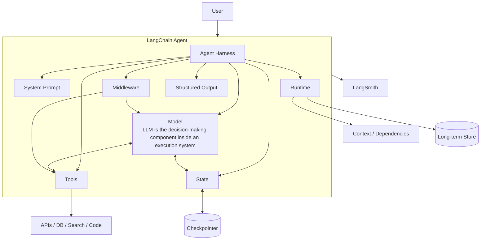
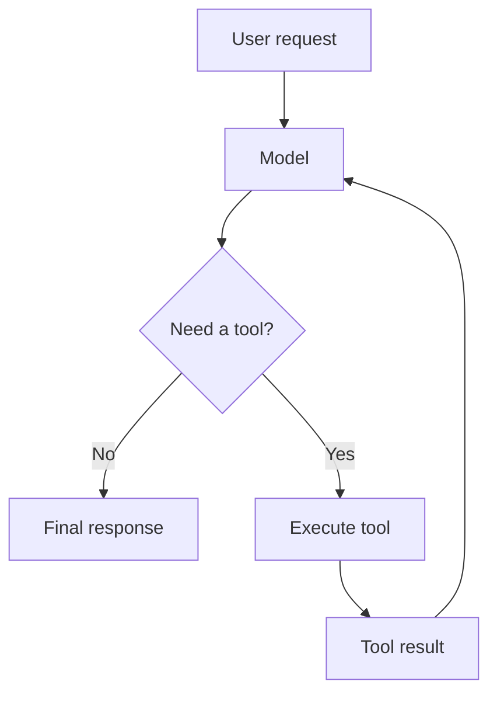
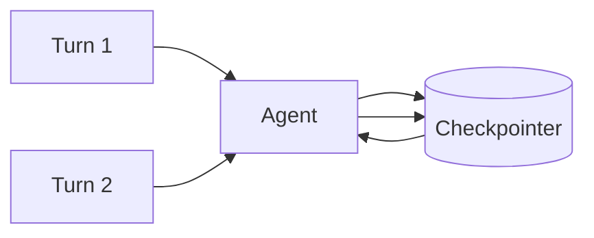
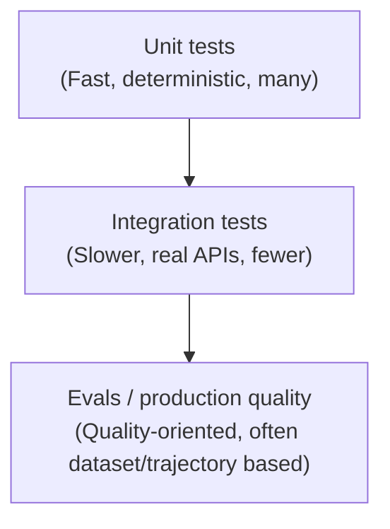
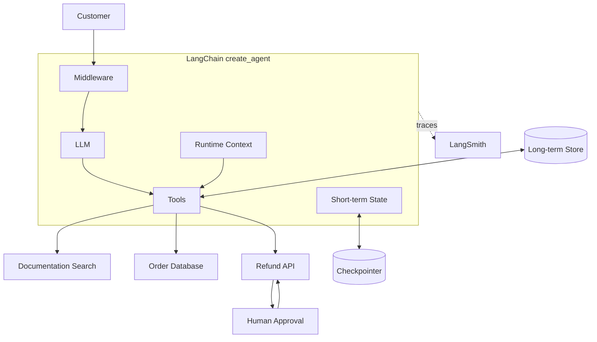

- LangChain is an agent **framework** built around `create_agent`, where an agent = model + harness
- Harness: It is prompt + tools + middleware surrounding the model loop
- LangSmith is used for tracing, debugging, and evaluation (closed-source proprietary software)
- Old Vs Modern:
  - Older flow: `prompt -> chain -> llm -> output parser`
  - Modern API centers around `create_agent`. Agent = LLM + harness (prompt+tools+middleware)
- Overall Mental Model:
  - Imagine you're building an **AI employee**
  - The LLM is the employee's brain
  - But a brain alone can't operate a company. It needs:
    - instructions → system prompt
    - knowledge of the current conversation → messages/state
    - access to company systems → tools
    - a way to produce predictable data → structured output
    - memory between conversations → store
    - rules/security → middleware
    - identity and dependencies → runtime/context
    - persistence → checkpointer
    - supervision → human-in-the-loop
    - monitoring → LangSmith
    - testing → unit tests, integration tests, evals

## CheatSheet

| Term              | Mental model                       | What it does                             |
| ----------------- | ---------------------------------- | ---------------------------------------- |
| Model             | Brain                              | Generates/reasons                        |
| Message           | Conversation event                 | Carries interaction context              |
| Tool              | Hand/API                           | Performs an external action              |
| Agent             | Employee                           | Model + execution harness                |
| Harness           | Operating procedure                | Prompt + tools + middleware              |
| Agent loop        | Think → act → observe              | Repeated model/tool execution            |
| State             | Desk                               | Current conversation/execution data      |
| Checkpointer      | Save game                          | Persists thread state                    |
| Context           | Environment variables/dependencies | Invocation-specific information          |
| Runtime           | Dependency injection container     | Gives tools/middleware execution context |
| Store             | Filing cabinet                     | Long-term memory                         |
| Structured output | Typed API response                 | Predictable application data             |
| Middleware        | Security/checkpoint layer          | Controls execution                       |
| Guardrail         | Policy                             | Prevents bad behavior                    |
| HITL              | Human supervisor                   | Human approval/intervention              |
| Streaming         | Live typing                        | Incremental output                       |
| MCP               | Standard connector                 | Standardized external capabilities       |
| LangGraph         | Workflow engine                    | Low-level orchestration                  |
| Deep Agents       | Full employee toolkit              | Batteries-included agent                 |
| LangSmith         | Flight recorder                    | Trace/debug/Observability                |
| Unit test         | Component test                     | Deterministic isolated testing           |
| Integration test  | System test                        | Real APIs/services                       |
| Eval              | Quality assessment                 | Measures agent behavior                  |



## LangChain vs LangGraph vs Deep Agents

- LangChain (Agent framework):
  - Use when you want: "A customizable agent harness"
  - `create_agent(...)`
  - Complexity: customizable agent
- LangGraph (Orchestration runtime):
  - Use when you need: "Low-level orchestration and explicit workflow topology"
  - Complexity: explicit workflow
- Deep Agents (High-level agent harness):
  - Use when you want: "A batteries-included agent"
  - It adds capabilities such as planning, filesystem access, subagents and memory on top of the LangChain/LangGraph architecture
  - Complexity: batteries included

```txt title='Decision tree'
Simple LLM call?
    ↓
Model

Need tools + agent loop?
    ↓
LangChain create_agent

Need custom deterministic + agentic workflow?
    ↓
LangGraph

Need planning/filesystem/subagents?
    ↓
Deep Agents
```

## Models

- Mental Model: Model = CPU
- LangChain provides a common model interface across providers. I.e. you shouldn't care too much whether the CPU is Intel or AMD
- `from langchain.chat_models import init_chat_model`
- `model = init_chat_model("openai:gpt-5.5")`or `= init_chat_model("anthropic:claude-sonnet-4-6")`
- Execution pattern:
  - `invoke()`: One request → one completed result
    - `response = model.invoke("What is dependency injection?")`
  - `stream()`: Instead of waiting for the entire response. Current behavior of ChatGPT
    - `for chunk in model.stream("Explain dependency injection"):`
  - `batch()`: Useful for processing many independent requests
    - `responses = model.batch(["Explain Python decorators", "Explain Python generators"])`

## Messages

- A model doesn't fundamentally receive "a conversation." It receives **messages**
- Mental Model:
  - Instead of conversation (= "some giant string")
  - we have list of messages: `[system instruction, user request, assistant response, tool call, tool result, assistant response, ...]`
- `from langchain.messages import SystemMessage, HumanMessage ...`
- Types:
  - SystemMessage: e.g. "You are a Python tutor."
    - It defines the agent's general behavior. Tells them how they should behave
  - HumanMessage: e.g. "Explain decorators."
  - AIMessage: e.g. "decorator is ....."
  - `ToolMessage(content="output-of-tool", tool_call_id="same-id-returned-by-llm")`

## Tools

- A tool gives the model an ability to interact with the outside world
- Its a callable function with a well-defined input/output schema that can be passed to a chat model
- A tool description tells model:
  - what the tool does
  - when to use it
  - what arguments it expects
- Manual Approach (Not Preferred): If LLM decides to use a tool, it will pass it in `ai_response.tool_calls`. Each tool call has:
  - `name`: name of the tool
  - `args`: arguments to the tool/function
  - `id`: Unique ID generated by the model. Needed to link the tool response to the tool call
  - Execute the tool and pass the tool output with the llm generated `id` back to the llm
  - This is the essence of an **agent loop**

```py title='tool definition'
from langchain.tools import tool

@tool
def get_weather(city: str) -> str:
    """Get the current weather for a city."""
    return f"It's sunny in {city}"

agent = create_agent(model="openai:gpt-5.5", tools=[get_weather])
```

## Agent Loop

- Agent is an iterative loop
- It repeatedly calls the model and tools until the task is complete
- **Agentic** behavior = **Autonomous** behavior: For e.x. the model might internally decide -
  1. Understand request
  2. Call get_weather("Sydney")
  3. Receive result
  4. Interpret result
  5. Answer user



```py title='Simple Agent'
from langchain.agents import create_agent

agent = create_agent(
    model="openai:gpt-5.5",
    tools=[get_weather],
    system_prompt="You are a helpful assistant.",
)

result = agent.invoke({
    "messages": [
        {
            "role": "user",
            "content": "What's the weather in Sydney?"
        }
    ]
})
```

## Structured output

- LLMs naturally produce free-flow text but applications often needs structured response like JSON
- Use pydantic to define the schema
- LangChain can choose between provider-native structured output and a tool-calling strategy depending on model capabilities
  - Provider-Native Structured Output (The Preferred Way):
    - Some LLM providers (like OpenAI) have built JSON formatting directly into their API engines at the system level
  - Tool-Calling Strategy (The Fallback / Alternative Way):
    - Many open-source or older models do not have a dedicated "JSON mode" API parameter, but they do know how to call functions/tools

```py title='Example'
from pydantic import BaseModel

class Person(BaseModel):
    name: str
    age: int
    occupation: str

agent = create_agent(
    model="openai:gpt-5.5",
    response_format=Person,
)
result = agent.invoke(...)
print(result["structured_response"])
```

## Memory

- Memory Types:
  1. Short-term/State:
     - It is information that belongs to the current execution/conversation
     - E.g. `{"messages": [...], "user_name": "Alice", "cart_total": 125.50}`
     - It is described as **thread-level** state, including messages and custom fields
     - E.g.:
       - User: My name is Alice.
       - Agent: Nice to meet you!
       - User: What's my name?
       - Agent: Your name is Alice.
  2. Long-term/Store
     - It is a persistent information across conversations
     - E.g. `User preference: language=Python; timezone=Sydney; favorite_editor=VS Code`
     - LangChain's runtime exposes a **persistent Store** for long-term memory
     - E.g.
       - Short-term memory: "What did we discuss in THIS conversation?"
       - Long-term memory: "What do we know about this USER across conversations?"
- LangChain uses a **checkpointer** to persist thread-level state



```py title='Thread Id'
# A thread_id identifies the conversation
agent.invoke(
    {"messages": [...]},
    config={
        "configurable": {
            "thread_id": "conversation-123"
        }
    }
)
```

## Middleware

- Middleware makes agents configurable. It let you control what happens inside agent at each step
- E.g. Suppose you want to prevent an agent from making more than 10 model calls
- Suppose you have `User -> Agent -> Model -> Tool -> Model -> Answer`
- You might want to insert `User -> Middleware -> Model -> Middleware -> Tool -> ...`:
  1. logging
  2. security
  3. retry
  4. rate limiting
  5. human approval (send 1000 emails; delete email). User action: approve/reject/modify-request
  6. summarization (when context is full)
  7. model routing (use model depending on task complexity; fallback if a model is not available)
  8. PII protection
     - Personally Identifiable Information protection
     - Refers to the practices, security strategies, and technical systems used to safeguard any data that could be exploited to uniquely identify, contact, or locate a specific individual
- Dynamic Model Selection:
  - Sometimes you don't need the same model for every request. For e.x:
    - Simple question → cheap/fast model
    - Complex reasoning → expensive model
    - Sensitive task → specialized model
  - Middleware can classify complexity and dynamically select appropriate models for the agent
- Dynamic tool selection:
  - Imagine you have 500 tools. Giving all 500 to the model creates a massive tool-selection problem
  - Approach: `User request -> Middleware[Tool selector] -> Relevant tools only -> Main model`
  - This is an example of context engineering
- Hooks:
  1. Node-style hooks: These run at particular points:
     - before_agent
     - before_model
     - after_model
     - after_agent
  2. Wrap-style hooks: These surround an operation:
     - wrap_model_call
     - wrap_tool_call
- LangChain provide various built-in middleware: `from langchain.agents.middleware import ...`

```py title='Custom Middleware'
from langchain.agents.middleware import before_model, after_model

## logging
@after_model
def log_response(state, runtime):
    print("Model responded:", state["messages"][-1])

## guard
@before_model
def check_limit(state, runtime):
    if len(state["messages"]) > 50:
        # stop or modify execution
        ...
```

```py title='Composition'
## We can compose multiple middleware
agent = create_agent(
    model=model,
    tools=tools,
    middleware=[
        logging_middleware,
        pii_middleware,
        retry_middleware,
        human_approval_middleware,
    ],
)
```

## Runtime

- Mental model: Runtime = dependency injection container for an agent execution
- Runtime can provide following data into tools and middleware:
  1. context
  2. store
  3. stream writer
  4. execution information
  5. server information

```py title='Context'
#  Application
#     │ context
#     ▼
#  Agent Runtime
#     ├── Tool A
#     ├── Tool B
#     └── Middleware
from dataclasses import dataclass

@dataclass
class UserContext:
    user_id: str

agent = create_agent(
    model=model,
    tools=[...],
    context_schema=UserContext, # schema
)
agent.invoke(
    {"messages": [...]},
    context=UserContext(user_id="user-123"), # pass value
)
```

## State vs Context vs Store Vs Checkpointer

| Concept      | Lifetime                 | Mental Model | Example                |
| ------------ | ------------------------ | ------------ | ---------------------- |
| State        | Current thread/execution | Current Chat | messages, counters     |
| Context      | Current invocation       | This Request | user ID, DB connection |
| Store        | Across conversations     | Long-term    | user preferences       |
| Checkpointer | Persists thread state    |              | conversation history   |

## Context engineering

- Incorrect Question: "How smart is my model?"
- Correct Question: "Did I give the model the right information, tools and instructions at the right time?"
- E.x.: Imagine a developer asks: "Fix this production bug."
  - ❌ everything (entire database, all source code, all Slack history, all documentation, all tools)
  - ✅ relevant repository, relevant logs, relevant documentation, relevant tools, specific task
- Good Agent: `Task -> Context selection -> Relevant information -> Relevant tools -> Model`

## Multi-agent patterns

- Multi-agent systems coordinate specialized components to tackle complex workflows, especially when a single agent has too many tools and makes poor decisions
- 5 primary patterns:
  1. Subagents:
     - How it works:
       - A central main agent coordinates specialized subagents as if they were standard tools
       - All routing passes strictly back and forth through the main agent
     - Best for:
       - Distributed development and heavy parallelization
       - Because subagents work in isolation, they provide excellent context isolation (less tokens)
     - Tradeoff:
       - It is stateless by design
       - If a user repeats a request, the entire routing flow must happen again
  2. Handoffs:
     - How it works:
       - Agents transfer control to each other dynamically via tool calls
       - Calling a tool updates a state variable, which shifts the active agent, prompt, or toolset
     - Best for:
       - Direct user interaction and repeat requests
       - Because state persists, specialized agent can be called directly — saving routing overhead
     - Tradeoff:
       - It must execute sequentially
       - It cannot research or execute tasks across multiple domains concurrently
  3. Skills:
     - How it works:
       - A single agent stays in full control of the entire conversation
       - It loads specialized prompts and knowledge datasets on-demand as needed
     - Best for: Minimizing total LLM model calls across repetitive user requests
     - Tradeoff:
       - It suffers from context accumulation
       - Once a skill is loaded into the conversation history, it stays there till the final answer is reached
  4. Router:
     - How it works:
       - A dedicated, initial routing step uses LLM to classify the user's input and immediately directs it to one or more specialized agents
       - A final step synthesizes the results into a combined response
     - Best for: Multi-domain tasks that require parallel execution without needing a complex, central orchestrator agent
  5. Custom Workflow:
     - A bespoke execution flow built manually using `LangGraph`
     - This allows to mix deterministic python logic (like if/else statements or loops) directly with agentic behaviors, embedding any of the other four patterns as specific nodes in the graph

## MCP — Model Context Protocol

- MCP standardizes how models/agents interact with external tools and resources
- LangChain supports MCP tools inside `create_agent` through MCP interceptors

## Testing

- Testing agents is fundamentally different since an LLM is nondeterministic
- `❌ assert agent("Explain Python") == "exact string"`
- Testing is divided into 3 categories:
  1. Unit tests:
     - It answer: "Does my agent logic work?"
     - Test **deterministic pieces** of your agent without calling a real LLM
     - `GenericFakeChatModel`: for unit test
     - Agent Flow: `Model -> call weather() -> Model -> Answer`
     - Test Flow: `Fake Model -> predictable tool call -> weather() -> Fake model -> predictable answer`
     - Testing memory: use `InMemorySaver` as a checkpointer
       - This allows you to test stateful behavior without setting up a production database
  2. Integration tests:
     - It answer: "Does the whole thing actually work with real services?"
     - It make actual network calls to verify that components work together, credentials and schemas are correct, and latency is acceptable
     - These tests are: slower, more expensive, less deterministic. But much closer to production reality
  3. Evals (Evaluators):
     - This is where AI testing becomes fundamentally different
     - An eval evaluates agent behavior like:
       - Was the answer correct?
       - Was the trajectory reasonable?
       - Did it follow policy?
     - It assess **execution trajectories** either through deterministic matching or an LLM judge
     - Why trajectory important:
       - Agent testing should sometimes evaluate the path, not just the destination
       - Trajectory: `User -> Model -> Tool A ->  Model -> Tool B -> Model -> Final answer`
       - Testing only "final answer" can miss serious problems
       - For e.x.:
         - Final answer: "Your payment was successful." (it looks fine)
         - But the actual trajectory could be: `Model -> called wrong customer API -> modified wrong account -> final answer`



```py title='Unit Test'
from langchain_core.language_models.fake_chat_models import GenericFakeChatModel

model = GenericFakeChatModel(
    messages=iter([
        AIMessage(
            content="",
            tool_calls=[
                {
                    "name": "get_weather",
                    "args": {"city": "Sydney"},
                    "id": "call_1",
                }
            ],
        ),
        "It's sunny in Sydney.", # test controls exactly what the model says
    ])
)
```

```py title='Unit Testing Memory'
agent = create_agent(model=model, tools=[], checkpointer=InMemorySaver())

# Turn 1
# "I live in Sydney"
#       ↓
# checkpoint


# Turn 2
# "What timezone am I in?"
#       ↓
# agent reads checkpoint
```

## Example

- Imagine we are building a customer-support agent. Requirements:
  - answer customer questions
  - search documentation
  - inspect orders
  - issue refunds
  - remember conversation
  - require human approval for refunds
  - return structured ticket information
  - log everything
  - test without spending API money



```py title='Implement skeleton'
# Includes: Tools, Context, Agent Loop
# Missing: Middleware, Checkpointer, Long-term store, Structured output, Streaming, Human approval, Multi-agent, Observability, Evaluations
from dataclasses import dataclass

from langchain.agents import create_agent
from langchain.tools import tool

@dataclass
class UserContext:
    user_id: str

@tool
def search_docs(query: str) -> str:
    """Search the product documentation."""
    ...

@tool
def get_order(order_id: str) -> str:
    """Retrieve an order by ID."""
    ...

@tool
def issue_refund(order_id: str, amount: float) -> str:
    """Issue a refund for an order."""
    ...

agent = create_agent(
    model="openai:gpt-5.5",
    tools=[search_docs, get_order, issue_refund],
    system_prompt="""
    You are a customer support agent.

    Search documentation when appropriate.
    Verify orders before issuing refunds.
    Never invent order information.
    """,
    context_schema=UserContext,
)
result = agent.invoke(
    {
        "messages": [
            {
                "role": "user",
                "content": "Where is my order?"
            }
        ]
    },
    context=UserContext(user_id="customer-123"),
)
```
