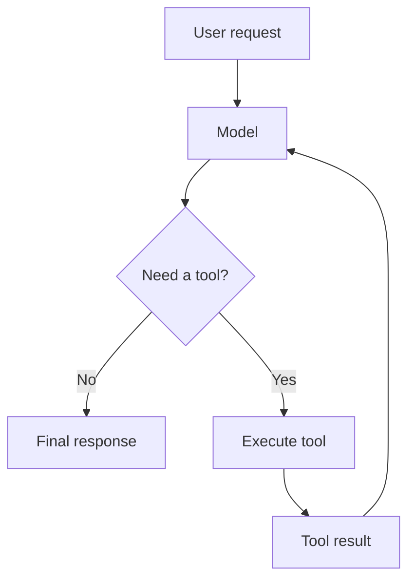
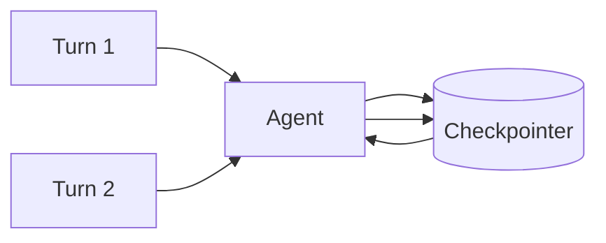

- LangChain is an agent framework built around `create_agent`, where an agent = model + harness
- Harness: It is prompt + tools + middleware surrounding the model loop
- LangSmith is used for tracing, debugging, and evaluation (closed-source proprietary software)
- Old Vs Modern:
  - Older flow: `prompt -> chain -> llm -> output parser`
  - Modern API centers around `create_agent`. Agent = LLM + harness (prompt+tools+middleware)
- Overall Mental Model:
  - Imagine you're building an **AI employee**
  - The LLM is the employee's brain
  - But a brain alone can't operate a company. It needs:
    - instructions → system prompt
    - knowledge of the current conversation → messages/state
    - access to company systems → tools
    - a way to produce predictable data → structured output
    - memory between conversations → store
    - rules/security → middleware
    - identity and dependencies → runtime/context
    - persistence → checkpointer
    - supervision → human-in-the-loop
    - monitoring → LangSmith
    - testing → unit tests, integration tests, evals

## Models

- Mental Model: Model = CPU
- LangChain provides a common model interface across providers. I.e. you shouldn't care too much whether the CPU is Intel or AMD
- `from langchain.chat_models import init_chat_model`
- `model = init_chat_model("openai:gpt-5.5")`or `= init_chat_model("anthropic:claude-sonnet-4-6")`
- Execution pattern:
  - `invoke()`: One request → one completed result
    - `response = model.invoke("What is dependency injection?")`
  - `stream()`: Instead of waiting for the entire response. Current behavior of ChatGPT
    - `for chunk in model.stream("Explain dependency injection"):`
  - `batch()`: Useful for processing many independent requests
    - `responses = model.batch(["Explain Python decorators", "Explain Python generators"])`

## Messages

- A model doesn't fundamentally receive "a conversation." It receives **messages**
- Mental Model:
  - Instead of conversation (= "some giant string")
  - we have list of messages: `[system instruction, user request, assistant response, tool call, tool result, assistant response, ...]`
- `from langchain.messages import SystemMessage, HumanMessage ...`
- Types:
  - SystemMessage: e.g. "You are a Python tutor."
    - It defines the agent's general behavior. Tells them how they should behave
  - HumanMessage: e.g. "Explain decorators."
  - AIMessage: e.g. "decorator is ....."
  - `ToolMessage(content="output-of-tool", tool_call_id="same-id-returned-by-llm")`

## Tools

- A tool gives the model an ability to interact with the outside world
- Its a callable function with a well-defined input/output schema that can be passed to a chat model
- A tool description tells model:
  - what the tool does
  - when to use it
  - what arguments it expects
- Manual Approach (Not Preferred): If LLM decides to use a tool, it will pass it in `ai_response.tool_calls`. Each tool call has:
  - `name`: name of the tool
  - `args`: arguments to the tool/function
  - `id`: Unique ID generated by the model. Needed to link the tool response to the tool call
  - Execute the tool and pass the tool output with the llm generated `id` back to the llm
  - This is the essence of an **agent loop**

```py title='tool definition'
from langchain.tools import tool

@tool
def get_weather(city: str) -> str:
    """Get the current weather for a city."""
    return f"It's sunny in {city}"

agent = create_agent(model="openai:gpt-5.5", tools=[get_weather])
```

## Agent Loop

- Agent is an iterative loop
- It repeatedly calls the model and tools until the task is complete
- **Agentic** behavior = **Autonomous** behavior: For e.x. the model might internally decide -
  1. Understand request
  2. Call get_weather("Sydney")
  3. Receive result
  4. Interpret result
  5. Answer user



```py title='Simple Agent'
from langchain.agents import create_agent

agent = create_agent(
    model="openai:gpt-5.5",
    tools=[get_weather],
    system_prompt="You are a helpful assistant.",
)

result = agent.invoke({
    "messages": [
        {
            "role": "user",
            "content": "What's the weather in Sydney?"
        }
    ]
})
```

## Structured output

- LLMs naturally produce free-flow text but applications often needs structured response like JSON
- Use pydantic to define the schema
- LangChain can choose between provider-native structured output and a tool-calling strategy depending on model capabilities
  - Provider-Native Structured Output (The Preferred Way):
    - Some LLM providers (like OpenAI) have built JSON formatting directly into their API engines at the system level
  - Tool-Calling Strategy (The Fallback / Alternative Way):
    - Many open-source or older models do not have a dedicated "JSON mode" API parameter, but they do know how to call functions/tools

```py title='Example'
from pydantic import BaseModel

class Person(BaseModel):
    name: str
    age: int
    occupation: str

agent = create_agent(
    model="openai:gpt-5.5",
    response_format=Person,
)
result = agent.invoke(...)
print(result["structured_response"])
```

## Memory

- Memory Types:
  1. Short-term/State:
     - It is information that belongs to the current execution/conversation
     - E.g. `{"messages": [...], "user_name": "Alice", "cart_total": 125.50}`
     - It is described as **thread-level** state, including messages and custom fields
     - E.g.:
       - User: My name is Alice.
       - Agent: Nice to meet you!
       - User: What's my name?
       - Agent: Your name is Alice.
  2. Long-term/Store
     - It is a persistent information across conversations
     - E.g. `User preference: language=Python; timezone=Sydney; favorite_editor=VS Code`
     - LangChain's runtime exposes a **persistent Store** for long-term memory
     - E.g.
       - Short-term memory: "What did we discuss in THIS conversation?"
       - Long-term memory: "What do we know about this USER across conversations?"
- LangChain uses a **checkpointer** to persist thread-level state



```py title='Thread Id'
# A thread_id identifies the conversation
agent.invoke(
    {"messages": [...]},
    config={
        "configurable": {
            "thread_id": "conversation-123"
        }
    }
)
```

## Middleware

- Middleware makes agents configurable. It let you control what happens inside agent at each step
- E.g. Suppose you want to prevent an agent from making more than 10 model calls
- Suppose you have `User -> Agent -> Model -> Tool -> Model -> Answer`
- You might want to insert `User -> Middleware -> Model -> Middleware -> Tool -> ...`:
  1. logging
  2. security
  3. retry
  4. rate limiting
  5. human approval (send 1000 emails; delete email). User action: approve/reject/modify-request
  6. summarization (when context is full)
  7. model routing (use model depending on task complexity; fallback if a model is not available)
  8. PII protection
     - Personally Identifiable Information protection
     - Refers to the practices, security strategies, and technical systems used to safeguard any data that could be exploited to uniquely identify, contact, or locate a specific individual
- Dynamic Model Selection:
  - Sometimes you don't need the same model for every request. For e.x:
    - Simple question → cheap/fast model
    - Complex reasoning → expensive model
    - Sensitive task → specialized model
  - Middleware can classify complexity and dynamically select appropriate models for the agent
- Dynamic tool selection:
  - Imagine you have 500 tools. Giving all 500 to the model creates a massive tool-selection problem
  - Approach: `User request -> Middleware[Tool selector] -> Relevant tools only -> Main model`
  - This is an example of context engineering
- Hooks:
  1. Node-style hooks: These run at particular points:
     - before_agent
     - before_model
     - after_model
     - after_agent
  2. Wrap-style hooks: These surround an operation:
     - wrap_model_call
     - wrap_tool_call
- LangChain provide various built-in middleware: `from langchain.agents.middleware import ...`

```py title='Custom Middleware'
from langchain.agents.middleware import before_model, after_model

## logging
@after_model
def log_response(state, runtime):
    print("Model responded:", state["messages"][-1])

## guard
@before_model
def check_limit(state, runtime):
    if len(state["messages"]) > 50:
        # stop or modify execution
        ...
```

```py title='Composition'
## We can compose multiple middleware
agent = create_agent(
    model=model,
    tools=tools,
    middleware=[
        logging_middleware,
        pii_middleware,
        retry_middleware,
        human_approval_middleware,
    ],
)
```

## Runtime

- Mental model: Runtime = dependency injection container for an agent execution
- Runtime can provide following data into tools and middleware:
  1. context
  2. store
  3. stream writer
  4. execution information
  5. server information

```py title='Context'
#  Application
#     │ context
#     ▼
#  Agent Runtime
#     ├── Tool A
#     ├── Tool B
#     └── Middleware
from dataclasses import dataclass

@dataclass
class UserContext:
    user_id: str

agent = create_agent(
    model=model,
    tools=[...],
    context_schema=UserContext, # schema
)
agent.invoke(
    {"messages": [...]},
    context=UserContext(user_id="user-123"), # pass value
)
```

## State vs Context vs Store Vs Checkpointer

| Concept      | Lifetime                 | Mental Model | Example                |
| ------------ | ------------------------ | ------------ | ---------------------- |
| State        | Current thread/execution | Current Chat | messages, counters     |
| Context      | Current invocation       | This Request | user ID, DB connection |
| Store        | Across conversations     | Long-term    | user preferences       |
| Checkpointer | Persists thread state    |              | conversation history   |

## Context engineering

- Incorrect Question: "How smart is my model?"
- Correct Question: "Did I give the model the right information, tools and instructions at the right time?"
- E.x.: Imagine a developer asks: "Fix this production bug."
  - ❌ everything (entire database, all source code, all Slack history, all documentation, all tools)
  - ✅ relevant repository, relevant logs, relevant documentation, relevant tools, specific task
- Good Agent: `Task -> Context selection -> Relevant information -> Relevant tools -> Model`

## Multi-agent patterns

TODO: https://docs.langchain.com/oss/python/langchain/multi-agent#subagents-2

## MCP — Model Context Protocol
