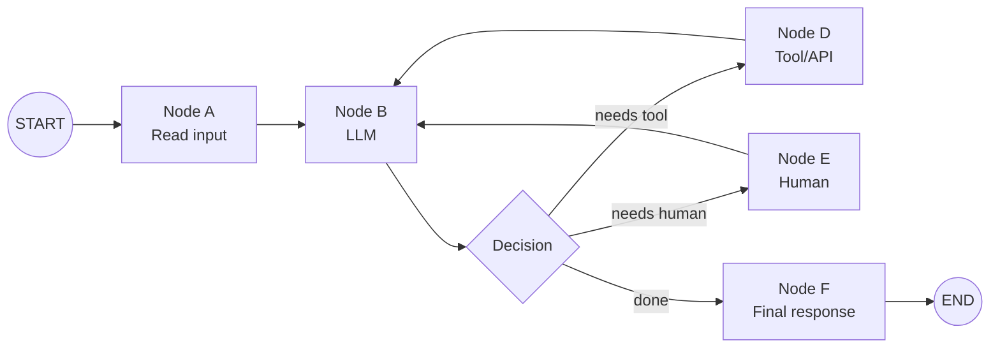

- LangGraph is a low-level orchestration runtime for building long-running, stateful workflows and agents
- Its not an LLM framework. It doesn't decide your prompts, agent architecture, or business logic for you
- It gives you primitives for controlling execution, state, persistence, branching, looping, streaming, interruption, recovery, and composition
- LangGraph separates "what work should happen" from "how execution survives reality."
- LangGraph itself does not require LangChain, although LangChain components are commonly used for models and tools

# Mental model

- 4 fundamental concepts: State, Nodes, Edges & Runtime/Execution
- Graph describes control flow, while state carries information through that flow
- Think of a LangGraph application as a railway system:
  1. State = the cargo/train manifest
  2. Node = a station where work happens
  3. Edge = track connecting stations
  4. Conditional edge = a junction
  5. LLM = a worker at a station who can make decisions
  6. Tool = an external service the worker can call
  7. Checkpointer = a black box recorder
  8. Checkpoint = a photograph of the train at a particular point
  9. Thread = one journey
  10. Interrupt = station master says "pause until human decides"
  11. Store = warehouse shared between different journeys
  12. Subgraph = another railway system embedded inside this one



```py title='Minimal Structure'
from langgraph.graph import StateGraph, MessagesState, START, END

def mock_llm(state: MessagesState):
    return {
        "messages": [{"role": "ai", "content": "hello world"}]
    }

graph = StateGraph(MessagesState)

graph.add_node("mock_llm", mock_llm)

graph.add_edge(START, "mock_llm")
graph.add_edge("mock_llm", END)

graph = graph.compile()

result = graph.invoke({
    "messages": [
        {"role": "user", "content": "hi!"}
    ]
})
print(result)
```

## State
