- LangGraph is a low-level orchestration runtime for building long-running, stateful workflows and agents
- Its not an LLM framework. It doesn't decide your prompts, agent architecture, or business logic for you
- It gives you primitives for controlling execution, state, persistence, branching, looping, streaming, interruption, recovery, and composition
- LangGraph separates "what work should happen" from "how execution survives reality."
- LangGraph is a durable state machine whose nodes happen to be very good places to call LLMs
- LangGraph itself does not require LangChain, although LangChain components are commonly used for models and tools

## Mental model

- 4 fundamental concepts: State, Nodes, Edges & Runtime/Execution
- Graph describes control flow, while state carries information through that flow
- Think of a LangGraph application as a railway system:
  1. State = the cargo/train manifest
  2. Node = a station where work happens
  3. Edge = track connecting stations
  4. Conditional edge = a junction
  5. LLM = a worker at a station who can make decisions
  6. Tool = an external service the worker can call
  7. Checkpointer = a black box recorder
  8. Checkpoint = a photograph of the train at a particular point
  9. Thread = one journey
  10. Interrupt = station master says "pause until human decides"
  11. Store = warehouse shared between different journeys
  12. Subgraph = another railway system embedded inside this one

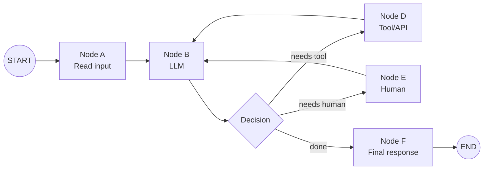

```py title='Minimal Structure'
from langgraph.graph import StateGraph, MessagesState, START, END

def mock_llm(state: MessagesState):
    return {
        "messages": [{"role": "ai", "content": "hello world"}]
    }

graph = StateGraph(MessagesState)

graph.add_node("mock_llm", mock_llm)

graph.add_edge(START, "mock_llm")
graph.add_edge("mock_llm", END)

graph = graph.compile()

result = graph.invoke({
    "messages": [
        {"role": "user", "content": "hi!"}
    ]
})
print(result)
```

## Thinking in LangGraph

- Process to design a graph:
  1. Start with the business process
  2. Break it into discrete steps
  3. Decide what each step needs
  4. Design state
  5. Implement nodes
  6. Connect nodes

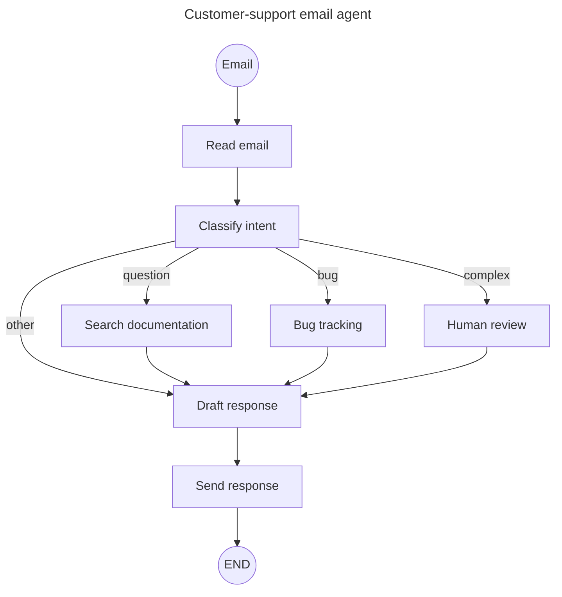

## Complete Architecture

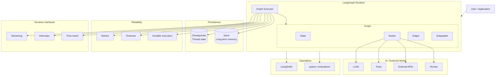

## State

- State is the shared data structure that flows through the graph
- Mental Model: Instead of every worker verbally telling every other worker everything, they all share a notebook
- Each node reads what it needs and writes its results

```py title='Example'
# RECOMMENDED: store raw data in state and format prompts when needed

class State(TypedDict):
    email_content: str
    classification: dict
    search_results: list[str]
    customer_history: dict
    draft_response: str

# This information may be needed differently by different nodes:
# Raw state
#    │
#    ├── classification prompt
#    ├── search query
#    ├── human review UI
#    └── final response prompt
```

## Nodes

- Node = A Python function that performs one logical unit of work
- Flow of Node: `read State -> does work -> returns State updates`
- Every node becomes a natural boundary for:
  - observability
  - retries
  - checkpointing
  - streaming
  - testing
  - error handling
- Trade-off: smaller nodes generally provide more granular recovery and observability, at the cost of more graph structure

```py title='Example'
def classify_email(state):
    result = llm.invoke(...)
    return {
        "classification": result
    }
```

## Edges

- Edge says: "After this node finishes, what happens next?"
- This makes LangGraph fundamentally a state machine / directed graph

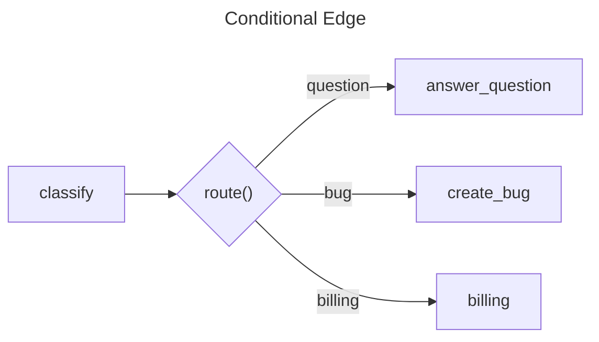

```py title='Example'
# Simple Edge
builder.add_edge("retrieve", "generate")
# Means: retrieve → generate

# Conditional Edge
builder.add_conditional_edges(
    "classify",
    route
)
```

## Compile & Invoke

- Flow: `Build graph -> Compile it -> Invoke it`
- Flow when invoked: `START -> node -> node -> ... -> END -> result`

```py title='Structure'
builder = StateGraph(State) # Initialize
# nodes + edge # Graph definition
graph = builder.compile() # Compile
graph.invoke(...) # Execute graph
# await graph.ainvoke(...) # Async version
## Mental Model: The builder is the blueprint. The compiled graph is the running machine
```

# Functional API (AVOID IT)

- LangGraph provide 2 coding style: Graph API & Functional API
- Mental Model:
  - Graph API: "Let me draw the graph"
  - Functional API: "Let me write normal Python and mark durable tasks."
- Conceptual difference:
  - Graph API: explicit graph topology
  - Functional API: ordinary Python control flow
- Both use LangGraph's runtime machinery i.e. context & state

```py title='Example'
from langgraph.func import entrypoint, task

@task
def call_llm(messages):
    return model.invoke(messages)

@task
def call_tool(tool_call):
    return tool.invoke(tool_call)

@entrypoint()
def agent(messages):
    response = call_llm(messages).result()
    while response.tool_calls:
        results = [
            call_tool(tool_call)
            for tool_call in response.tool_calls
        ]

        tool_results = [
            result.result()
            for result in results
        ]

        messages = add_messages(
            messages,
            [response, *tool_results]
        )

        response = call_llm(messages).result()

    return response
```

## Workflows vs agents

- Workflow:
  - Workflow has a predetermined structure
  - E.x. `Input -> Extract -> Classify -> Search -> Generate -> Review -> Send`
  - You know roughly what happens before execution begins
- Agent:
  - Agent has dynamic control flow
  - E.x. `User -> LLM -> "What should I do?" (use a tool or answer) -> LLM -> decide again`
- Mental Model:
  - workflow = GPS with a predefined route
  - agent = A driver who knows the destination but chooses roads dynamically
- LangGraph supports both

## Workflow patterns

1. Prompt Chaining:
   - Useful when each step depends on the previous step.
   - `LLM 1(Plan) -> LLM 2(Build) -> LLM 3(Test)`
2. Parallelization:
   - Independent tasks execute simultaneously
   - Mental model: Three engineers independently review the same document, then one manager combines their findings
3. Routing:
   - Mental Model: A switch based on state/LLM output
   - `Customer Request -> Classify[Router] -> Refund Workflow | Billing Workflow | Technical workflow`
4. Orchestrator-worker:
   - This pattern becomes important for dynamic workloads
   - Mental model: `Manager → dynamically assigns tasks → employees → manager aggregates results`
   - E.g: User ask: "Write a comprehensive report about LangGraph"
     - Orchestrator: "divide the report in following sections: Architecture, Streaming, Production, Testing"
     - Orchestrator then dynamically create workers for each section
     - Once every worker is done, orchestrator synthesize all info
5. Evaluator-optimizer:
   - Useful when quality can be evaluated but the first attempt may not be sufficient
   - `Generate -> Evaluate --[good]--> Finish; --[bad]--> generate again`

## Agent Loop

- Key difference from a fixed workflow: The LLM participates in deciding the next action

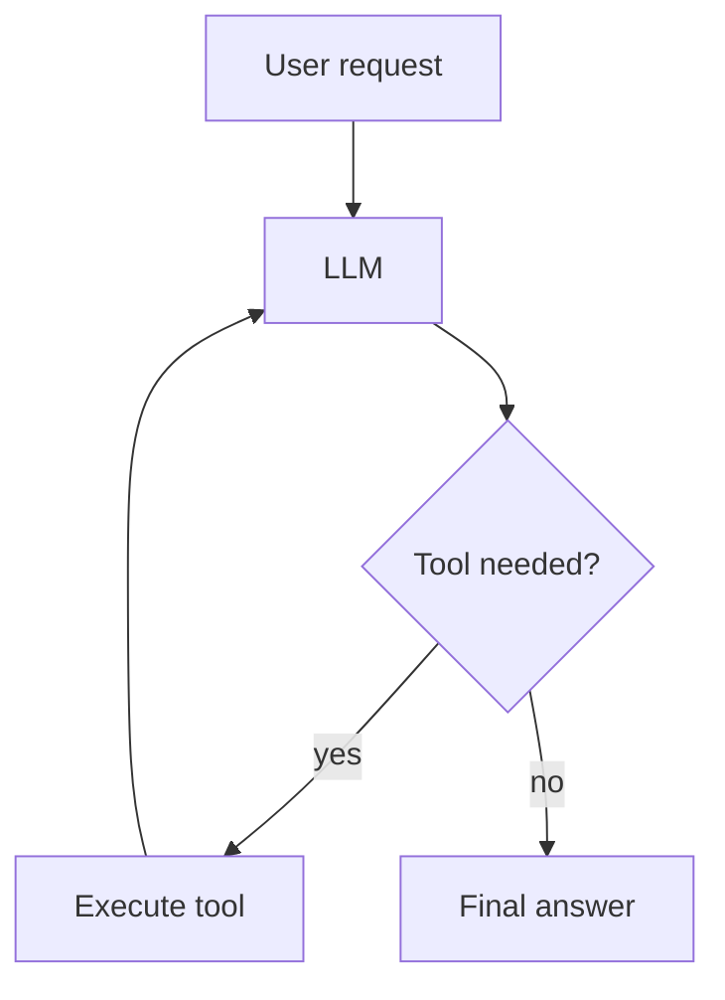

## Persistence

- Without persistence: `Run -> state exists in memory -> process dies -> state disappears`
- With persistence: `Run -> Node -> Checkpoint -> Node -> Checkpoint -> Node -> Checkpoint`
- Persistence system saves graph state as checkpoints, organized into threads
- It enables:
  - memory
  - human-in-the-loop
  - time travel
  - fault tolerance

## Threads

- Thread represents a persistent execution history
- Mental Model: thread is one ongoing journey/conversation/work item
- E.g. `thread_id = "customer-123"`
- Checkpointer uses thread_id to locate the corresponding state history

## Checkpoints

- Checkpoint is a snapshot of graph state at a particular execution point

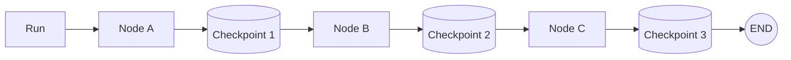

## Checkpointer

- Checkpointer is the persistence mechanism responsible for saving/loading checkpoints
- Mental model: Checkpointer = database-backed save game system. `Save game -> play tomorrow`

## Persistence vs state

- State: "What information does the graph currently have?"
- Persistence: "Where is that state saved so we can recover it later?"
- Checkpointer: "The component responsible for saving/restoring thread state."

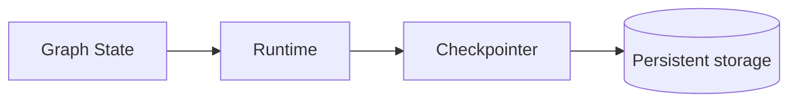

## Durable execution

- Persistence gives Durable Execution
- E.x: Suppose `Node A → Node B → Node C → Node D`
  - Node A/B/C have completed
  - Node D fails because an external API is temporarily unavailable
  - Durable runtime can resume based on persisted execution state rather than blindly starting the entire workflow again
- Usage:
  - long-running task
  - human approval
  - asynchronous jobs
  - multi-step automation

## Fault tolerance

- LangGraph provides several mechanisms for handling failures, including:
  - retries
  - timeouts
  - error handlers
  - checkpoint recovery
  - interruption/resumption
- NOTE: Failure itself is part of the workflow design
- Treat errors according to their nature rather than simply catching everything:
- | Failure               | Example                | Strategy         |
  | --------------------- | ---------------------- | ---------------- |
  | Transient (temporary) | network timeout        | Retry            |
  | LLM-recoverable       | malformed tool result  | Loop back to LLM |
  | User-fixable          | missing account number | Interrupt        |
  | Unexpected            | programming bug        | Raise            |

```py title='Retry'
# Suppose: Search API occasionally returns HTTP 503

from langgraph.types import RetryPolicy
builder.add_node(
    "search",
    search,
    retry_policy=RetryPolicy(max_attempts=3, initial_interval=1)
)
```

## Idempotency

- An operation is idempotent if executing it multiple times produces the exact same result as executing it a single time
- Durable execution creates an important engineering requirement: "Make side effects safe to retry"
- Design Node's operations to be idempotent when possible
- | Technique           | Where it Lives                        | Primary Purpose                                             | Real-world Analogy                                                                        |
  | ------------------- | ------------------------------------- | ----------------------------------------------------------- | ----------------------------------------------------------------------------------------- |
  | Idempotency Key     | API Gateway / Web Tier                | Protects the server network boundary from client retries.   | A ticket office checking if they've already seen your specific receipt number.            |
  | Transaction ID      | Core Domain / Business Layer          | Uniquely identifies a single business event across systems. | Your unique booking or order reference number.                                            |
  | Transactional State | Distributed Workflows / Orchestration | Manages irreversible third-party mutations safely.          | Checking a flight status registry before trying to print a second physical boarding pass. |
  | Upsert              | Database Storage Tier                 | Guarantees data structural integrity without duplication.   | Overwriting a whiteboard entry rather than writing a new line.                            |
  | Deduplication       | Message Queue / Consumer              | Drops identical messages during asynchronous processing.    | Throwing away junk mail addressed to you that you already read.                           |

## Stores

- Checkpointer answers: "What happened in this thread?"
- Store answers: "What information should be available across multiple threads?"
- Store uses namespaces
  - Store API supports namespaced key-value items and semantic search
  - Mental Model: Store namespace = folder/database partition
  - Semantic search is useful for long-term memories that can't conveniently be retrieved using exact keys
  - `User message -> Embedding -> Semantic Store Search -> Relevant memories -> LLM`

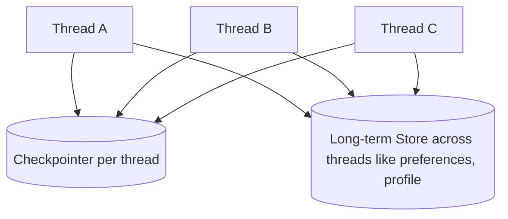

```py title='namespace'
namespace = (user_id, "memories") # a tuple (user-id, category)

store.put(
    namespace,
    "favorite_food", # key
    {"food": "pizza"} # value
)

memories = store.search(namespace) # return items stored in 'namespace' variable
store.get(namespace, "favorite_food") # return value
store.search(namespace, query="What food does this person enjoy?") # support semantic search
```

## Memory

- LangGraph's memory model has two main levels:
  1. Short-term memory:
     - Thread-scoped
     - Implemented through graph state + checkpointer
  2. Long-term memory:
     - Cross-thread
     - Implemented through stores
     - E.x: preferences, facts, learned information, history

## Interrupts

- `interrupt()` is a dynamic pause mechanism that can occur anywhere in graph code and resume using `Command`
- `interrupt()` turns a running program into a durable "waiting state"
- Why `thread_id` matters for interrupts:
  - `config = { "configurable": { "thread_id": "123" }}`
  - When you resume, thread_id tells LangGraph: "Load the execution I was previously running."
  - `thread_id` as effectively a persistent cursor into the checkpoint history
  - `thread_id = 123 -> checkpoint history -> paused node -> resume`

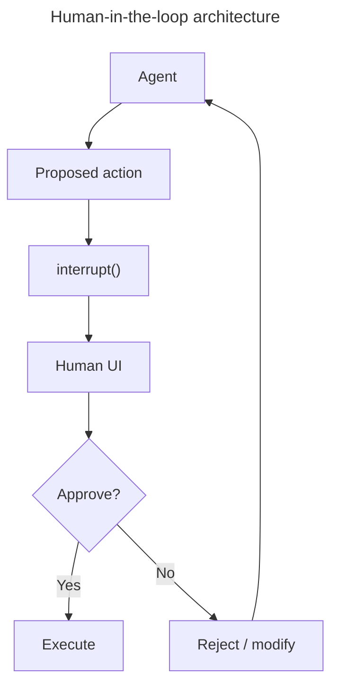

```py title='Example'
from langgraph.types import interrupt

def approval_node(state: State):
    # Pause and ask for approval
    approved = interrupt("Do you approve this action?")

    # When you resume, Command(resume=...) returns that value here
    return {"approved": approved}
```

## Streaming

- Without streaming: `request ---[wait]---> answer`
- With streaming: `request -> token -> token -> token -> ... -> complete`
- LangGraph supports streaming through APIs: `graph.stream(...)`, `graph.astream(...)`
- LangGraph exposes graph execution through stream modes such as:
  1. updates: Useful when you want: "Node X just changed state."
  2. values: Useful when you want: "Give me the current complete state."
  3. messages: Useful for: token streaming from chat models
  4. custom: Useful for: `progress = 72%, searching database..., uploaded file...`

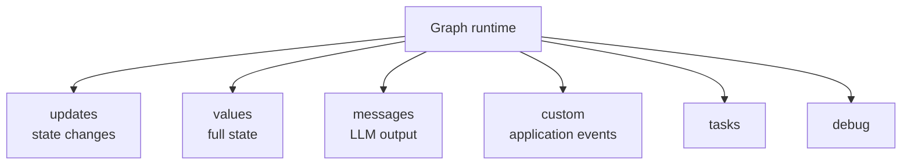

## Event streaming

- Streaming Vs Event streaming:
  - Streaming = lower-level graph execution events
  - Event streaming = normalized, typed layers over those events. E.x:
    - stream.messages
    - stream.subgraph
    - stream.interrupts
    - stream.values (state of graph)
- Mental Model: Imagine a security camera system
  - Streaming: raw camera footage
  - Event Streaming: person detected, door opened, vehicle detected

## Time travel

- It is actually a natural consequence of checkpointing
- If you have: `Checkpoint 1...Checkpoint 4`, you can replay from checkpoint 2
- LangGraph describe 2 main operations:
  1. Replay: "Go back and run forward again"
  2. Fork: "Go back and create a new branch"
- This is similar to: Git branches for agent execution
- Useful for:
  - `Checkpoint before LLM went bad -> modify state -> run again`
  - debugging
  - evaluating alternate prompts

## Subgraphs

- Subgraph is: A LangGraph graph embedded inside another LangGraph graph
- This allow a large agent systems to become composable instead of turning into one enormous graph
- Subgraph persistence modes:
- | Mode                         | `checkpointer=` | Meaning                                  |
  | ---------------------------- | --------------- | ---------------------------------------- |
  | Per-invocation (Recommended) | `None`          | Fresh state for each invocation/subGraph |
  | Per-thread                   | `True`          | State persists across calls              |
  | Stateless                    | `False`         | No checkpointing                         |

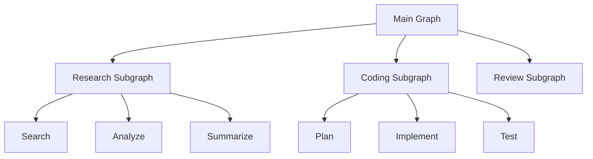

## Production architecture

- `langgraph.json`:
  - It is the deployment manifest for your LangGraph application
  - E.x: `{"dependencies": ["."], "graphs": { "agent": "./my_agent/agent.py:graph" }, "env": ".env"}`
- Persistence:
  - Local: `InMemorySaver()` is useful for development/testing
  - Production: Use PostgreSQL-based stores/checkpointers
- `langgraph dev` is lightweight, doesn't require Docker, supports hot reload, and is designed for rapid development
- `langgraph up` is a more production-like environment involving Docker, PostgreSQL and Redis

```txt title='project structure'
my-app/
│
├── my_agent/
│   ├── __init__.py
│   ├── agent.py
│   │
│   └── utils/
│       ├── __init__.py
│       ├── state.py
│       ├── nodes.py
│       └── tools.py
│
├── tests/c
│   ├── test_graph.py
│   └── test_nodes.py
│
├── langgraph.json
├── pyproject.toml
└── .env
```

## Testing

- Should test both ordinary Python logic and graph behavior
- Types:
  1. Unit Test: Test Node with mock API calls. Fast. Deterministic
  2. Graph Test: Topology. State
  3. Integration Test: Real APIs
  4. Eval(LLM Evaluation): Quality
- Partial execution testing:
  - LangGraph's persistence mechanisms can be used to create a state at a particular point
  - This can be used to test a partial execution path
  - Use `update_state`, a thread, and interruption boundaries for this
  - Mental Model: Instead of replaying an entire movie, start the test at the scene you care about

```py title='Example'
# Use pytest
def test_basic_agent_execution():
    checkpointer = MemorySaver()
    graph = create_graph()
    compiled = graph.compile(checkpointer=checkpointer)
    result = compiled.invoke(
        {"my_key": "initial_value"},
        config={"configurable": {"thread_id": "1"}}
    )
    assert result["my_key"] == "hello from node2"

# Unit test: Node
# We can test Node without running the entire agent
# compiled graph also exposes individual nodes through 'graph.nodes'
result = compiled_graph.nodes["node1"].invoke({"my_key": "initial_value"})
```

## Observability

- LangGraph itself handles orchestration, while LangSmith provides tracing/observability/evaluation
- `LangGraph -> Execution trace -> LangSmith/LangFuse -> Developer`

```txt title='What we want to see'
Run
 ├── node: classify
 │    └── LLM call
 ├── node: search
 │    └── API call
 ├── node: draft
 │    └── LLM call
 ├── interrupt
 └── resume
```
