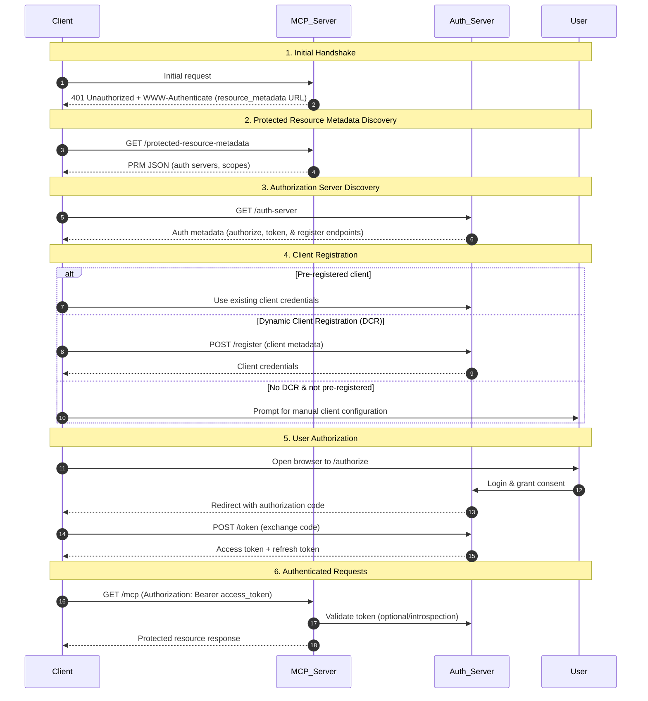

- coding agent vs LLM:
  - Coding agent uses LLM as its "brain" to plan, write, test, and debug code, while LLM is a static model that generates code snippets based on a single prompt
  - Agents use tools (bash, editors) to complete tasks, whereas LLMs are passive, single-turn text generators
  - Example of coding agent:
    - IDE-Integrated Agents: GitHub Copilot, Cursor
    - Terminal & CLI-First Agents: Claude Code, Codex CLI
- The 4 Era:
  1. Prompting (2023): Write a clever instruction
  2. Vibe coding (early 2025): Let the AI figure it out
  3. Context Engineering (mid 2025): Design the information system
  4. Agentic Engineering (2026): Build autonomous system
- Context window contains both input tokens and output tokens:
  - Each output token is generated by looking at the input tokens and the preceding output tokens
  - For context window of `1M` size, use only `100-200k` (20%) tokens for input

## Foundation of LLM Context

- Difference b/t prompting and context:
  - prompt: system message + user message
  - context = system prompt + RAG + tools + memory + Conversation History + Guardrails & schemas ...
  - prompt engineering: one dimensional
  - context engineering: multi dimensional
- OS Analogy:
- | Operating system | LLM system                                   |
  | ---------------- | -------------------------------------------- |
  | CPU              | LLM Model (Claud, GPT-4o, Gemini)            |
  | RAM              | Context Window (128K-2M tokens)              |
  | File System      | Retrieval/RAG (Vector DBs, documents)        |
  | System Calls     | Tool/API Calls (MCP, Function Calling)       |
  | Applications     | Agents (Autonomous task executors)           |
  | OS Kernel        | System Prompt (CLAUDE.md, base instructions) |
- Context window has 2 constraint (just like RAM): memory is temporary & it has a size
- token & english word relationship:
  - 1 token = $\frac{3}{4}$ word = 0.75 words
  - 1 page = 300 words (about 2 paragraphs)
  - 2M token = $2M \times \frac{3}{4}$ words = 1.5M words
  - 1.5M words = $\frac{1.5M}{300}$ pages = $\frac{15 \times 10^5}{3 \times 10^2}$ pages = 5k pages
- You should engineer to reduce the context window because:
  - Context Rot: Context quality will degrade with the increase in token size
  - Cost: The more token the more cost
  - Latency
- Definition: Context engineering is the process of finding the smallest set of high-signal tokens that maximize the likelihood of your desired outcome
- Context Window (6 elements). Focus on the order to minimize Context Rotting:
  1. System prompt
  2. Memory & State
  3. Retrieved Knowledge (RAG)
  4. Tool outputs
  5. Conversation History
  6. Current Query
- The Three-Layer Context Model (REFER INFOGRAPHIC):
  - Every LLM call assembles context from three distinct layers (IKT) - Instructional, Knowledge, and Tool - each with its own engineering discipline
- Difference b/t Memory & Conversation History:
  - Memory is more persistent than the conversation history
  - In other words - Memory is long-term and conversation history is short-term
  - Example: In Email, consider the agent is replying to a thread containing 10 conversation:
    - Conversation History: 10 conversation
    - Memory: LLM create a summary (from last 100-200 emails) of how the user reply - user preferences
- If the conversation grows long, the system must either:
  - Drop older messages (most common in chat systems)
  - Summarize earlier content into fewer tokens
  - Or reject the request if using raw API
- Context Rot (Lost in the middle Effect):
  - Context Overflow: Exceeding the maximum token limit (Uncommon Problem)
  - Context Rot: Performance degradation within the allowed limit (Common Problem)
  - Lost in the middle Effect: LLMs effectively use information at the beginning or end of a long input context but struggle to access or reason with information buried in middle
- WSCI (write-select-compress-isolate) principles for context window:
  1. Write:
     - The model produces something worth keeping, and you save it outside the context window. This is how agents develop memory
     - The information flows outward from the window into some form of storage
  2. Select:
     - The model needs information it does not currently have, and you pull it into the window from external storage
     - The information flows inward from storage into the window
     - E.x. RAG
  3. Compress/Compact:
     - The window is getting full, and you need to shrink what is already inside it without losing the essential meaning
     - The information stays in the window but becomes smaller
     - Summarization is the classic technique
  4. Isolate:
     - The task is too large or complex for a single context window, so you split it across multiple parallel windows - multiple agents, each with a focused slice of the problem
     - The information spreads across systems

## Instructional layer (system prompts)

- In claude code, system prompt is saved in `CLAUDE.md` file
  - This file should not change frequently since it contains the main idea behind the project
  - Whole file is not loaded in the context window. Some part are always loaded and some part are loaded as per demand (this is done by the agent internally)
- 5 components (IrfKT) of a system prompt (in broad terms):
  - Identity: What this agent is, or Overview of a project
  - Rules: Do & Don't. **Guardrails**
  - Format: Structure of output, or Folder structure of a project
  - Knowledge: Background facts for all interactions. **NOTE**: Knowledge describes reality. Rules control behavior
  - Tools: What capabilities/functions are available: `search_codebase`, `check_lint`
- While writing instructions don't be too vague or too specific. Just instruct how to approach a problem and what to do in edge cases (REFER INFOGRAPHIC - right altitude principle)
- `AGENTS.md`: The emerging universal standard:
  - Alternative to `ClAUDE.md`. A project can contain both - `ClAUDE.md` at root and specific `AGENTS.md` at subdirectory level
  - Proposed by Agentic AI Foundation. This is already supported by OpenAI Codex, Github Copilot, Cursor, etc
  - Placement: root of the repository (like README.md)
  - Tools like OpenAI Codex read AGENTS.md files before beginning any work, building what they call an "instruction chain" from the root down through subdirectories (SEE INFOGRAPHIC)
- | Feature | AGENTS.md (or CLAUDE.md)                                                         | SKILL.md                                                                        |
  | ------- | -------------------------------------------------------------------------------- | ------------------------------------------------------------------------------- |
  | Loading | Persistent: Loaded every time you start a session                                | On-Demand: Loaded only when Claude decides it's relevant to the task            |
  | Purpose | Static Rule-book: High-level project context, coding standards, & build commands | Dynamic Toolset: Specialized "tricks" or complex multi-step workflows           |
  | Scope   | Broad: Universal rules for the entire repository                                 | Narrow: Reusable expertise for specific actions (e.g., migrations, deployments) |
  | Content | No front-matter                                                                  | Front-matter: Name, Description. Use `/<name>` to trigger the skill manually    |
- NOTE: always provide examples in instruction file. SEE INFOGRAPHIC for type of task and its example structure
  - Give only one example for each scenario to reduce token consumption. One example per scenario is sufficient

## RAG (Retrieval-augmented generation) Pipeline Architecture

- RAG flow:
  1. Ingest: Load documents and convert into (structured) text. Use OCR for pdf files
     - Library: Docling (IBM), PyMuPDF (very fast), LangChain document loader, BeautifulSoup (for html)
  2. Chunking: Split documents into chunks. Types of chunking Strategies
     1. Fixed-Size: Splits text at exact character count (e.g., every 500 characters). Cons: Often splits mid-sentence; destroys context and semantic meaning
     2. Token: Similar to fixed-size but counts tokens specific to an embedding model. Ensures chunks fit perfectly within a model's context window
     3. Sliding Window: Uses fixed-size chunks but includes an overlap (e.g., 20%) between them. Maintains continuity; prevents context loss at boundaries
     4. Sentence: Splits text at natural sentence boundaries. Cons: Chunk sizes vary widely; some sentences may be too short to embed meaningfully
     5. Paragraph: Divides text based on newline characters (e.g., \n\n). Preserves coherence within a topic
     6. Recursive: Tries to split by large separators first (paragraphs), then smaller ones (sentences, words) if chunks are too big
     7. Semantic: Uses embeddings to measure similarity between segments; splits only when the topic changes. Cons: Computationally expensive; requires embedding model
     8. Topic: A variation of semantic chunking that explicitly detects major shifts in subject matter. Ideal for documents with distinct sections or multiple topics
     9. Markdown: Uses Markdown-specific syntax like headers (#) or lists to define boundaries
     10. Code: Splits source code by logical blocks like functions, classes, or specific syntax
  3. Embedding: Convert text chunks to vectors using embedded model. E.x. OpenAI Embedding, SentenceTransformer
  4. Vector Storage
  5. Query: Embed user question using **same** embedding model
  6. Retrieval: Find similar chunks via vector similarity search (top-k)
  7. Re-rank (optional): Score & reorder retrieved chunks for precision using a cross encoder
  8. Generate: LLM answers using retrieved context plus the user question
- TF-IDF (term frequency & inverse document frequency) embedding:
  - Here, one document is one chunk
  - On a plot, each term is one dimension
  - This is a **sparse** model since most of dimension are 0
  - TF: measures how frequently a term $t$ appears in a specific document $d$: $TF(t,d)=\frac{\text{no. of 't' in 'd'}}{\text{total no. of terms in 'd'}}$
  - IDF: measures how important a term is across the entire corpus $D$: $IDF(t,D)=\log\frac{\text{total no. of documents}}{\text{no. of documents containing 't'}}$
  - $TF\text{-}IDF(t,d,D)=TF(t,d) \times IDF(t,D)$
- Embedding Dimensions:
  - The primary trade-off in LLM embedding dimensions is between representational precision and operational efficiency
  - Higher dimensionality allows the model to map text into a much richer semantic space
  - Smaller embeddings prioritize performance and cost-savings over absolute semantic richness
  - Use Smaller embedding - If the chunk texts are already diverse, taking about different-different topics
  - Rule of Thumb: For most general RAG applications, 384 to 768 dimensions is considered the "sweet spot" for balancing cost and quality
- Similarity Search Algorithms:
  - Cosine Similarity: Measures the angle between two vectors, ignoring their length
  - Dot Product: Considers both direction and magnitude. Higher values indicate greater similarity
  - Euclidean Distance (L2): Measures the straight-line distance between two points
  - Manhattan Distance (L1): Sums the absolute differences across all dimensions
  - Approximate Nearest Neighbor (ANN): It is a class of algorithms designed to search through massive datasets of high-dimensional vectors (embeddings) in milliseconds
    - While K-Nearest Neighbor (KNN) checks every single item to find the exact closest match, ANN find results that are "close enough" without scanning the entire database
    - Librarians Analogy: Instead of "brute-force" scan of every record, ANN algorithms use indexes to organize data into searchable structures
      - Graph-based (e.g. HNSW): Imagine a "social network" of vectors. Each vector "knows" its nearest neighbors. To find a match, you jump from node to node (friend to friend)
      - Partition-based (e.g. IVF): Like a library divided into genre rooms. The algorithm searches through the books inside that room, ignoring 99% of the library
      - Hashing-based (e.g. LSH): Groups similar items into the same "buckets" using specialized hash functions. If two vectors are close, they end up in the same bucket
      - Compression-based (e.g. PQ): Compresses long vectors into tiny summaries to save space and speed up distance calculations
- Retrieved Metrics:
  - Context Recall (calculated in %): How much of the relevant information was retrieved
  - Context Precision (calculated in %): How much of the retrieved context is actually relevant
  - If recall is 95% & precision is 40%: It means the system retrieved most relevant chunks but also pulled a lot of irrelevant ones - reduce top-k or add re-ranking

## Tools, Function Calling, & MCP (Model Context Protocol)

- RAG answer 'what does the model **know**?'; Tools answer 'what can the model **do**?'
- With tool:
  - LLM (a text predictor) becomes an agent that can **perceive** the world, **reason** about it, and **act** on it
  - LLM can act as an information access tool - like API, database query, file read
  - LLM can act as a computation tool - like calculator, code interpreters
  - LLM can act as a side effect tool (i.e. can take action) - like email sender, device control, purchasing agent
- Tool lifecycle (REFER INFOGRAPHIC):
  1. Describe: tool schema
  2. Decide: llm decide which tools to engage
  3. Call: llm execute the tool with correct augments
  4. Return: tool sends result back to llm
  5. Response: llm uses the output of the tool to answer user's query
- MCP: Its a protocol for connecting AI applications to external data sources and tools
- MCP Architecture - The protocol follows a Host-Client-Server model:
  - MCP Host: The user-facing AI application (e.g., Claude Desktop, Cursor, or VS Code). It orchestrates multiple connections and manages the user's overall conversation context
  - MCP Client: An internal component within the Host that maintains a 1:1 connection with a specific server. MCP host creates 1 MCP client for each MCP server
  - MCP Server: A standalone service that exposes specific Tools (actions), Resources (data), or Prompts (templates)
    - Servers can be local (running on your machine via standard input/output (**stdio**)) or remote (accessible via **HTTP/SSE(streaming)/Socket**)
    - Server sends the response to the MCP Client (and not to MCP Host)
- MCP Server-Side Primitives: These are fundamental building blocks that servers can expose:
  1. Tools (Actions): Executable functions that allow the model to perform operations with side effects. E.g. `get_weather`, `delete_product`, `create_ticket`
  2. Resources (Context): Read-only data sources that provide the "grounding" information for a model's responses. E.g. file contents, database schemas, or API documentation
  3. Prompts (Templates): Reusable instruction sets. They ensure consistency. E.g. `code-review` prompt that prepopulates instructions on how to analyze a specific codebase
- MCP Client-Side Primitives are primitives that clients can expose. These primitives allow MCP server authors to build richer interactions:
  1. Sampling: Allows server to "reach back" and ask the host's LLM to generate a completion
     - This allow server to be model-independent
     - E.x. A code-fixing server might use sampling to ask the model to generate a commit message for the fix it just made
  2. Elicitation: Enables a server to pause its execution to ask the human user for more information or approval
  3. Roots: Defines the specific filesystem boundaries (like a project directory) that a server is permitted to access
- MCP Example - Imagine you are building a travel agent that needs to check local weather and your private calendar:
  - Request: You ask the Host (e.g., Claude Desktop), "Can you schedule a lunch in London tomorrow when it’s not raining?"
  - Discovery: The Host starts two MCP Clients to talk to two separate servers: Weather Server (exposes `get_forecast` tool) & Google Calendar Server (`create_event` tool)
  - **Handshake**: Upon connection, MCP clients perform a "handshake" with each server to learn their available capabilities and input schemas
  - Execution Loop:
    - The LLM decides it needs the weather first. The Weather Client sends a request to the Weather Server
    - The Weather Server calls an external API, gets the forecast, and sends the structured data back
    - Equipped with the weather info, the LLM then instructs the Calendar Client to tell the Calendar Server to create a 1 PM event
  - Final Response: The Host confirms the event is scheduled, integrating all external data into a natural language reply
- JIT (Just In Time) Approach:
  - Its a strategy where specific goals or context are dynamically generated and injected into the model's environment at the exact moment they are needed
  - Agent-Side:
    - Agents built with “just in time” approach do not pre-processing all relevant data up front
    - Agent maintain lightweight identifiers (file paths, stored queries, web links, etc.) and use these references to dynamically load data into context at runtime using tools
    - E.x. Claude Code leverages Bash commands like head and tail to analyze large volumes of data without ever loading the full data objects into context
    - This mirrors human cognition - we don’t memorize every information, but use tools & indexing systems like file systems, & bookmarks to retrieve relevant information on demand
  - Server-Side:
    - `_jit_instructions` field in MCP server output is a specialized metadata field specifically tailored to the result of a tool execution
    - Why: Instead of bloating system prompt with "if/then" rules for every possible tool outcome, the server injects these rules only when they are relevant
    - E.x. Imagine a tool that searches a company database:
      - Request: The model calls `search_employees(name="John")`
      - Server Response: The server finds 50 matches
      - `{"results": [...50 items...], "_jit_instructions": "Too many results to display. Ask user for last name or department to narrow the search before attempting to summarize."}`
      - Model Behavior: model reads these instructions and, instead of trying to list all 50 names, it immediately follows the JIT advice and asks the user for more details
    - | Feature            | Traditional      | JIT Approach     |
      | ------------------ | ---------------- | ---------------- |
      | tool instruction   | in system prompt | returned by tool |
      | token usage        | very large       | small            |
      | instruction timing | before reasoning | when needed      |
- ReAct (Reason+Act) Framework: It operates in a structured feedback loop (Thought → Action → Observation), often visualized as a "scratchpad" (SEE INFOGRAPHIC)
  - Loop:
    1. Thought (Reasoning): The LLM verbalizes its understanding of the task, identifies what it doesn't know, and plans the next step
    2. Action: Based on its thought, the model executes a specific task, such as calling an MCP tool, searching a database, or performing a calculation
    3. Observation: The system feeds the results of that action (e.g., search results or an error message) back into the LLM
    4. The model then generates a new thought based on this fresh observation, repeating the cycle until it reaches a final answer
  - NOTE: for ReAct, always use **reasoning** model
- MCP Authorization Flow:

## Agent Architecture

- The capstone agent integrates all six modules:instructional context, RAG, MCP tools, memory, guardrails, and observability:into a single orchestrator
