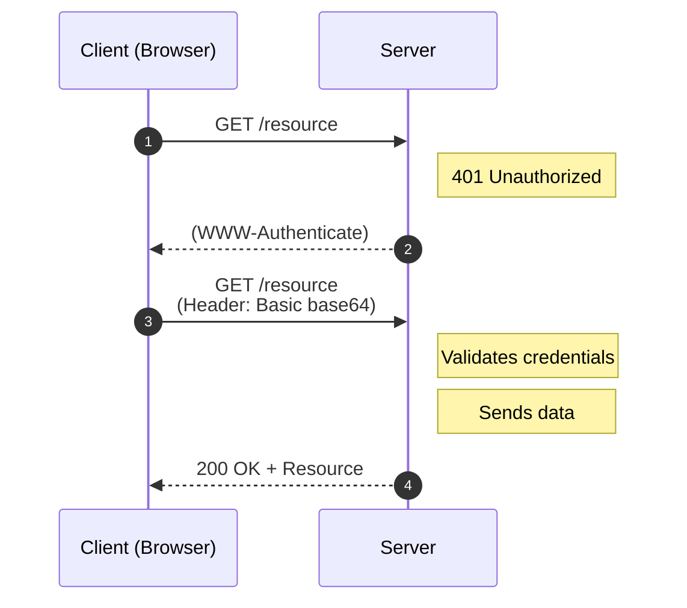
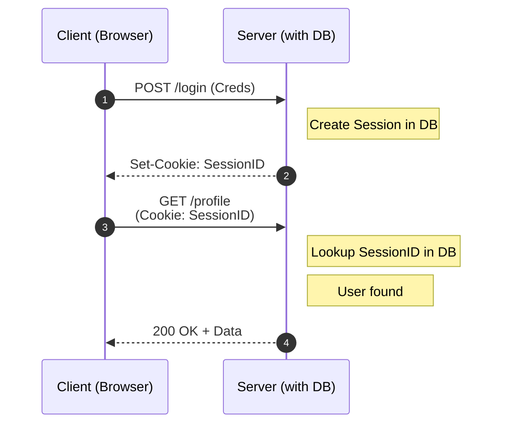
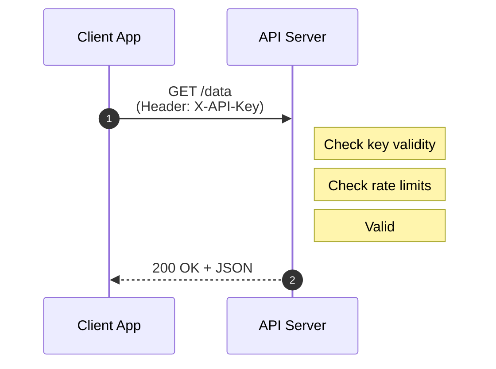
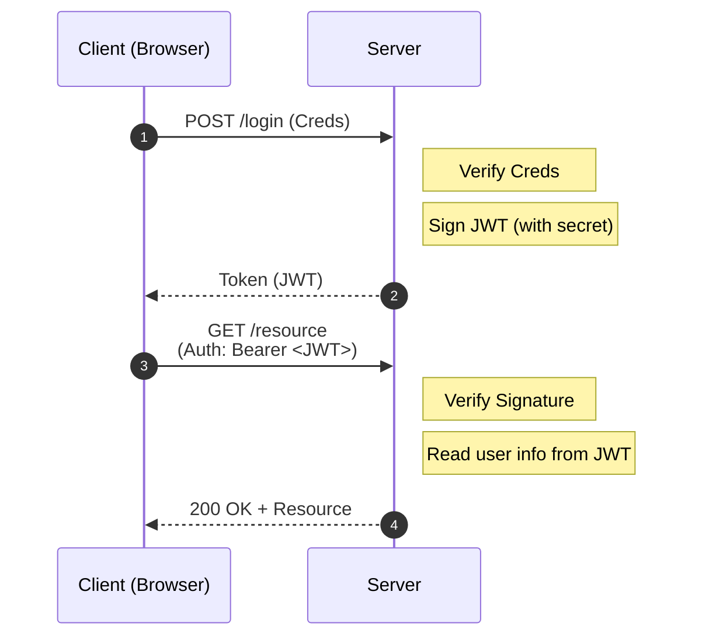
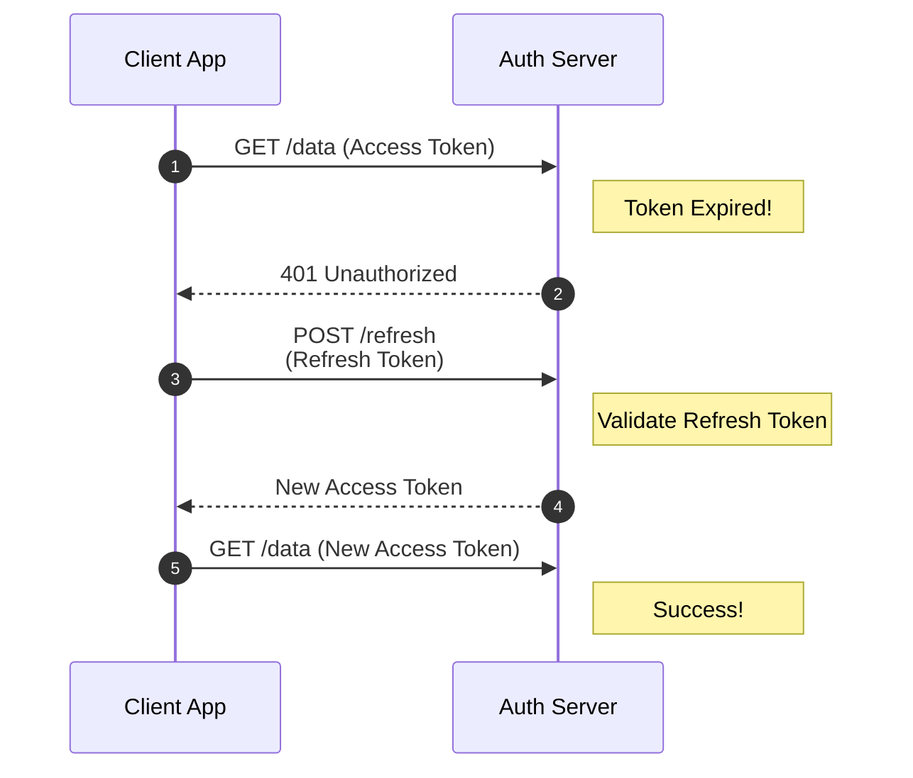
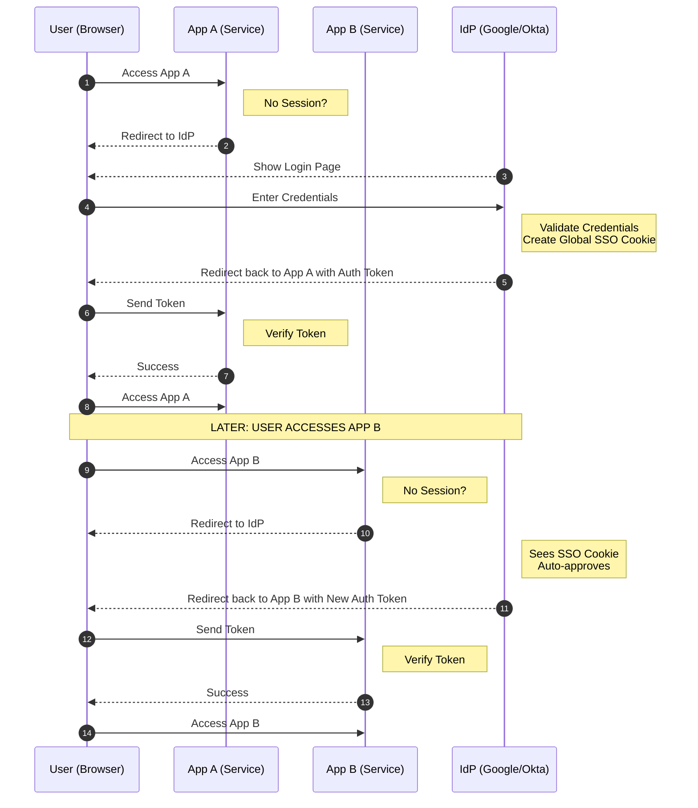
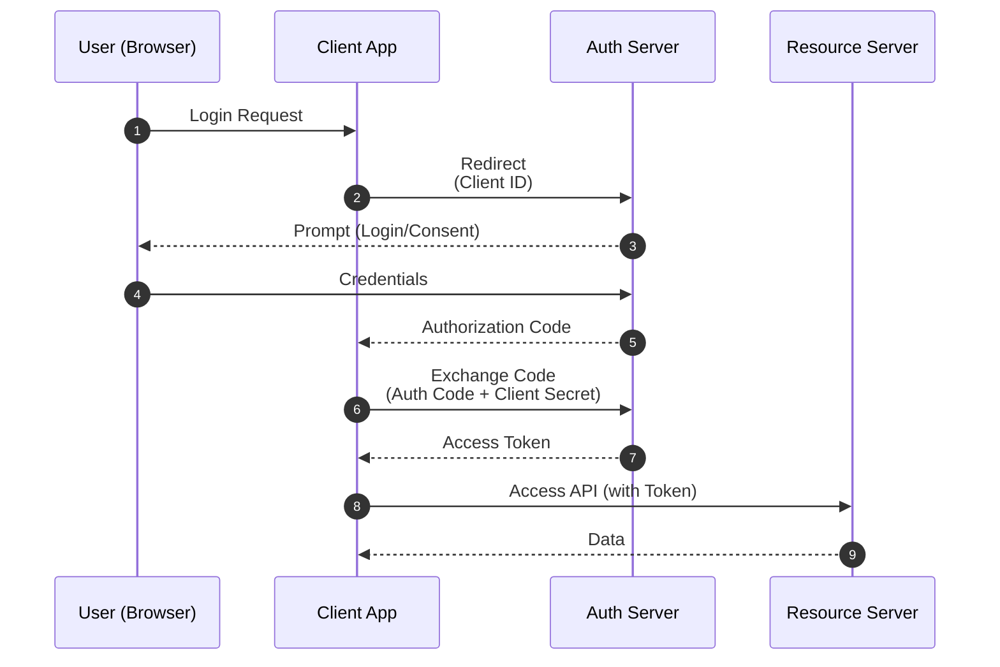

## Basic Authentication

- Client sends a username and password in every HTTP request header. While simple to implement, it is insecure without HTTPS encryption

## Session-Based Authentication (Stateful)

- Server stores session data and gives the user a session ID (often in a cookie)
- The server must check its own storage for every request to confirm the user is still logged in

## API Keys

- API Keys are unique strings to identify an application or project rather than a specific person
- They are passed for every request usually via headers

## JWT (JSON Web Tokens) (Stateless)

- Server issues a digitally signed token containing user data (claims)
- The server trusts the token because it signed it; no DB lookup needed for requests

## Access vs. Refresh Tokens

- Use short-lived Access Tokens for data requests
- Use long-lived Refresh Tokens to securely generate new access tokens (**handshake**) without making the user log in again
- Once a refresh token is used, the old one is immediately invalidated
- "Log out of all devices" button allows server to immediately deletes all active refresh tokens from the server

## SSO (Single Sign-On)

- Log in once and gain access to multiple independent applications
- This centralizes identity management - the **Identity Provider (IdP)** acts as the single source of truth
- Once you log into IdP for App A, you receive a global session. When you then access App B, IdP recognizes your active session and logs you in instantly without asking for password

## OAuth (Open Authorization) 2.0 & OIDC (OpenID Connect)

- OAuth 2.0 is the industry standard for authorization (granting permission to data), while OIDC is a layer on top of it that provides authentication (verifying who the user is)
- It allows applications to access a user's data from another service (like Google or Facebook) without the user having to share their password
- 4 primary roles:
  1. Resource Owner (User): The person who owns the data and grants access to it (e.g., you)
  2. Client (Application): The third-party app requesting access to the user's account (e.g., Spotify asking for your Facebook friends list)
  3. Authorization Server: The server that authenticates the user and issues access tokens after getting consent (e.g., Google's login server)
  4. Resource Server (API): The server that hosts the protected data the client wants to access (e.g., the Google Photos API)
- Key Tokens:
  - Authorization Code: A temporary code sent to the client via the browser, which the client then exchanges for an access token
  - Access Token: The "key" that the client uses to access the Resource Server. It contains specific permissions called "scopes"
  - Refresh Token: Used to get a new access token once the current one expires, without asking the user to log in again

- Why both auth code and access token?:
  - Its a security measure designed to protect the token from being exposed in insecure environments like a web browser's URL bar or history
  - Problem: If a token is sent directly to the browser via URL, it can be leaked through browser history, logs, or malicious scripts
  - Solution:
    - Server sends a short-lived Authorization Code to the browser instead
    - App’s backend then exchanges this code for the actual Access Token over a secure, private connection using a Client Secret that never touches the browser
- PKCE (Proof Key for Code Exchange):
  - While PKCE was an optional add-on in OAuth 2.0 (mainly for mobile/single-page apps), it is now mandatory for all clients in OAuth 2.1
  - It replaces the static "Client Secret" with a dynamic, one-time secret for every login
  - The 3-Step Handshake:
    1. Setup (The Challenge):
       - Before sending the user to the login page, the app generates two strings:
         - Code Verifier: A unique, random cryptographically strong string (the "secret")
         - Code Challenge: A hashed version (SHA-256) of the Verifier (the "lock")
       - The app sends the Code Challenge to the Authorization Server during the initial login request. The server saves this "lock" and associates it with the user's session
    2. The Relay (The Code): The user logs in as usual. The server sends the Authorization Code back to the app via the browser
    3. Verification (The Proof):
       - The app sends the Authorization Code + the original Code Verifier to the server’s token endpoint
       - The server hashes the Verifier. If the result matches, it proves the same app is finishing the flow. Only then does it issue the Access Token
  - Why it works: Because SHA-256 is a one-way street, a hacker cannot "reverse engineer" the Code Verifier
