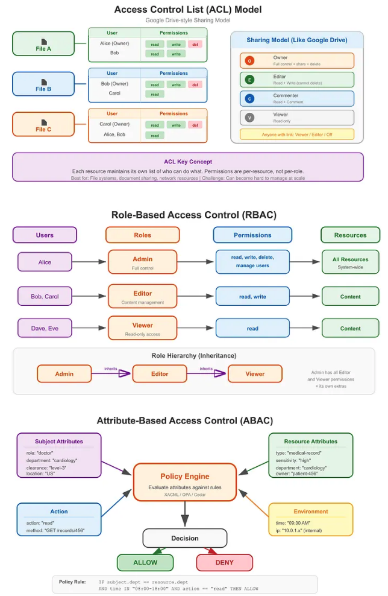
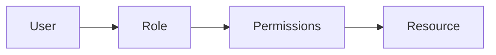
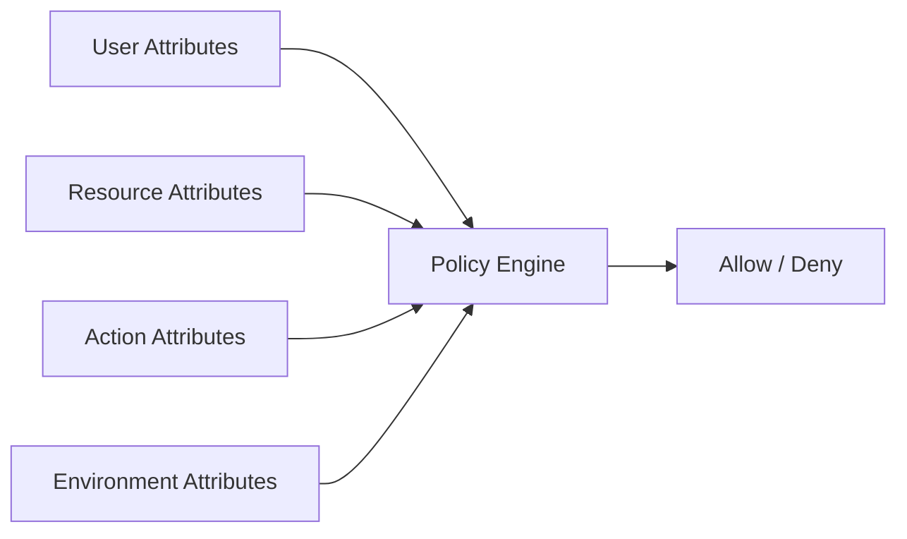

- Authorization decides whether an authenticated user or application is allowed to perform an action on a resource
- It answers the question: “What can this **identity** do?”

## ACL (Access Control List)

- Every resource maintains a list of entries, where each entry specifies:
  - Who (a user or group)
  - What they can do (read, write, execute, share, etc.)
- Example:
  ```txt
  Document: "Q4 Financial Report.pdf"
  ACL:
    ├── alice@example.com     → [read, write, share]
    ├── bob@example.com       → [read]
    ├── finance-team@group    → [read, write]
    └── everyone@public       → [no access]
  ```
- Pros: Simple and easy to understand
- Cons: Hard to manage as the number of users and resources grows


## RBAC (Role-Based Access Control)

- Permissions are grouped into roles, and users are assigned to those roles
- Example: `editor` role has permissions `["read:articles", "create:articles", "update:articles"]`
- In many RBAC implementations, roles form a hierarchy where higher roles inherit permissions from lower ones:
  ```txt
  Super Admin
  └── Admin
        └── Manager
              └── Editor
                    └── Viewer
  ```
- Pros: Easier to manage than ACLs
- Cons: Not granular enough for resource-level control. Difficult to express rules like “only access your own resources”



## ABAC (Attribute-Based Access Control)

- Instead of assigning static roles, access decisions are based on attributes — properties of the user, the resource, the action, and the environment:
  1. Subject attributes: Properties of the user (department, clearance level, job title, location)
  2. Resource attributes: Properties of the resource being accessed (classification, owner, creation date)
  3. Action attributes: The operation being performed (read, write, delete, approve)
  4. Environment attributes: Contextual information (time of day, IP address, device type)
- Policy: a logical rule that uses Boolean logic to evaluate attributes to determine whether to allow or deny an access request
- Pros: Highly flexible and fine-grained; Better suited for policy-driven systems
- Cons: More complex to design and troubleshoot



```json title='policy example'
{
  "id": "policy-001",
  "description": "Department members can edit draft articles in their department during business hours",
  "effect": "allow",
  "target": {
    "action": "edit",
    "resource_type": "article"
  },
  "conditions": {
    "all": [
      { "subject.department": { "equals": "resource.department" } },
      { "resource.status": { "equals": "draft" } },
      { "environment.time": { "between": ["09:00", "18:00"] } },
      { "environment.ip": { "in_cidr": "10.0.0.0/8" } }
    ]
  }
}
```

## Quick Rule of Thumb

- Use ACL when you need simple, direct permission lists
- Use RBAC when access aligns with job roles
- Use ABAC when access decisions depend on multiple conditions and context
