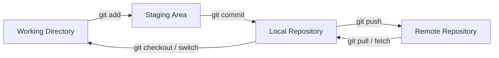
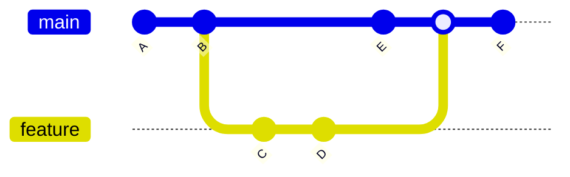
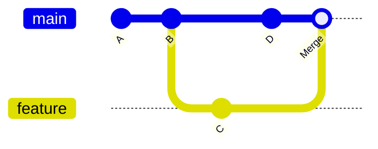
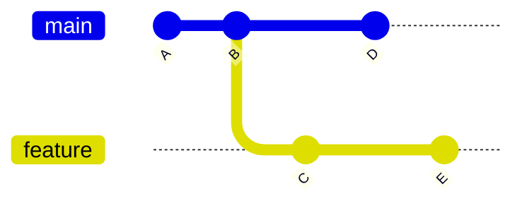
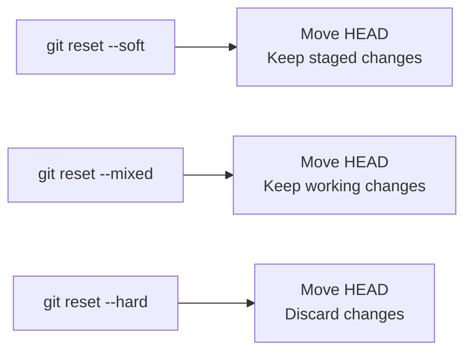

- The most important mental model is: `Edit → Stage → Commit → Push`
- Mental Model when receiving other people's work: `Fetch/Pull → Inspect → Integrate → Continue`
- Golden Rules:
  - When in doubt, inspect first: `git status`, `git log`, and `git diff`
  - Prefer `git revert` for undoing commits that have already been shared
  - Be cautious with `git reset --hard`
  - Avoid rewriting shared history with force pushes
  - Before destructive commands, make sure you understand exactly what will be removed

| Syntax                                             | Description                  |
| -------------------------------------------------- | ---------------------------- |
| `git --version`                                    | Check Git version            |
| `git config --global user.name "Your Name"`        | Configure your identity      |
| `git config --global user.email "you@example.com"` | Configure your email address |
| `git config --list`                                | View configuration           |
| `git init`                                         | Initialize a repository      |
| `git clone <repo-url>`                             | Clone a repository           |

```bash title='new branch'
git checkout -b <branch>
git push -u origin <new-branch>
```

```bash title='merge'
git push # or stash
git fetch
git merge origin/main
# if conflict
git merge --continue
git merge --abort
```

```bash title='diff'
git difftool main -- <file>
git difftool <old> <new>
# HEAD~1 -> second to last commit
```

```bash title='renaming'
git branch -m <new-branch>
# remote
git push -u origin <new-branch>
git push origin --delete <old-branch>
```

## Git Workflow

- Working directory: files you're currently editing
- Staging area: changes selected for the next commit
- Repository: committed history stored locally
- Remote repository: a shared repository such as GitHub



## Check What's Going On

| Syntax                                       | Description                  |
| -------------------------------------------- | ---------------------------- |
| `git status`                                 | Show changed/untracked files |
| `git diff`                                   | Show unstaged changes        |
| `git diff --staged`                          | Show staged changes          |
| `git log`                                    | Show commit history          |
| `git log --oneline`                          | Compact history              |
| `git log --oneline --graph --decorate --all` | Graphical/branch history     |

TODO `git difftool <branch> -- <file>`

## Stage & Commit Changes

| Syntax                                    | Description                               |
| ----------------------------------------- | ----------------------------------------- |
| `git add <file1> <file2>`                 | Stage files                               |
| `git add .`                               | Stage all changes                         |
| `git commit -m "Add user authentication"` | Commit staged changes                     |
| `git commit -am "Fix login validation"`   | Stage tracked modifications and commit    |
| `git commit --amend`                      | Change the most recent commit             |
| `git commit --amend --no-edit`            | Amend without changing the commit message |

## Branches

- A branch is essentially a movable pointer to a commit. Creating a branch does not copy the entire repository.
  - When you save your work in Git, you create a commit (a snapshot of your files)
  - Each commit gets a unique ID
  - A branch is simply a pointer (or sticky note) that says, "I am pointing to commit ID XYZ."
  - When you make a new commit while on that branch, the pointer automatically moves forward to the new commit



| Syntax                        | Description                   |
| ----------------------------- | ----------------------------- |
| `git branch`                  | List local branches           |
| `git branch -a`               | List all branches             |
| `git branch feature/login`    | Create a branch               |
| `git switch feature/login`    | Switch branches               |
| `git switch -c feature/login` | Create and switch to a branch |
| `git branch -d feature/login` | Delete a merged local branch  |
| `git branch -D feature/login` | Force-delete a local branch   |

TODO: `git checkout -b <branch>` `git branch -m ,new-branch> (rename)`

## Remote Repositories

| Syntax                                   | Description                                 |
| ---------------------------------------- | ------------------------------------------- |
| `git remote -v`                          | Show configured remotes                     |
| `git remote add origin <repo-url>`       | Add a remote                                |
| `git fetch origin`                       | Fetch changes without modifying your branch |
| `git pull`                               | Fetch and integrate remote changes          |
| `git push`                               | Push current branch                         |
| `git push -u origin feature/login`       | Push a new branch and set upstream          |
| `git push origin feature/login`          | Push a local branch to a remote branch      |
| `git push origin --delete feature/login` | Delete a remote branch                      |

## Fetch vs Pull

```
git fetch
git pull
(Remote Repository)
Update remote-tracking refs
Local repository
Working directory remains unchanged
fetch + integrate
Local branch updated
Working directory updated
```

git fetch is safer when you want to inspect incoming changes first.

git pull essentially performs a fetch followed by integration (merge or rebase, depending on configuration/options).

## Merge



| Syntax                                       | Description                                  |
| -------------------------------------------- | -------------------------------------------- |
| `git switch main`, `git merge feature/login` | Merge another branch into the current branch |
| `git merge --abort`                          | Abort a merge with conflicts                 |

## Rebase

- Rebasing the feature branch onto main replays its commits on top of the newer main history
- Golden rule: Don't rebase commits that other people are already depending on unless you understand the consequences



| Syntax                                             | Description                        |
| -------------------------------------------------- | ---------------------------------- |
| `git switch feature/login`, `git rebase main`      | Rebase current branch onto main    |
| `git add <resolved-file>`, `git rebase --continue` | Continue after resolving conflicts |
| `git rebase --abort`                               | Abort a rebase                     |

## Undoing Changes

- Be careful with `git reset --hard` — it can permanently discard uncommitted work



| Syntax                        | Description                                                                     |
| ----------------------------- | ------------------------------------------------------------------------------- |
| `git restore <file>`          | Discard changes in a working file. Restore a file to the last committed version |
| `git restore --staged <file>` | Unstage a file                                                                  |
| `git revert <commit>`         | Undo a commit safely. Create a new commit that reverses an earlier commit       |
| `git reset --soft HEAD~1`     | Move the branch pointer backwards                                               |
| `git reset --mixed HEAD~1`    | Move the branch pointer backwards                                               |
| `git reset --hard HEAD~1`     | Move the branch pointer backwards                                               |

## Fixing Common Mistakes

| Syntax                                                         | Description                                        |
| -------------------------------------------------------------- | -------------------------------------------------- |
| `git restore --staged <file>`                                  | Unstage a file accidentally staged                 |
| `git restore <file>`                                           | Discard changes to a file (restore to last commit) |
| `git commit --amend -m "New message"`                          | Change the last commit message                     |
| `git add <forgotten-file>` then `git commit --amend --no-edit` | Add a forgotten file to the last commit            |
| `git reset --soft HEAD~1`                                      | Undo the last commit but keep changes staged       |
| `git reset HEAD~1`                                             | Undo the last commit and keep changes unstaged     |

## Stash

- Use stash when you need to temporarily put unfinished work aside.

| Syntax                      | Description                           |
| --------------------------- | ------------------------------------- |
| `git stash`                 | Save current changes                  |
| `git stash -u`              | Include untracked files when stashing |
| `git stash list`            | List stashes                          |
| `git stash apply`           | Apply the latest stash and keep it    |
| `git stash pop`             | Apply and remove the latest stash     |
| `git stash apply stash@{2}` | Apply a specific stash                |
| `git stash drop stash@{0}`  | Delete a stash                        |
| `git stash clear`           | Delete all stashes                    |

```bash title='Typical Scenario'
git stash
# do other work
git stash pop
```

## Compare Branches & Commits

| Syntax                                   | Description                                |
| ---------------------------------------- | ------------------------------------------ |
| `git diff`                               | Changes between working directory and HEAD |
| `git diff main..feature/login`           | Changes between two branches               |
| `git log main..feature/login --oneline`  | Commits in feature but not main            |
| `git log main...feature/login --oneline` | Commits in either branch but not both      |
| `git show <commit>`                      | Show a commit                              |

## Finding Commits

| Syntax                              | Description                  |
| ----------------------------------- | ---------------------------- |
| `git log --grep="login"`            | Search commit messages       |
| `git blame <file>`                  | Find who changed each line   |
| `git log --oneline --all -- <file>` | Find commits touching a file |

## Bisect

- Git performs a binary search through your commit history to find the commit that introduced a bug

| Syntax                                | Description                     |
| ------------------------------------- | ------------------------------- |
| `git bisect start`                    | Start a bisect session          |
| `git bisect bad`                      | Mark current commit as bad      |
| `git bisect good <known-good-commit>` | Mark a known good commit        |
| `git bisect good` / `git bisect bad`  | Mark test results during bisect |
| `git bisect reset`                    | Finish bisect and reset         |

## Tags

- Tags are commonly used to mark releases

| Syntax                                 | Description              |
| -------------------------------------- | ------------------------ |
| `git tag`                              | List tags                |
| `git tag v1.0.0`                       | Create a lightweight tag |
| `git tag -a v1.0.0 -m "Release 1.0.0"` | Create an annotated tag  |
| `git push origin v1.0.0`               | Push a tag               |
| `git push origin --tags`               | Push all tags            |
| `git tag -d v1.0.0`                    | Delete a local tag       |
