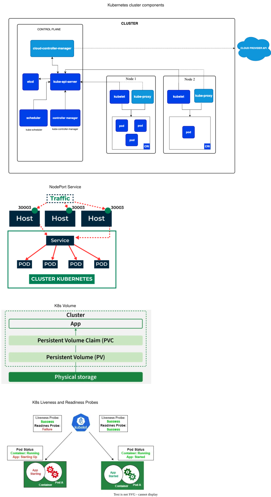

- Kubernetes (K8s) is a **container orchestration platform** that automates deployment, scaling, distributing loads and management of containerized applications
- When using k8s, do not use Docker Volume, Docker Network or docker-compose.yaml
- Deployment Workflow:
  1. The first is containerization, where the application and its dependencies are packaged into a lightweight, standalone, executable unit known as a container image
  2. The second stage is orchestration, where these containers are deployed, monitored, and managed at scale
- Kubernetes add-ons are plug-ins that enhance the cluster's functionality
- Minikube: a tool that lets you run/create a **single-node k8s cluster** locally on your own computer. Basic commands: `minikube start|status|dashboard|stop`
  - In Minikube's single-node setup, that one single machine acts simultaneously as the master node (control plane) and the worker node
  - While it defaults to a single node, you can force Minikube to spin up distinct worker nodes if you want to test how your apps behave across multiple machines
  - `minikube start --nodes 3`: it creates one master/worker node, and two dedicated worker-only nodes on your computer
- kubectl: (often pronounced cube-control or cube-c-t-l) a command-line tool used to control and communicate with a Kubernetes cluster
- Alternatives to Kubectl: While `kubectl` is the gold standard, other tools offer different workflows:
  - Helm: an open-source package manager for Kubernetes. Think of it as the equivalent of `Homebrew` for macOS, but specifically built for Kubernetes clusters
  - Lens: a popular desktop IDE for Kubernetes that provides real-time cluster insights, and log streaming
- k8s objects:
  1. Cluster: A set of machines (nodes) managed together as a unit. Consists of master (control plane) nodes (plural; others act as backup) and worker nodes
  2. Node: A physical or virtual machine that is part of the cluster. Types: Master Node (control plane) & Worker Node
     - Master Node contains API Server, Scheduler, Controller Manager, and Etcd
     - Worker Node contains kubelet, kube-proxy, container runtime and pods
  3. Pod: A smallest deployable unit which runs on a Node. Contains containerized apps and shared resources for those containers
- API objects/resources:
  1. Service: Its an abstraction which defines a logical set of Pods and a policy by which to access them
  2. ReplicaSet: Its an artifact/object that ensures that the right number of identical Pods are running
  3. Deployment: It instructs Kubernetes how to create and update instances of your application
  4. DaemonSet: Strictly binds one Pod per Node across the cluster. Scales automatically; adding a node spawns a new Pod. Use Case: Infrastructure agents, logging, monitoring
  5. Job: It is designed for short-lived, batch processing tasks
  6. ConfigMap: Its an object that stores configuration settings (or env variables) separately from the application
  7. Secret: Its an object that stores sensitive data like password, token, or API key
  8. Persistent Volume (PV): Its a storage object in the cluster that you can use to store data and it doesn’t get deleted when a Pod is removed or restarted
- 3 commonly used controllers for creating Pods are:
  1. Jobs → For batch tasks that run once and complete (ephemeral)
  2. Deployments → For stateless and persistent applications, such as web services
  3. StatefulSets → For stateful and persistent applications, like databases
- Manifest/Declarative/Spec YAML file: must contain four required root-level fields to describe the desired state of a cluster resource:
  1. apiVersion: API version (v1, apps/v1, etc.)
     - `v1` is the core API group that includes resources like Pods, Services, PersistentVolumes, and ConfigMaps
     - `apps/v1` include resources such as Deployments, StatefulSets and DaemonSets looking on high-level application management
     - `batch/v1`: contains the resources like Jobs and CronJobs specifically designed for batch programming
  2. kind: The type of object you want to spin up (e.g., Pod, Deployment, Service)
  3. metadata: Data that uniquely identifies the object, such as its name, namespace, and labels
  4. spec: The technical specification describing your desired end-state for the object
  5. `---` is used to have multiple config in a single file

## Node

- Node is a single machine, either a physical server or a virtual machine, that runs the necessary components to execute and manage containerized applications
- Can have multiple master nodes. But at a given time, only one is active and others as used as backup (if the active master node goes down)
- Relationship: 1 active master node and multiple worker nodes
- Master Node **automatically** handles scheduling the Pods across the Nodes in the cluster
- Master Node modules:
  1. API server: Every request—whether from you (`kubectl`), a configuration file, or another system—comes through here **first**
  2. Scheduler: When you say “I want to deploy my application,” someone needs to decide which worker node it should run on. That’s the Scheduler’s job
  3. Controller Manager: It constantly watches the cluster and fixes problems. If a Pod crashes, it restarts it. If a Deployment says 3 replicas, it scaleup/down to match total pods
  4. Etcd (Linux `/etc` directory): Its a a database that stores all cluster information — configurations, state, secrets, everything
- Worker Node modules:
  1. Kubelet: It’s the bridge between the Control Plane and the actual containers on that node
     - Receives Pod specifications from the API Server
     - Talks to the Container Runtime to start containers
     - Monitors container health and reports back to the Control Plane if something is wrong
     - Restarts containers if they crash
  2. Kube Proxy: It manages network rules for **all pods across all nodes**. It ensures that requests reach the right Pod and distributes load across multiple Pods.
     - kube-proxy reads cluster-wide network information (every pod IP across all nodes) to build its local routing tables
     - Unlike kube-proxy, kubelet only looks inward, managing the lifecycle of containers running locally on its own hardware
     - It is the process responsible for forwarding the request from Kubernetes Services to the right pods
  3. Container Runtime (like Docker): Its the software that actually runs your containers. It pulls images and run them
- Why kube-proxy on worker node and not on master node:
  - Network traffic interception must happen exactly where the application workloads are running
  - Bottleneck: every network packet traveling b/t apps would have to travel out of its worker node, jump to master node, and then jump back to destination worker node
  - Availability: because kube-proxy lives on the worker nodes, pods can still talk to each other through Services even if the master node completely goes offline

## Pod

- **Smallest deployable unit** in Kubernetes (compared to containers in Docker)
- A Pod is an abstraction that represents a group of one or more containers and some shared resources for those containers. Those resources include:
  - Shared Networking: Every Pod is assigned a unique IP address. All containers within that Pod communicate with each other using `localhost`
  - Shared Storage: Containers within a Pod can share storage volumes, allowing them to have a common filesystem and exchange data seamlessly
- Each Pod in a Kubernetes cluster has a unique IP address, even Pods on the same Node
- Multi-container pod:
  - All containers within a single Pod are guaranteed to be co-located on the same worker node, and they share the same environment
  - init containers: special containers that run sequentially before the main container. Role: prepare environment, set up configurations, or perform database migrations
  - multi-container (sidecar pattern): sidecars provide logging, monitoring, or proxy functionality alongside the main application container
- Pods runs in a private isolated network:
  - visible from other Pods and services
  - By default, it cannot be accessed from outside the network. This can be changed via multiple ways
  - One way to access from outside is to use a proxy - `kubectl proxy` - which will expose `kubectl` as an API
    - The API Server inside of Kubernetes have created an endpoint for each pod by its pod name
    - `curl http://localhost:8001/api/v1/namespaces/default/pods/$POD_NAME`
    - `curl 127.0.0.1:8001` list all valid paths
- 5-phase Pod life cycle:
  1. Pending: It has been accepted by master node but is waiting for resources to become available. K8s decides on which node it should run and pulls the required container images
     - It pulls the images just to be efficient
  2. Running: All containers in the Pod have been started, and the application is executing its workload
  3. Succeeded: When all its containers have completed successfully. This is common for batch jobs or one-time tasks where completion is the goal
  4. Failed: At least one container terminates with an error and won’t be restarted
  5. Unknown: It indicates that the state of the Pod cannot be determined, often due to communication issues with the node
- Communication between Pods:
  - Intra-Pod (Same Pod): Containers within same Pod share a single IP address. They communicate with each other via `localhost` using different port numbers
  - Service-Level Discovery: Pod IPs are temporary. So a Pod talk to the Service, which then load-balances the traffic to the correct Pods
  - External Access: To reach Pods from outside cluster, use Ingress or LoadBalancer Service, which maps external traffic to internal cluster
    - Ingress: operates at app layer; more control. It is able to make decisions based on the actual content of each message
    - LoadBalancer: operates at transport layer (tcp/udp). It uses a simple algorithm such as a round-robin across the selected paths

```yaml title="Web Server Pod"
apiVersion: v1
kind: Pod
metadata:
  name: web-server-pod
  namespace: production # specifying namespace where we want to create pod
  labels:
    app: frontend
    environment: production
spec:
  # 1. Init Containers run first and sequentially
  initContainers:
    - name: wait-for-db
      image: busybox:1.36
      command:
        [
          "sh",
          "-c",
          "until nslookup db-service.default.svc.cluster.local; do echo waiting for database; sleep 2; done",
        ]
  # 2. Main Application Containers only start after initContainers exit with code 0
  containers:
    - name: nginx-container
      image: nginx:1.25
      ports:
        - containerPort: 80 # exposes port 80 inside the container so it can receive network traffic
```

## Namespace & Context

- Namespaces act as virtual clusters, enabling logical isolation and resource management for different teams or projects
- Context is basically cluster
- Install Plugins/Tools - `kubectx` and `kubens`:
  - `kubectx` is a tool to switch between contexts (clusters)
    - `kubectx`: list down all cluster (active cluster is marked in different color)
    - `kubectx minikube`: Switch to another cluster
  - `kubens` is a tool to switch between Kubernetes namespaces
    - `kubens`: list down all namespace (active namespace is marked in different color)
    - `kubens my-ns`: Switch to another namespace. This means that by default if we do not specify the namespace the components will be created in `my-ns`

## Service

- A Service in Kubernetes is an abstraction which defines a logical set of Pods and a policy by which to access them
- We need service because pod IP address keep changing (every time pod is restarted)

### Service & Label

- The set of Pods targeted by a Service is determined by a `LabelSelector`
- By applying labels, e.x. frontend, db - high-level domain language - to Pods, we are able to refer to Pods by their logical name rather than their specifics, i.e IP number
- Labels are key/value pairs attached to objects at creation time or later on. They can be modified at any time

### Service & Traffic

- Services allow your applications to receive traffic from inside (default) and outside the cluster
- Services have an integrated load-balancer that will distribute network traffic to all Pods of an exposed Deployment
- Services will monitor continuously the running Pods using **endpoints**, to ensure the traffic is sent only to available Pods
- Services can be exposed in different ways by specifying a `type` in `ServiceSpec` (service specification):
  1. `ClusterIP` (Default / Internal Only): This type gives your Service a **permanent IP** address that is only valid inside the cluster
     - It has an internal load-balancer mechanism which distributes load among pod replicas
     - Base use case: Databases, cache layers, or backend microservices that should never be exposed to the public internet
  2. `NodePort` (External Gateway): This type opens a specific, identical **port** (within the range of 30,000-32,767) on every single server node in your cluster
     - Kubernetes forward any traffic hitting `<Any-Node-IP>:<NodePort>` straight to your underlying Pods
     - Superset of ClusterIP: Kubernetes automatically creates a ClusterIP behind the scenes
     - Best use case: Good for testing, development, or environments where you do not have a cloud provider to automatically give you a load balancer
  3. `LoadBalancer` (The Cloud Standard): This type connects your Kubernetes cluster directly to your cloud provider's infrastructure (like AWS, Google Cloud, or Azure)
     - Kubernetes tells your cloud provider to spin up a physical, external load balancer appliance. The cloud provider assigns a **public IP address** to it
     - Anyone on the internet can hit this public IP, and the cloud infrastructure will route the traffic to those NodePorts
     - Superset of NodePort: Kubernetes automatically creates a NodePort and a ClusterIP behind the scenes
  4. `ExternalName` (Internal Alias/Shortcut): Its different from the other 3. It does not route traffic to Pods, and it does not use a proxy (`kube-proxy`)
     - It acts as a simple DNS shortcut (a CNAME record). It maps an internal Kubernetes DNS name to an external domain name
     - Example:
       - If your app inside Kubernetes needs to talk to an external database hosted at `://amazon.com`, you can create an ExternalName service called `my-database`
       - When your code looks up `my-database`, Kubernetes instantly tells it to go to `://amazon.com` instead
     - Best use case: linking your internal containers to external, third-party APIs and legacy databases
- Create Service: `kubectl expose deployment/kubernetes-first-app --type="NodePort" --port 8080`:
  - Here we are just targeting one of the deployment `kubernetes-first-app` and referring to it with `<type>/<name>`
  - Expose it as service of type NodePort and finally, we choose to expose it at port 8080
  - On running `kubectl get services/kubernetes-first-app`, I got port as `8080:31468/TCP`: (opposite to Docker port mapping)
    - 31468: NodePort (External Entry Point). To access from outside, use `curl http://<YOUR-NODE-IP>:31468`
    - 8080: Cluster Port (Internal Entry Point). To access from within th cluster, use `curl <SERVICE-CLUSTER-IP>:8080`

```yaml title='clusterIP.yaml'
# 'spec' has 3 fields - type, selector, & port list
apiVersion: v1
kind: Service
metadata:
  name: my-app-cluster-ip # Other pods in the cluster can access it using this exact name as a domain (e.g., http://my-app-cluster-ip)
spec:
  type: ClusterIP
  selector: # Routing target. It tells the service to look for any Pods in the cluster running the label "app: my-app" and send traffic to them
    app: my-app
  ports:
    - name: tcp # optional. It only make sense when we have multiple ports
      protocol: TCP
      port: 80 # Service port. Other pods will target this port (e.g., http://my-app-clusterip:80)
      targetPort: 80 # container port. Port number that the underlying container is listening on inside the Pod
```

```yaml title='nodePort.yaml'
# same as clusterIP. Only difference is spec.type and additional field in spec.ports.nodePort
...
spec:
  ...
  ports:
    - protocol: TCP
      port: 80         # Service port
      targetPort: 80   # container port
      nodePort: 30080  # Port on nodes (30000-32767)
```

```yaml title='externalName.yaml'
apiVersion: v1
kind: Service
metadata:
  name: my-service
  namespace: prod
spec:
  type: ExternalName
  externalName: my.database.example.com
```

## Label & Selector

- Labels are key/value pairs. They are the primary way to organize your resources
- Selectors are how you find and filter those objects based on the labels
- Types of selectors:
  1. Equality-Based: Exact match. Operators: `=, ==, and !=`. No difference between '=' & '=='.
     - `kubectl get pods -l 'tier=backend,environment=production'`: Find the Pod that is both backend and production
  2. Set-Based: More flexible. Operators: `in, notin, and exists`
     - `kubectl get pods -l 'environment in (development,staging)'`: Find all Pods in either the development or staging environment
     - `kubectl get pods -l 'app'`: Find all Pods that have an app label, regardless of its value (the `exists` operator)

## ReplicaSet

- Its an artifact/object that can drive the cluster back to **desired state** via the creation of new Pods to keep your application running
- Desired State: You need to specify how many containers you want of each kind, at all times - like 4 database containers or 3 services
- ReplicaSet name format: `[DEPLOYMENT-NAME]-[RANDOM-STRING]`
- Use Deployment. Avoid ReplicaSet:
  - Deployment is a higher-level abstraction that manages application rollouts and rollbacks
  - Whereas a ReplicaSet is a lower-level mechanism strictly responsible for ensuring a specified number of identical pod replicas are running at any given time
  - Deployment does not manage Pods directly. Instead, it manages ReplicaSets, and ReplicaSets manage Pods

## Deployment

- A Deployment is a Kubernetes object used to manage a set of Pods running your containerized applications
- It provides declarative updates, meaning you tell Kubernetes what you want, and it figures out how to get there
- Behind-the-Scenes Workflow for `kubectl create deployment`:
  1. Scheduling: The Kubernetes Scheduler searches for a suitable node. Since Minikube only has one node, it chooses that one
  2. Deployment Tracking: The Deployment controller notes that your application must always have 1 instance running
  3. Execution: The kubelet on that chosen node downloads your container image and spins up the container using container runtime
  4. Rescheduling Protection: Because it is managed by a Deployment, if that node crashes or fails, k8s instantly recreate that instance on a new node the moment one becomes available
- `kubectl get deployments` returns following important columns:
  - `READY`: format: `Current-Healthy-Pods / Desired-Total-Pods`
  - `UP-TO-DATE`: tells how many Pods have the **most recent version** of the configuration blueprint/specs
    - Why it matters: When app's code is changed, K8s doesn't kill all old apps at once. It does a "rolling update" — gradually spinning up new pods while terminating old ones
  - `AVAILABLE`: tells how many Pods are fully operational and have been accessible to users for a safe amount of time (configured via a setting `minReadySeconds`)
    - vs `READY`: A Pod might be "Ready" the exact millisecond its container starts up, but it might take a few seconds to load data or initialize
    - "Available" confirms the Pod is stable, has passed its health checks, and is reliably serving users

```yaml title='web app'
apiVersion: apps/v1
kind: Deployment
metadata:
  name: web-app-deployment
  labels:
    app: web-app
spec:
  replicas: 3 # run exactly three identical instances (Pods) of your application at all times
  selector: # define how to select pods. It looks for Pods matching the label app: web-app
    matchLabels:
      app: web-app
  template: # defines the blueprint for the Pods that Kubernetes will create
    metadata:
      labels: # assigns the label app: web-app to the created Pods. This must match the matchLabels defined in the selector above
        app: web-app
    spec:
      containers:
        - name: nginx-container
          image: nginx:1.25.4
          ports:
            - containerPort: 80 # exposes port 80 inside the container so it can receive network traffic
          resources: # controls hardware allocation
            limits: # set the maximum amount of CPU and memory the container is allowed to consume
              memory: "256Mi"
              cpu: "500m"
            requests: # guarantee the minimum CPU and memory the container needs to start
              memory: "128Mi"
              cpu: "250m"
```

### Deployment & Scale

- Scaling is accomplished by changing the number of replicas in a Deployment
- When scaled, kubernetes is ready to **load balance** any incoming requests - given that a **service is already attached** to the said deployment
- Self-healing: Its Kubernetes way of ensuring that the desired state is maintained - `kubectl scale ... --replicas=4`
- Auto-scaling: We don't set the number of replicas but rather rely on K8s to create the number of replicas it thinks it needs by specifying CPU utilization or other metrics
- General Horizontal Scaling Vs Vertical Scaling:
  - Horizontal Scaling (Scaling Out): means adding more machines to your infrastructure to distribute the workload
  - Vertical Scaling (Scaling Up): means adding more power (such as CPU, RAM, or storage) to an existing single machine
- Horizontal auto-scaling (HPA - horizontal pod auto-scaler):
  - It consists of two parts a `resource` and a `controller`
  - `controller` checks utilization, or whatever metric you decided, to ensure that the number of replicas matches your specification
  - The default is checking every 15 seconds but you can change that by setting `--horizontal-pod-autoscaler-sync-period`
  - Equation for deciding number of replicas: `desiredReplicas = ceil[currentReplicas * ( currentMetricValue / desiredMetricValue )]`
  - 2 things we need to specify when we do autoscaling:
    1. min/max: set a minimum and maximum in terms of how many Pods we want
    2. metric: for e.x. set a certain CPU utilization percentage. If CPU value greater than the threshold, k8s scale out. IF CPU value is lower, k8s matches min value
  - `kubectl autoscale deployment/php-apache --cpu=50 --min=1 --max=10`: If CPU load is >= 50% create a new Pod. Maximum 10 Pods. If load is low go back gradually to 1 Pod

### Deployment & Rolling

- Roll back: In kubernetes deployment, you can revert back to the previous version of the application if you find any bugs in the present version
- Steps for rolling back a deployment:
  1. List all the revisions and select the version of deployment to which you want to roll back
  2. Roll back to the previous (or stable) version of the deployment
- Zero-Downtime Rollouts: By default, Kubernetes deployments use the `RollingUpdate` strategy:
  - Gradual replacement: It replaces old pods with new ones step-by-step
  - Continuous availability: Old pods remain online until new pods are ready
  - Smart traffic routing: The Service component only sends user traffic to healthy, running pods
- You can pause (`kubectl rollout pause ...`) the deployments which you are updating currently and later resume (`kubectl rollout resume ...`)
  - Why do this?: This is highly useful if you want to make multiple changes at once without triggering a separate, resource-heavy, time-consuming rollout for every single command
  - When you pause the rollouts you can update the image using `kubectl set image deployment/webapp-deployment webapp=webapp:2.1`
  - To actually replace the current version with the new image, you must explicitly resume the deployment

## Job

- Job, unlike Deployment, is designed for short-lived, batch processing tasks. The primary purpose is to execute a task and exit with code 0
- Job will create a pod, monitor the task, and recreate another one if that pod fails for some reason. Upon completion of the task, it will terminate the pod
- When a job is suspended, all of its active Pods are deleted until the job is restarted
- A CronJob is the same as a regular Job, only it creates jobs on a schedule
- Example:
  - Database Migrations: Upgrading database schemas before launching a new application version
  - Data Seeding: Populating a database or cache with initial dummy data
  - Batch Processing: Running nightly data backups, reports, or file conversions
  - Automated Testing: Running a test suite inside a staging environment

```yaml title='PI Calculator'
apiVersion: batch/v1
kind: Job
metadata:
  name: pi-calculator
spec:
  # Scaling and Control Configurations
  completions: 10 # Kubernetes will not mark this Job as complete until it registers 10 successful Pod runs
  parallelism: 2 # Process exactly 2 pods at the same time
  backoffLimit: 4 # Max retry attempts before failing the entire job
  activeDeadlineSeconds: 60 # Kill the entire job if it takes longer than 1 minute

  template:
    spec:
      containers:
        - name: pi
          image: perl:5.34
          command: ["perl", "-Mbignum=bpi", "-wle", "print bpi(2000)"]
      restartPolicy: Never # Required for Jobs. Alternatives: 'OnFailure'
```

## Persistent Storage

- Kubernetes Volumes provide a persistent storage abstraction that decouples data from the individual container's lifecycle:
  - Persistence: Volumes prevent data loss by ensuring files remain intact even if a container crashes or is restarted by the kubelet
  - Container Sharing: They act as a shared directory accessible by all containers within a single Pod, enabling efficient intra-Pod file exchange
  - Lifecycle Coupling: Volume is typically deleted if the Pod is destroyed
  - Abstraction Layer: They provide an interface for containers to access diverse storage backends - like local disk, cloud-based block (or file or object) storage
- **Container Storage Interface (CSI)** is a K8s Storage Plugin layer - a interface that connects the external storage systems with Kubernetes
- Some of storage-related API objects:
  - PersistentVolume (PV): treated as a cluster resource, similar to nodes. They represent variety of storage backends such as NFS, or cloud storage
  - PersistentVolumeClaim (PVC):
    - It is a request made by a user or application to access persistent storage in a Kubernetes cluster
    - Since Pods cannot directly manage or provision storage, PVCs act as a bridge between Pods and PersistentVolumes (PVs)
    - PVC specifies:
      1. Storage size: such as 5Gi or 10Gi
      2. Access modes:
         - ReadWriteOnce (RWO) – mounted as read-write by a single node
         - ReadOnlyMany (ROX) – mounted as read-only by multiple nodes
         - ReadWriteMany (RWX) – mounted as read-write by multiple nodes
  - StorageClass (SC): allow to provision storage **dynamically**
- Workflow:
  1. The cluster administrator defines PersistentVolumes (PVs) or configures StorageClasses to enable dynamic provisioning
  2. Developers or applications create PersistentVolumeClaims (PVCs) by requesting storage with requirements such as size, access mode, and optionally a StorageClass
  3. The Kubernetes control plane matches each PVC with a suitable PV that meets the requirements and binds them together
  4. If dynamic provisioning is enabled, a new PV is created automatically
  5. Once bound, the Pod mounts the PVC and uses it like any other volume
  6. The application running inside the Pod has persistent storage even if the Pod restarts

```yaml title='Manual Storage'
# we are going manual way instead of pre-created storage classes for better understanding of workflow
# Step 1: Create a PV ( Persistent Volume )
apiVersion: v1
kind: PersistentVolume
metadata:
  name: mypv
spec:
  capacity:
    storage: 2Gi # 2Gi means 2 Gibibytes (approximately 2.15 GB (gigabytes))
  accessModes:
    - ReadWriteOnce
  persistentVolumeReclaimPolicy: Retain # This makes the data permanent even after the deletion of the pod application. Default: `Delete`
  hostPath:
    path: "/mnt/data"
---
# Step 2: Create a PVC (Persistent Volume Claim)
apiVersion: v1
kind: PersistentVolumeClaim
metadata:
  name: mypvc
spec:
  accessModes:
    - ReadWriteOnce
  resources:
    requests:
      storage: 2Gi
---
# Step 3: Create Pod Yaml File with PV and PVC
apiVersion: v1
kind: Pod
metadata:
  name: my-pod
spec:
  containers:
    - name: my-container
      image: nginx:latest
      volumeMounts: # Tells Kubernetes to mount a storage volume inside the container
        - name: my-persistent-storage # Refers to a volume defined later in the volumes section
          mountPath: "/usr/share/nginx/html" # Specifies where the storage appears inside the container. NGINX serves web pages from this directory by default
  volumes: # Defines the storage volumes available to this Pod
    - name: my-persistent-storage
      persistentVolumeClaim:
        claimName: my-pvc # Kubernetes automatically connects the Pod to the PersistentVolume that is bound to my-pvc
```

## ConfigMap

- Stores non-sensitive configuration data as key-value pairs
- Decouples configuration from application code
- Can be consumed by Pods as environment variables or mounted volumes

```yaml title="ConfigMap example"
apiVersion: v1
kind: ConfigMap
metadata:
  name: app-config
data:
  DATABASE_URL: "postgres://db:5432"
  LOG_LEVEL: "info"
```

## Secret

- Similar to ConfigMap but stores sensitive data
- Data is base64 encoded (not encrypted by default)
- Similar to ConfigMap, can be consumed by Pods as environment variables or mounted volumes

```yaml title="Secret example"
apiVersion: v1
kind: Secret
metadata:
  name: app-secret
type: Opaque # what kind of secret this is. `Opaque` means Generic key-value secrets. Other kind: `kubernetes.io/basic-auth`, `kubernetes.io/ssh-auth`
data:
  password: cGFzc3dvcmQxMjM= # base64 encoded
---
apiVersion: v1
kind: Pod
metadata:
  name: api-keys-pod
spec:
  volumes:
    - name: secret-volume
      secret:
        secretName: api-keys-secret
  containers:
    - name: api-keys-container
      image: registry.k8s.io/busybox
      command: ["ls", "-la", "/etc/secret-volume"]
      volumeMounts:
        - name: secret-volume
          readOnly: true
          mountPath: "/etc/secret-volume"
```

## Liveness and Readiness and Startup Probes

- Kubernetes lets you define probes to continuously monitor the health of containers in a Pod
- A probe (investigation) is a diagnostic performed periodically by the kubelet on a container
- To perform a diagnostic, the kubelet either executes code within the container or makes a network request
- Startup probe:
  - It verify whether the application within a container is started - allowing the application time to finish its initialization
  - If a startup probe is configured, k8s does not execute liveness or readiness probes until the startup probe succeeds
  - This probe is only executed at startup, unlike liveness and readiness probes, which are run periodically
  - If the startup probe fails, the kubelet kills the container, and the container is subjected to its restart policy
  - Usage: useful for Pods that have containers that take a long time to come into service
    - Rather than set a long liveness interval, you can configure a separate configuration for probing the container as it starts up
- Liveness probe:
  - Tell us if the pod is alive or not
  - Usage: Use it to catch a deadlock, where an application is running, but unable to make progress
  - If a container fails its liveness probe more times than the configured tolerance, the kubelet restarts that container as per its restart policy
- Readiness probe:
  - It determine when a container is ready to accept traffic
  - Usage:
    - Its useful when waiting for an application to perform time-consuming initial tasks, such as establishing network connections, or loading files
    - Can also be useful later in the container’s lifecycle, for example, when recovering from temporary faults or overloads
  - If the readiness probe returns a failed state, the EndpointSlice controller removes the Pod's IP address from all Services that match the Pod

```yaml title='probes'
apiVersion: v1
kind: Pod
metadata:
  name: application-health-demo
spec:
  containers:
    - name: web-app
      image: nginx:latest
      ports:
        - containerPort: 8080

      # 1. STARTUP PROBE: Protects slow booting apps
      startupProbe:
        httpGet:
          path: /healthz/startup
          port: 8080
        periodSeconds: 10 # Check every 10 seconds
        failureThreshold: 30 # App has up to 5 minutes (30 * 10s) to boot up

      # 2. LIVENESS PROBE: Detects deadlocks and internal freezes
      livenessProbe:
        httpGet:
          path: /healthz/live
          port: 8080
        periodSeconds: 15
        timeoutSeconds: 2 # Fail if the app doesn't answer within 2 seconds
        failureThreshold: 3 # After a probe fails 'failureThreshold' times in a row, k8s considers that the overall check has failed. Restart pod after 3 consecutive failures

      # 3. READINESS PROBE: Manages service routing availability
      readinessProbe:
        httpGet:
          path: /healthz/ready
          port: 8080
        periodSeconds: 5 # Check frequently to route traffic accurately
        successThreshold: 1 # Minimum consecutive successes for the probe to be considered successful (to be re-added to load balancer) after having failed
        failureThreshold: 2 # Pull from service pool after 2 consecutive failures
```

## Stateful Set

- `Deployment`: for stateless applications; `StatefulSet`: for stateful applications
- A stateful application is an application that maintains data or state across sessions and requests. E.g. Database or message queues
- If such an application crashes or restarts, it must be able to recover its state to continue functioning correctly
- In Kubernetes, stateful applications are deployed using StatefulSets because:
  - Each Pod needs a stable, unique identity (name, network ID, and hostname)
  - Persistent storage must be attached to Pods so data survives restarts
  - Scaling requires careful handling to ensure data consistency and ordering
- To create a StatefulSet, you need a Service (to provide stable network identities) and the StatefulSet itself (to manage pod creation and unique persistent storage)
- | Deployment                                               | StatefulSets                                 |
  | -------------------------------------------------------- | -------------------------------------------- |
  | Used to deploy stateless applications                    | Used to deploy stateful applications         |
  | All pods are created in parallel                         | The pods are created one by one              |
  | When scaling down, a random pod is picked up and deleted | When scaling down, the last pod gets deleted |
  | A random name is assigned to the pods                    | A sticky and predictable name is assigned    |
  | All the pods use the same persistent volume              | Each pod uses its own persistent volume      |

## CLI

- Image Naming Format: `[<registry>/][<project>/]<image>[:<tag>|@<digest>]` e.g. gcr.io/google-samples/kubernetes-bootcamp:v1
- K8s Specific Object Command - 3 different variant of same command:
  - `kubectl <cmd> <object-type>/<object-name> ...`. "/" delimiter
  - `kubectl <cmd> <object-type> <object-name> ...`. space delimiter
  - `kubectl <cmd> <object-type>(s) <object-name> ...`. plural object type
- `kubectl apply -f ...`:
  - **Declarative approach**, meaning it tells Kubernetes to make the cluster's live state match the state defined in the file
  - `Declarative` tells k8s what to do instead of how to do it
  - For `pod.yaml` : if you were to change the file and run kubectl apply again, Kubernetes would intelligently update the existing Pod to match your new desired state
- `kubectl create -f ...`: (AVOID). Imperative approach
  - | Feature                      | `kubectl create -f` | `kubectl apply -f`               |
    | ---------------------------- | ------------------- | -------------------------------- |
    | Creates a new resource       | ✅ Yes              | ✅ Yes                           |
    | Updates an existing resource | ❌ No               | ✅ Yes                           |
    | Safe to run multiple times   | ❌ No               | ✅ Yes                           |
    | Common use                   | Initial creation    | Ongoing configuration management |
- Some alias:
  - `po` = pods
  - `deploy` = deployment
  - `service` = svc
  - `cm` = configmaps
  - `ns` = namespace

| Object     | Command                                                                       | Usage                                                                              |
| ---------- | ----------------------------------------------------------------------------- | ---------------------------------------------------------------------------------- |
| Node       | `kubectl get nodes`                                                           | get all nodes                                                                      |
| Namespace  | `kubectl get namespaces`                                                      | get all namespaces                                                                 |
| Namespace  | `kubectl create namespace my-ns`                                              | create a new Namespace                                                             |
| Pod        | `kubectl get pods [-l <key>=<value>] [--show-labels] [-o wide]`               | get all pods. `-l`:label. `-o`:output                                              |
| Pod        | `kubectl run <pod-name> --image=nginx --port=8080`                            | create Pod "Imperatively". Use yaml (declarative). `--port`: container expose port |
| Pod        | `kubectl logs <pod-name> [-n prod] [-c server] [-f] [--tail=50] [--since=1h]` | get logs. `-n`: namespace. `-c`: container. `-f`: follow/live                      |
| Pod        | `kubectl exec -it [-c server] <pod-name> -- bash` ('--' absent in docker cli) | execute shell command in container                                                 |
| Pod        | `kubectl delete pod/<pod-name>`                                               |                                                                                    |
| Label      | `kubectl label pod <pod-name> app=v1 [--overwrite]`                           | add/apply new label. Use `--overwrite` to update existing label                    |
| Storage    | `kubectl get pv`                                                              | get all pv (persistent volume)                                                     |
| Storage    | `kubectl get pvc`                                                             | get all pvc (persistent volume claim)                                              |
| Secret     | `kubectl get secrets`                                                         | get all secrets                                                                    |
| Deployment | `kubectl get deployments`                                                     |                                                                                    |
| Deployment | `kubectl create deployment first-app --image=nginx --port=8080`               | create deployment. Use yaml (declarative). `--port`: container expose port         |
| Scale      | `kubectl scale deployment/first-app --replicas=4`                             |                                                                                    |
| Autoscale  | `kubectl autoscale deployment/php-apache --cpu=50 --min=1 --max=10`           |                                                                                    |
| Autoscale  | `kubectl get hpa`                                                             |                                                                                    |
| Service    | `kubectl expose deployment/first-app --type="NodePort" --port 8080`           | create service                                                                     |
| Service    | `kubectl get services [-l <key>=<value>]`                                     | get all services. `-l`:label                                                       |
| Service    | `kubectl delete service [-l <key>=<value>]`                                   | delete based on label                                                              |
| Job        | `kubectl get jobs`                                                            |                                                                                    |
| Job        | `kubectl delete job/ping`                                                     |                                                                                    |
| Rollout    | `kubectl rollout history deployment/nginx`                                    | get previous rollout revisions. Pass `--revision=3` to view detailed history       |
| Rollout    | `kubectl rollout undo deployment/nginx --to-revision=1`                       | Roll back to deployment revision 1 (1 means previous version of the deployment)    |
| Rollout    | `kubectl rollout status deployment/nginx`                                     | Show the status of the rollout. By default it will watch until it's done           |
| Manifest   | `kubectl run nginx --image=nginx --dry-run=client -o yaml > pod.yaml`         | generate boilerplate YAML                                                          |
| Manifest   | `kubectl get deployment my-app -o yaml > deployment.yaml`                     | export YAML from a running resource                                                |
| Manifest   | `kubectl apply -f manifest.yaml [--dry-run=server]`                           | apply a manifest file. `--dry-run`: validate syntax                                |
| Misc       | `kubectl describe deployment/first-app`                                       | get detailed information                                                           |
| Misc       | `kubectl top pod --all-namespaces`                                            | displays real-time CPU and memory utilization for pods across entire cluster       |
| Misc       | `kubectl .... --help`                                                         | get help                                                                           |

## RBAC

- It is a built-in authorization mechanism that regulates who can perform specific actions on cluster resources
- It follows **additive** (allow-only) model. All actions are blocked by default, and you must explicitly write rules to grant access. There are no "deny" rules
- Contains:
  1. Subjects: They are the **identities** requesting access to the cluster. Can be `User` or `Group` (preferred for scalability reason and simple access management)
     - Kubernetes delegates user **authentication** to an external mechanism (like certificates, OIDC, or cloud providers) rather than an internal user database
       - Successful authentication assigns a **Username, UID, and Groups** to the request
  2. Roles: Collection of permissions
     - `Role`: Confined to a single, specific namespace
     - `ClusterRole`: Scoped across entire cluster. Used for non-namespaced resources (like `Nodes` or `PersistentVolumes`) or to grant permissions across all namespaces simultaneously
  3. Link: A role contains permissions, but it does nothing until it is attached to a subject via a binding
     - `RoleBinding`: Attaches a `Role` or `ClusterRole` to a subject within a specific namespace
     - `ClusterRoleBinding`: Attaches a `ClusterRole` to a subject globally across the entire cluster
- Check permissions: `kubectl auth can-i create deployments --as=john --namespace=prod`

```yaml title='rbac example'
# Step 1: Define the Permission (Role)
apiVersion: rbac.authorization.k8s.io/v1
kind: Role
metadata:
  namespace: prod
  name: pod-reader
rules:
  - apiGroups: [""] # The core API group ("" means core)
    resources: ["pods"]
    verbs: ["get", "list", "watch"] # Read-only access
---
# Step 2: Link the Group to the Permission (RoleBinding)
apiVersion: rbac.authorization.k8s.io/v1
kind: RoleBinding
metadata:
  name: read-pods-binding
  namespace: prod
subjects:
  - kind: Group
    name: developers
roleRef:
  kind: Role
  name: pod-reader # Must match the exact name of the Role above
  apiGroup: rbac.authorization.k8s.io
```

## Example - 3-tier application (Frontend, Backend, and Database)

1. Database Tier (MongoDB): We use a standard MongoDB image and expose it via a ClusterIP service so only the backend can access it
2. Backend Tier (Node.js API): Backend connects to the database using the internal Kubernetes DNS name `mongodb://db-service:27017`
3. Frontend Tier (Node.js / Web Server): It connects backend `http://backend-service`

```txt title="flow"
[ Browser ] ──(External IP:80)──> [ Frontend Service ]
                                           │
                                    [ Frontend Pod ]
                                           │
                              (Internal DNS: http://backend-service)
                                           │
                                           ▼
                                    [ Backend Service ]
                                           │
                                    [ Backend Pod ]
                                           │
                              (Internal DNS: mongodb://db-service:27017)
                                           │
                                           ▼
                                      [ DB Service ]
                                           │
                                      [ DB Pod ]
```

```yaml title='db.yaml'
apiVersion: apps/v1
kind: Deployment
metadata:
  name: db-deployment
spec:
  replicas: 1
  selector:
    matchLabels:
      app: db
  template:
    metadata:
      labels:
        app: db
    spec:
      containers:
        - name: mongodb
          image: mongo:7.0
          ports:
            - containerPort: 27017
---
apiVersion: v1
kind: Service
metadata:
  name: db-service
spec:
  type: ClusterIP
  selector:
    app: db
  ports:
    - port: 27017
      targetPort: 27017
```

```js title='server.js'
const express = require("express");
const { MongoClient } = require("mongodb");
const app = express();

// 'db-service' matches the K8s database Service name exactly
const url = "mongodb://db-service:27017";
const client = new MongoClient(url);

app.get("/api/data", async (req, res) => {
  await client.connect();
  res.json({
    message: "Hello from the Node.js backend!",
    status: "Connected to DB",
  });
});

app.listen(3000, () => console.log("Backend running on port 3000"));
```

```yaml title='backend.yaml
apiVersion: apps/v1
kind: Deployment
metadata:
  name: backend-deployment
spec:
  replicas: 2
  selector:
    matchLabels:
      app: backend
  template:
    metadata:
      labels:
        app: backend
    spec:
      containers:
        - name: node-backend
          image: your-dockerhub-username/node-backend:latest # Replace with your built image
          ports:
            - containerPort: 3000
---
apiVersion: v1
kind: Service
metadata:
  name: backend-service
spec:
  type: ClusterIP
  selector:
    app: backend
  ports:
    - port: 80
      targetPort: 3000
```

```js title='frontend-index.js'
const express = require("express");
const axios = require("axios");
const app = express();

app.get("/", async (req, res) => {
  try {
    // Fetches data internally via K8s Service DNS routing
    const response = await axios.get("http://backend-service/api/data");
    res.send(
      `<h1>Frontend Page</h1><p>Backend says: ${response.data.message}</p>`,
    );
  } catch (error) {
    res.status(500).send("Cannot reach backend.");
  }
});

app.listen(8080, () => console.log("Frontend running on port 8080"));
```

```yaml title='frontend.yaml'
apiVersion: apps/v1
kind: Deployment
metadata:
  name: frontend-deployment
spec:
  replicas: 2
  selector:
    matchLabels:
      app: frontend
  template:
    metadata:
      labels:
        app: frontend
    spec:
      containers:
        - name: node-frontend
          image: your-dockerhub-username/node-frontend:latest # Replace with your built image
          ports:
            - containerPort: 8080
---
apiVersion: v1
kind: Service
metadata:
  name: frontend-service
spec:
  type: LoadBalancer
  selector:
    app: frontend
  ports:
    - port: 80
      targetPort: 8080
```

## Best Practices

1. **Always specify resource requests and limits** on containers
2. **Use labels and selectors** for organizing and querying objects
3. **Use Deployments** instead of bare pods for production workloads
4. **Use Services** to expose applications (not pod IPs directly)
5. **Separate configuration from code** using ConfigMaps and Secrets
6. **Use namespaces** to organize and isolate resources
7. **Set up proper RBAC** (Role-Based Access Control) for security
8. **Use health checks** (livenessProbe, readinessProbe) for reliability
9. **Implement resource quotas** to prevent resource exhaustion
10. **Use version control** for all Kubernetes manifests (GitOps approach)
